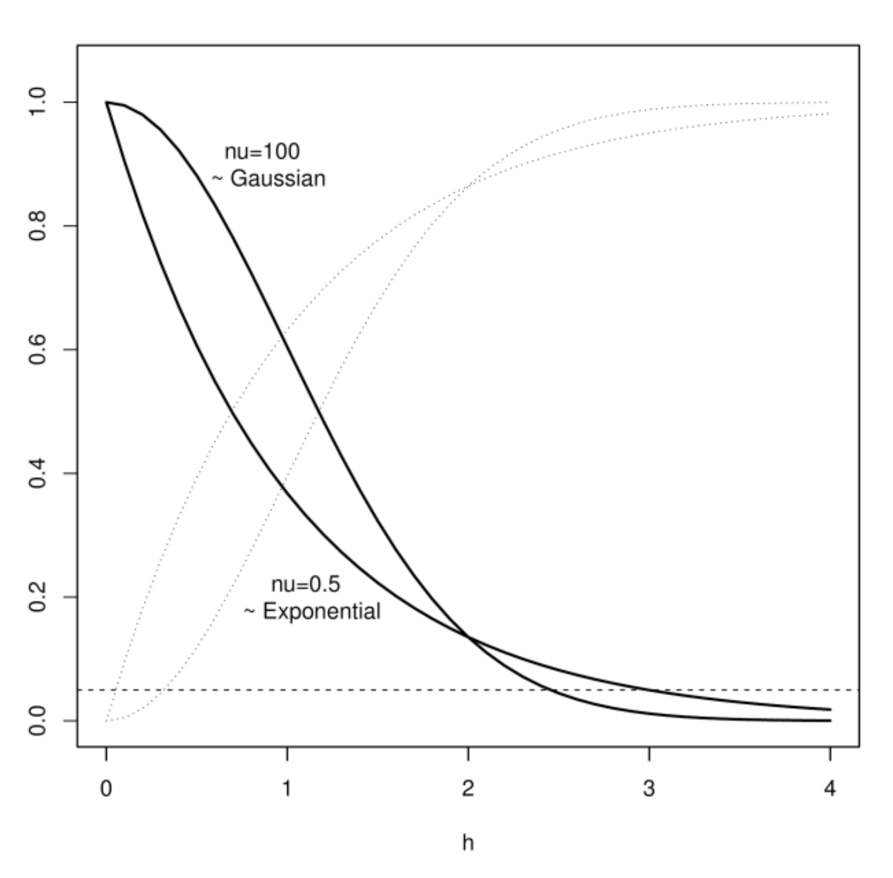

<!-- Quarto formatted: To create/render document:

make quarto FN=covariance.md DOCTYPE=html PARAMS="-P todo:[nothing,add,more,here]" --directory=~/projects/model_covariance/docs

-->

<!-- To include a common file:
  
-->


<!-- To force landscape (eg. in presentations), surround the full document or pages with the following fencing:
::: {.landscape}
  ... document ...
:::
-->

# Preface

These are notes from a non-statistician's perspective on learning to use statistics. They are offered here as an aide for others that are beginning a similar journey trying to make sense of data through the lens of personal interests. 

The concept of *Covariance* is foundational to much of practical numerical analysis, modelling and parameter estimation. However, its importance was never really clearly expressed in numerous foundational courses. Instead, derived components such as correlation and sums of squares, variance, etc., were the focus as they are usually *simpler* to understand. Covariance was always some abstract quantity that lurked in the background and referenced but never directly treated. Understanding of it's importance only gradually seeping after many years. A better intuition of covariance at the very beginning of my career would have likely made my progress that much more efficient.  

Here I focus upon using [Julia](https://julialang.org/), as in my experience,
it is a clear didactic tool and better for long-term learning and use in large
projects due to maintainability of the code-base. It is an open-source platform
created by mathematicians, engineers, natural scientists, statisticians,
computer scientists and machine learning specialists, each bringing the best
from their respective fields and lessons learned from domain-specific software
platforms in a coherent and performative fashion. At the time of this writing,
there still remain some lingering issues (start up speed, recompilation of code
and incompatibility creep when there are updates to any library, most already
being addressed rapidly), but the speed that is offered and code clarity in
exchange is worth it in any serious data manipulation efforts. Your mileage
will vary, but the lessons learned are also easily transportable to R, python,
matlab, octave, etc. if you are forced to use those platforms. They each have
their own quirks and challenges, but until their eventual convergence, Julia is
a great platform to learn, teach and operate/develop cutting edge work. Many
learning tools exist. [Have a look here for a curated list](https://julialang.org/learning/).
 
# Covariance-based models

*Covariance* is a measure of the relationship between two variables. Of course it one of many that can be expressed, but this measure comes up repeatedly in almost every statistical endeavour. It is computed as the average of the product of two variables after they are each centered to their respective means. As intuition on this quantity is not immediately apparent, most introductions to modelling ignore it and instead focus upon some component of it that is simpler to intuit. However, as covariance is the basis for almost every form of parameter estimation, from Regression, and Gaussian Process to Kalman Filters and Bayesian HMM, etc, it is worthwhile be-labouring our focus upon this quantity a little longer.

More explicitly, *covariance* is:

$$\begin{align*}
Cov(X, Y) & = E[(X − \bar{X})(Y − \bar{Y})]  \\ 
 & = E[xy]   \\ 
 & = Cov(x,y),  
\end{align*}$$

where, $E[\cdot]$ means "expected value", $\bar{X}$ means the mean value of $X$, $x=X-\bar{X}$ and $y=Y-\bar{Y}$.

How does multiplying two variables together represent a relationship between them? The intuition is that when two such centered variables are completely random (i.e., each observation of $x$ and $y$ is completely independent), then each variable has a mean expected value of 0, and consequently, their product would also have a mean expected value of 0. However, if they are related or dependent (linearly), their product would result in a value that deviates from 0; the greater this deviation from zero, the more they "covary". Geometrically, each $(x, y)$ pair represents the opposing corner of a rectangle with the origin $(0, 0)$ and so the product, $x y$ is simply the surface area. When completely random, the rectangles would be completely random with overall average surface area of 0; when non-random, they would represent rectangles of maximal size predominantly in either the 1st and 3rd quadrants (positive covariance) or 2nd and 4th quadrants (negative covariance).  

The suffix, "variance" in co-variance identifies the connection to the concept of variance as the mean of the squared differences of a variance from its average value. And indeed, when $X=Y$, then the covariance of $X$ with itself is the variance of $X$.

$$\begin{align*}
Cov(X,X) &= E[ (X - \bar{X})(X - \bar{X}) ] \\ 
& = Var(X)
\end{align*}$$

$~$  &nbsp; <br /> <!-- adds invisible space and line break(2) -->

## Preliminaries in Julia

Most functions used here that are not part of a standard library are collected together in [Julia](https://julialang.org/) functions in [src](../src/). They can be loaded with supporting standard libraries, as follows:


```{julia}
#| label: load-julia-environment
#| eval: true
#| echo: false
#| output: false

using DrWatson

project_directory = joinpath( homedir(), "projects", "model_covariance"
) # change to location where you stored the project

quickactivate(project_directory)

include( scriptsdir( "startup.jl" ))     # env and data
include( srcdir( "simple_linear_regression.jl") )
include( srcdir( "regression_functions.jl" ))   # support functions  

include( srcdir( "car_functions.jl" ))   # support functions  

# additional libraries
using Random, RDatasets, Plots, CSV, DataFrames 
using Distributions, StatsBase, Statistics, LinearAlgebra, GLM 

# Set a seed for reproducibility.
Random.seed!(1234)

```


### Basic test data  

Here are some basic data, useful for comparisons of computational methods to help build intuition.


```{julia}
#| label: partial-corr-julia
#| eval: true
#| echo: false
#| output: false

example_data_source = "random"

if example_data_source=="random"
  n = 100
  cormat = random_correlation_matrix(3, 0.1)
  o = rand( MvNormal( cormat^2 ), n )
  X = o[1,:]
  Y = o[2,:]
  Z = o[3,:]

elseif example_data_source=="peltzer"

  fn = joinpath( project_directory, "reference", "data.txt" )
  testdata = CSV.read(fn, DataFrame, delim=",", ignorerepeated=true )
  X = testdata[!, "X"] 
  Y = testdata[!, "Y"] 
  n = length(X)

elseif example_data_source == "iris"

  iris = RDatasets.dataset("datasets", "iris")
  X = iris[!,:PetalWidth]
  Y = iris[!,:PetalLength]
  Z = iris[!,:SepalLength]
  n = length(Y)

end


# We want centered and standardized versions for some calculations:
  x = (X .- mean(X)) ./ std(X)
  y = (Y .- mean(Y)) ./ std(Y)
  z = (Z .- mean(Z)) ./ std(Z)
 
 
```

 
### Matrix manipulations and GLM

Aside: see following nice summary for [matrix and symbolic manipulation in Julia](https://docs.juliahub.com/CalculusWithJulia/AZHbv/0.0.5/differentiable_vector_calculus/vectors.html)
 

```{julia}

using Symbolics, LinearAlgebra
 
a = [10  11  12] # row vector
b = [10; 11; 12] # column vector 

[a; a.+2]   # vertically combine
[b b.+2]   # horizontally combine

M = [3 4 -5; 5 -5 7; -3 6 9] # matrix(3,3)
@variables x1 x2 x3
x = [x1, x2, x3]

M * x - b

@variables c d e f g h i j k
A = [ c d e;  f g h;  i j k ]
A * A'
A * x - b
dot(A, A)

a = [1, 2, 3]
b = [4, 2, 1]
cross(a, b)

M = [
  i j k; 
  1 2 3; 
  4 2 1]
det(M)   # same as cross(a,b)

```
 
Covariance can also be computed as an inner product, or, from simpler intermediate quantities (used when calculating resources were limiting). 

$$Cov(X, Y) = \frac{1}{n} (X-\bar{X}) (Y-\bar{Y})^T$$
 

The next few steps uses a traditional (didactic) approach to calculations,
usually found in introductory statistics to help build intuition.


```{julia}
  Xmean = sum(X)/n;
  Ymean = sum(Y)/n;
  
  SXY = sum( (X .- Xmean) .* (Y .- Ymean ) ) # sum of covariance

  cov_pop = SXY/(n)    # average covariance (population)
  cov_sample = SXY/(n-1)  # average covariance (sample)
```

It is really as simple as that. The sample estimate uses n-1 as the divisor as, 1 degree of freedom is being used for the mean estimate itself. The equivalent statements using Julia are as follows:


```{julia}
  # equivalent statements for (sample) covariance:
  # NOTE julia uses corrected=true as default which means use n-1 to compute means (with loss of 1 df for the point estimate of var or cov) 

  cov_julia = cov(X, Y)
  cov_definition = sum(X.*Y)/(n-1) − sum(X) / (n-1) * sum(Y) / (n-1)
  cov_innerproduct = ((X.-mean(X) )' * (Y.-mean(Y)))/(n-1) 
  
  isapprox( cov_sample, cov_julia ) # ok
  isapprox( cov_sample, cov_definition )  # diverges at 6 decimal places .. not sure why
  isapprox( cov_sample, cov_innerproduct ) # ok

  # equivalent statements for (population) covariance:
  cov_julia = cov(X, Y; corrected=false)
  cov_definition = sum(X.*Y)/(n) − sum(X) / (n) * sum(Y) / (n)
  cov_innerproduct = ((X.-mean(X) )' * (Y.-mean(Y)))/n
 
  isapprox( cov_pop, cov_julia ) # ok
  isapprox( cov_pop, cov_definition )  # ok
  isapprox( cov_pop, cov_innerproduct ) # ok
 
 # by definition
  isapprox(cov(X,X), var(X))

```
 
Covariance is, where $a,b,c,d$ are constants and $v,w, x, y$ are random variables:

- Bilinear: $Cov(ax + by, u) = a Cov(x,u) + b Cov(y,u)$ 

- Symmetric: $Cov(x,y) = Cov(y,x)$

- Positive definite: $Var(x) = Cov(x,x) \ge 0$

Other useful identities include:

- $Cov(ax, by) = ab Cov(x,y)$   

- $Cov(x, y) = \frac{Var(x+y) - Var(x) - Var(y)}{2}$

- $Cov(ax + by, cw + dv) = ac \cdot Cov(x, w) + ad \cdot Cov(x, v) + bc \cdot Cov(y, w) + bd \cdot Cov(y,v).$

And some more related to variance:

- $Var(x) = Cov(x, x)$

- $Var(x + y) = Var(x) + Var(y) + 2Cov(x, y)$

- $Var(ax+b) = a^2 Var(x)$

- $Var(ax + by) = a^2 Var(x) + b^2 Var(y) + 2 ab Cov(x,y)$

- $Var(x) = Var( E[x|y] ) + E[ Var(x|y) ]$

  $= E[ x^2 -2x E[x] + E[x]^2 ]$

  $= E[ x^2] - E[x]^2$

Already, you can see how it is implicated with or foundational to many important statistical concepts and identities.


$~$  &nbsp; <br /> <!-- adds invisible space and line break(2) -->


## Correlation

*Correlation* is similar to *Covariance* in that it describes the relationship between variables. When two variables are completely random, there would be no relationship and when they are completely dependent, functionally or mechanistically, they would be completely correlated and given a value of 1 or -1. 

The most frequently used form of correlation is the Pearson product moment correlation coefficient ($\rho$) where this scaling is accomplished by dividing the covariance by their respective standard deviations. In other words, the covariance between two variables $x$ and $y$ scaled by the standard deviation of each variable:

$$\begin{align*}
\rho_{xy} &= \frac{Cov(x, y)}{\sqrt{Var(x) \cdot Var(y)}} \\
&= \frac{Cov(x, y)}{ \sigma_x \sigma_y }
\end{align*}$$

To belabour the point, intuition in an algebraic sense is similar to covariance. The expected value of each variable $x$ and $y$, being centered is zero. Like covariance, the product of two completely random variables would also be zero. However, if correlated, then the product would deviate from zero and being scaled to a maximum value of respective standard deviations, 1 or -1. Intuition in the geometric sense is also similar: covariance scaled to respective standard deviation renders the variables as $x$ and $y$ as corners of rectangles opposite of the origin, and so where correlation is strong, most of such rectanges would be either in the 1st and 3rd quadrants (positive correlation) or 2nd and 4 quadrants (negative correlation).  

 
```{julia}

# didactic: using above computations of cov and SS

  SSX = sum( (X .- Xmean).^2 )
  SSY = sum( (Y .- Ymean).^2 )

  cor_definition = SXY / sqrt( SSX * SSY )

# Note: cov and var use "corrected=false" as default, 
#   where n-1 is used instead of n so values will be slightly different 
#   than if computed  with E[] which uses n
#   but, as ratios, they cancel out here: 
 
  cor_julia = cor(X,Y)
  cor_definition = cov( X, Y ) / sqrt( var(X) * var(Y) )  # cov(X,Y) = E[XY] .. if independent ==E[X] * E[Y]
  cor_alt = ( var(X) + var(Y) - var(X-Y) ) / ( 2* sqrt( (var(X) *var(Y)) ) )

  isapprox(cor_definition, cor_julia ) # ok
  isapprox(cor_definition, cor_definition) # ok
  isapprox(cor_definition, cor_alt) # ok

```

$~$  &nbsp; <br /> <!-- adds invisible space and line break(2) -->


### Rank correlation

Other forms of simple bivariate correlations exists, such as the Spearman and Kendall nonparametric rank correlations. Spearman correlation is simply the same as the Pearson correlation, except that it operates upon the sorted order (rank) of each variable. Kendall correlation similarly focusses upon the sorted order (rank) of each variable. However, the statistic is the number of concordant and discordant pairs of observations(i, j) in a binomial random variable, where con/dis-cordance are determined from sorted orders (rank) of $x$ and $y$. This amounts to a quadrant analysis of point $j$ relative to  point $i$ as the "center", on the basis of ranks. 


### Partial correlation

Controlling for the influence of a common third variable, $z$, is known as a partial correlation. It is computed as the correlation between the *residuals*, $e$, derived from two bivariate regressions ($\epsilon_{xz}$ vs $\epsilon_{yz}$). This simplifies to [see Wikipedia](https://en.wikipedia.org/wiki/Partial_correlation#cite_ref-3):

$$
\rho_{xy.z}=\frac{\rho_{xy}-\rho_{yz}\rho_{xz}}{\sqrt{1-\rho_{\smash[b]{yz}}^{2}}\sqrt{1-\rho_{xz}^{2}}}
$$

This can also be seen as:

$$\begin{align*}
\rho_{xy.z} &= \frac{Cov(\epsilon_{xz}, \epsilon_{yz})}{\sqrt{Cov(\epsilon_{xz}, \epsilon_{xz}) \cdot Cov(\epsilon_{yz}, \epsilon_{yz}) } } \\
&= - \frac{ \sigma_{xy}^{-2} }{ \sqrt{ \sigma_{xx}^{-2} \sigma_{xy}^{-2} } }
\end{align*}$$

 
```{julia}
rho_xy = cor(X,Y)
rho_yz = cor(Y,Z)
rho_xz = cor(X,Z)

rho_xy_z = ( rho_xy - rho_xz * rho_yz ) / sqrt( (1-rho_xz^2 ) * (1-rho_yz^2)  ) # partials 

# if another variable W: then this becomes a recursive process

```

$~$  &nbsp; <br /> <!-- adds invisible space and line break(2) -->

### Model-based partial correlation

This requires an understanding of Linear regression so a bit out of sequence as it has not yet been introduced. Skip ahead to Linear Regression if you need more background.

Our purpose here is to obtain a way to flexibly obtain correlations from a model-based approach. Ultimately, this amounts to estimating partial correlations, however, for cases where additional factors are random effects in time and space, this is seldom discussed.  

To develop intuition, let us find the connection between simple bivariate linear regression model between $X$ and $Y$, and their correlation. The linear model is the usual:

$$Y=\beta_{0}+\beta_{1}X_1+\epsilon,$$

where $\beta_{0}$ is the constant (intercept), ${\beta_1}$ is the slope between $Y$ and $X$, and $\epsilon$ is some random error, usually $\epsilon\sim\text{Normal}(0, \sigma_Y)$ with standard deviation $\sigma_Y$. The error $\epsilon_Y$, in ordinary linear least squares, is usually minimizied to obtain parameter estimates: 

$$\epsilon_Y^2 = {(Y - \beta_{0} - \beta_{1}X)}^2$$

Upon expansion, the estimator for $\beta$ is:

$$\begin{align*}
\hat{\beta_1} &= \frac{E[(X - \bar{X}) (Y - \bar{Y})] }{ E[{(X - \bar{X})}^2]} \\
&= \frac{Cov(X,Y)}{ Var(X)}.
\end{align*}$$

We know from the previous section that: $\rho  = \frac{Cov(X, Y)}{\sqrt{Var(X) \cdot Var(Y)}} $. So by substitution of the covariance relationship with correlation:

$$\begin{align*}
\hat{\beta_1} &= \frac{Cov(X,Y)}{ Var(X)} \\
&= \frac{\rho  \sqrt{Var(X) \cdot Var(Y)} }{Var(X)} \\
&= \rho \frac{\sigma_Y}{\sigma_X}.
\end{align*}$$

 

That is, the correlation is equivalent to the regression coefficient when it is scaled by the ratio of the standard deviation of the independent variable ($\sigma_X$) and the dependent variable ($\sigma_Y$). 

This means that if we operate upon variables that have been centered to the mean and scaled to unit variance, that is: $(x,y) = ( \frac{X-\bar{X}}{\sigma_{X}},\frac{Y-\bar{Y}}{\sigma_Y})$ with: 

$$y=\beta_{0}+\beta_{1}x+\epsilon.$$

where,and $\epsilon\sim\text{Normal}(0,1)$, then, as $\sigma_{x}=\sigma_{y}=1$:

$$\beta_1 = \rho \frac{\sigma_y}{\sigma_y} = \rho$$


Many factors can influence or modulate the strength or form of a bivariate relationship. Ignoring them can cause biased parameter estimates. If it is simply another variable $z$, then this can be addressed as a multiple regression problem: 

$$y=\beta_{0}+\beta_1 x + \beta_2 z + \epsilon$$

and so an exercise in estimating partial correlations. In this tri-variate linear model, the partial correlation between $y$ and $x$, controlling for $z$ (note the notation used is: $\rho_{yx.z}$) is related to the
0th order (naive bivariate) correlations, $\rho_{yx},\rho_{yz},\rho_{xz}$ as:

$$
\rho_{yx.z}=\frac{\rho_{yx}-\rho_{yz}\rho_{xz}}{\sqrt{1-\rho_{\smash[b]{yz}}^{2}}\sqrt{1-\rho_{xz}^{2}}}
$$ 

{#eq-a}

where for example, $(1-\rho_{yz}^{2}),$ represents the proportion of unexplained variance (i.e., residual variability) in a model of the dependent variable $y$ with the independent variable $z$. The scaled regression coefficient has a similar form to the partial correlation:

$$\begin{align*}
\beta_{1} &= \frac{\rho_{yx}-\rho_{yz}\rho_{xz}}{1-\rho_{xz}^{2}} \\ &= \frac{\rho_{yx}-\rho_{yz}\rho_{xz}}{\sqrt{1-\rho_{xz}^{2}}\sqrt{1-\rho_{xz}^{2}}}
\end{align*}$$ 

{#eq-b}


Note that there is difference in the equations: the term $\sqrt{1-\rho_{\smash[b]{yz}}^{2}}$ in (@eq-a) vs $\sqrt{1-\rho_{xz}^{2}}$ in (@eq-b).

From the above, multiplying through and simplifying, we obtain:

$$
\rho_{yx.z}=\beta_{1}\frac{\sqrt{1-\rho_{xz}^{2}}}{\sqrt{1-\rho_{\smash[b]{yz}}^{2}}}.
$$

That is, the partial correlation between $y$ and $x$, while controlling for the effect of $z$, is equal to the regression coefficient scaled by the ratio of the residual standard deviation associated with ($x$ as a function of $z$) : ($y$ as a function of $z$). Importantly, when using a regression-based approach, $\rho_{yx.z}$ will not always be equal to $\rho_{xy.z}$; indeed, the weaker the correlation, the greater the divergence. The overall correlation can be approximated as the geometric mean of these two estimates (Rodgers and Nicewander 1988): 

$$
\rho=\sqrt{\rho_{yx.z}\rho_{xy.z}},
$$

which in terms of the regression coefficients becomes:

$$\begin{align*}
\rho &= \sqrt{ 
  \beta_{1_{yx}} \frac{\sqrt{ 1-\rho_{xz}^{2}} }{\sqrt{1-\rho_{\smash[b]{yz}}^{2}}} \cdot 
  \beta_{1_{xy}} \frac{\sqrt{ 1-\rho_{\smash[b]{yz} }^{2}} }{\sqrt{1-\rho_{xz}^{2}}} 
} \\
& = \sqrt{\beta_{1_{yx}}\beta_{1_{xy}}}
\end{align*}$$


```{r}
#| label: partial-corr-r
#| eval: true
#| output: true
#| fig-dpi: 144
#| fig-height: 4 
#| echo: false 
#| code-fold: true

## NOTE: this is R-code

require(randcorr)  # create random correlation matrices
require(MASS) # nvnorm
require(ppcor) # partial correlations

seed(123)

n = 100 # no observations
p = 3  # no of vars

# correlation matrix
C = randcorr(p)

# data corresponding to C; 
G = mvrnorm(n=n, mu=rep(0,p), Sigma=C)  

# note already centered and standardized above but do it again as the sample may not be exactly centered
G = scale(G)

plot(data.frame(G))

# simple correlations
  xy_cor = cor(G[,1], G[,2] )

  xy = lm( G[,2] ~ G[,1] + 0 ) 
  yx = lm( G[,1] ~ G[,2] + 0 ) 

  xy_slope = coef(xy)[[1]]
  yx_slope = coef(yx)[[1]]
  xy_gm = sign(xy_slope) * sqrt( xy_slope * yx_slope )  # standardized slope == correlation

  xy_gm - xy_cor  # no difference between direct and model-based

# partial correlations (controlling for "z" .. var 3)
  xy_cor_partial = pcor(X)$estimate
  print(xy_cor_partial)
 
  # linear models, controlling for 3rd variable ("z")
  xy.z = lm( X[,2] ~ X[,1] + X[,3] + 0 ) 
  yx.z = lm( X[,1] ~ X[,2] + X[,3] + 0 ) 

  xy_slope.z = coef(xy.z)[[1]]
  yx_slope.z = coef(yx.z)[[1]]
  xy_gm.z = sign(xy_slope) * sqrt( xy_slope.z * yx_slope.z )  # standardized slope == correlation 

  xy_gm.z - xy_cor_partial[1,2]  # no difference
 
```

So, bottom line, random effects can be modelled as covariates.

We repeat the above using Julia.

```{julia}
#| label: partial-corr-julia
#| eval: true
#| output: true
#| fig-dpi: 144
#| fig-height: 4 
#| echo: false 
#| code-fold: true

Random.seed!(1234)

# basic approach
  cor_XY = cor(X,Y)
  cor_YX = cor(Y,X) 
  cor_YX == cor_XY  # same

  plot(X, Y, seriestype=:scatter )
  ols = linear_regression_simple(X, Y; method="glm" , toget="res")
  (b,a) = coef(ols) # a=slope, b= intercept
  Plots.abline!(a, b, line=:dash)
 
  cor_xy = cor(x,y) 
  cor_yx = cor(y,x) 

  isapprox( cor_xy, cor_yx ) # ok
  isapprox( cor_xy, cor_XY ) # ok

  plot(x, y, seriestype=:scatter )
  ols_xy = linear_regression_simple(x, y; method="glm" , toget="res")
  (b,a) = coef(ols_xy) # a=slope, b= intercept
  Plots.abline!(a, b, line=:dash)

  plot(y, x, seriestype=:scatter )
  ols_yx = linear_regression_simple(y, x; method="glm" , toget="res")
  (b2,a2) = coef(ols_yx) # a=slope, b= intercept
  Plots.abline!(a2, b2, line=:dash)

  # slope estimates which are also equal to the correlations (due to standardization): nearly identical
  isapprox(a, a2)  # ok

  cor_geometric = sign(a) * sqrt(a*a2) # geometric mean  -0.7097178637658089
  isapprox(cor_geometric, cor_xy) # ok
  
  b = linear_regression_simple(x, y; method="MAR_geometric_mean_untransposed", toget="res" )  # method used in "deprivation indices"
  isapprox( b.r, cor_xy)  # ok
  isapprox( b.beta[2], cor_xy)  # ok  

  # using MCMC/Turing
  using Turing, Distributions
  n = length(y)

  # test regression using Turing directly (Model 1, ~ OLS)

  @model function linear_regression_nointercept(x, y; ncoef=1)
    yvar ~ truncated(Normal(0, 1); lower=0) # observation error in Y
    beta_x ~ MvNormal(zeros(ncoef), 10.0 * I)
    @. y ~ Normal( x .* beta_x, yvar )

    xvar ~ truncated(Normal(0, 1); lower=0) # observation error in X
    beta_y ~ MvNormal(zeros(ncoef), 10.0 * I)
    @. x ~ Normal( y .* beta_y, xvar )
    r = sign(beta_y[1]) * sqrt( abs(beta_x[1] * beta_y[1]) )
    return r
  end


  model = linear_regression_nointercept(x, y)
  res = sample(model, Turing.NUTS(0.65), 3_000)
  showall(res)

  parameters      mean       std      mcse    ess_bulk    ess_tail      rhat   ess_per_sec 
        yvar    0.3040    0.0221    0.0003   4699.3708   2419.0914    0.9997      431.3328
   beta_x[1]   -0.9538    0.0307    0.0004   5282.5847   2554.9165    1.0000      484.8632
        xvar    0.3038    0.0214    0.0003   5015.1167   1832.3955    1.0021      460.3136
   beta_y[1]   -0.9535    0.0320    0.0004   5409.3544   2310.5897    1.0004      496.4988

  corrs = generated_quantities( linear_regression_nointercept(x,y), res)
  summarystats(corrs)

  Mean:          -0.953392 
  Std. Deviation: 0.022223
  
  corr = - sqrt( -0.9538 * -0.9535 ) # -0.9536499882032191 

  corr - cor_xy # 0.0002769013212672311 ... so a bit of a difference vs MCMC (but well within 1 SD) and a proper SD estimate for free

```

So for simple bivariate regression, all is good. We can use the slope coefficient to estimate correlation and be be reasonably accurate -- make sure to use the scaled and centered data.

Now we turn to a regression with three variables. Here we are essentially trying to estimate partial correlations from the regression coefficients:


```{julia}

  # these are the partial correlations between x and y, controlling for z
  r_xy_z = partialcor(x,y,z)  # -0.18396101222357 
  
  dat = DataFrame(x=x,y=y,z=z)

  res = lm( @formula( y~ x + z +0), dat )  # 0 means no intercept
  coefs = coef(res) # -0.1007989629054409  slope parameter

  res2 = lm( @formula( x~ y + z +0), dat )  # 0 means no intercept
  coefs2 = coef(res2) # -0.3357341488728164 slope parameter
  
  # compute geometric mean:
  r_estimate = sign(coefs[1]) * sqrt( coefs[1] * coefs2[1] ) # -0.18396101222357086

  isapprox(r_estimate, r_xy_z)  # ok


  # via turing (y ~ x+z OLS)

  @model function linear_regression_partial(x, y, z; ncoef=2)
    
    yvar ~ truncated(Normal(0, 100); lower=0) # observation error in Y
    beta_xz ~ MvNormal(zeros(ncoef), 10.0 * I)
    xmu = [x z] * beta_xz
    @. y ~ Normal( xmu, yvar )
    
    xvar ~ truncated(Normal(0, 100); lower=0) # observation error in Y
    beta_yz ~ MvNormal(zeros(ncoef), 10.0 * I)
    ymu = [y z] * beta_yz
    @. x ~ Normal( ymu, xvar )
      
    r = sign(beta_yz[1]) * sqrt( abs(beta_xz[1] * beta_yz[1]) )
    return r

  end

  model = linear_regression_partial(x, y, z)
  chain_xyz = sample(model, Turing.NUTS(0.65), 3_000)

  showall(chain_xyz)

  parameters      mean       std      mcse    ess_bulk    ess_tail      rhat   ess_per_sec 
        yvar    0.2910    0.0211    0.0004   2810.2221   1925.8563    1.0025      383.9101
  beta_xz[1]   -0.7861    0.0610    0.0012   2385.3107   1735.1998    1.0009      325.8621
  beta_xz[2]   -0.1908    0.0611    0.0012   2451.2246   1931.6370    1.0014      334.8667
        xvar    0.2954    0.0218    0.0004   3086.9207   1933.4088    1.0012      421.7105
  beta_yz[1]   -0.8126    0.0645    0.0014   2152.8606   1799.9549    1.0020      294.1066
  beta_yz[2]    0.1604    0.0633    0.0013   2219.7180   1789.0834    1.0011      303.2402

  # fast estimate from geometric mean of coefficient means
  r_partial_turing = - sqrt(-0.7861 * -0.8126) # -0.7992401766678149
  
  isapprox( r_partial_turing, r_xy_z) # not equal 
  r_partial_turing - r_xy_z # but the difference is 0.0007150127684701912
 
  # get the actual posteriors of the estimate:
  corrs = generated_quantities( linear_regression_partial(x,y, z), chain_xyz)
  summarystats(corrs)

  Mean:           -0.797952 # diff << SD
  Std. Deviation:  0.043714
  Median:         -0.797654

```

So bottom line: the model-based approach is flexible and permits more complex random effects models, including *spatial and temporal and spatiotemporal autocorrelation models* (see below), to be able to contribute towards partial correlation estimates. This becomes useful in applications such as PCA, wherevariables can have multiple spatiotemporal autocorrelations interfering with real bivariate correlations.
 
For example, if we attribute to $x_2$ all the additional factors that modify or influence the relationship between $y$ and $x_1$:

$$
y=\beta_1 x_1 + \beta_2 x_2 +\epsilon.
$$

If the additional variable $x_2$ is continuous then this amounts to adding a new term estimating partial correlations from $\beta_2 x_2$. In the case of simple factorial effects, dummy-encoded variables can be used such that $\beta_2$ becomes a matrix of coefficients specifying factorial effects. Bakdash and Marusich (2017) implemented an approach similar to this, using one common slope $\beta_1 x_1$ and multiple intercepts $\beta_{0,s}$ associated with stratified repeated measurements of subjects $s$. 

Correlations that have some spatial and temporal structure can be parameterized if the slopes of the relationships between two variables have this structure. A model that can express this structure is a multiple-slope model. That is, a spatially varying slope (i.e., a location-specific correlation) is assumed to have some neighbourhood effects (a Besag-York-Mollie conditional distribution, $\beta_2 x_2 \sim\text{BYM}$). Further, wecan add a time-varying elevation (intercept) that follows an Autoregressive 1 process at each location $s$ as $\beta_{0,s} \sim \text{AR1}$. The end result is that correlation between variables have freedom to change locally while still contributing to an overall global relationship between variables. 

In contrast, if the focus had been upon the variability of slopes (correlations) across time, that is, with some temporal structure, then a temporally varying random slope parameter that is autoregressive, $\beta_1 x_1 \sim AR1$ could be used. This can be useful as the aggregate processes that are generally responsible for a temporal process is longer term than the temporal process in that they are the result of latter interacting with geographic processes. To parameterize such a model, we could assume a spatially varying random intercept, $\beta_{0,s} \sim \text{BYM}$.

The overall mean inter-variable correlations, "de-correlated" in space and/or time, can then be subjected to a standard eigen-decomposition in order to determine orthogonal composite axes (Principal components) that maximally accounts for the total variability in the data. In our case, a singular-value-decomposition (SVD) was used for the eigen-decomposition due to the greater numerical stability of the technique relative to a direct eigen-decomposition. The resultant factor loadings are varimax rotated to facilitate interpretation while retaining orthogonality.


### References

Bakdash, J.Z., and Marusich, L.R. (2017). Repeated Measures Correlation. Frontiers in Psychology, 8, 256. <URL: https://doi.org/10.3389/fpsyg.2017.00456>.

Bevington and Robinson (1992) "Data Reduction and Error Analysis for the Physical Sciences, 2nd Ed.".  pp: 104, and 108-109,

Bland, J.M., and Altman, D.G. (1995). Calculating correlation coefficients with repeated observations: Part 1 - correlation within subjects. BMJ, 310, 446. 

Kermack & Haldane (1950) Biometrika 37: 30-41; 

Rodgers, J.L., and Nicewander, W.A. (1988). Thirteen Ways to Look at the Correlation Coefficient The American Statistician, Vol. 42, No. 1. (Feb., 1988), pp. 59-66.  doi:10.2307/2685263. https://www.stat.berkeley.edu/~rabbee/correlation.pdf

Pearson (1901) Phil. Mag. V2(6): 559-572.

Ricker (1973) Linear regressions in Fishery Research, J. Fish. Res. Board Can. 30: 409-434

York (1966) Canad. J. Phys. 44: 1079-1086; 
 

$~$  &nbsp; <br /> <!-- adds invisible space and line break(2) -->

## Linear regression 

### Ordinary Linear Regression (OLS) 

OLS is also known as Model 1 Regression. Here, we go through the basic form using matrix algebra ([copied from Wikipedia](https://en.wikipedia.org/wiki/Linear_regression)) in Julia and then eventually the Bayesian form. The basic model is:

$$y = \bold{X} \bold{\beta} + \bold{\epsilon}$$

where:

- $y$ is a column vector of $n$ observations
- $\bold{X}$ is an $n \times p$ matrix of covariates with $p$ dependent variables 
- $\bold{\beta}$ is $p \times 1$ column vector of linear coefficients 
- $\bold{\epsilon}$ is a $n \times 1$ column vector of residual IID errors 

Further assumptions about the error distribution of $\bold{\epsilon}$ and how to optimize/minimize it define various forms of linear regression. 

This is the standard form with error only in Y. The standard form assumes an IID Normal distribution and solutions found by optimization (minimize the $\Sigma \epsilon^2$). This quantity is the Least-Squares (of error) and known as Model 1 Regression, where error only exists in the $y$. The solution is exact and popular because it is easily computed as: 

$$\bold{\beta} = (\bold{X}^T \bold{X})^{-1} \bold{X}^T y$$

Notice the dot product $X^T X^T$, is our covariance matrix. As this is a common task many, approaches exist, In Julia, this is solved with GLM.jl or with lm or glm in R, etc. However, they are accounting systems around the solution to these few matrix operations.

```{julia} 
# didactic form of linear regression:

  SSR = SXY^2 / SSX  # of regression == cov(x,y)^2 / var(x)
  SSE = SSY - SSR

  SDX = sqrt(SSX/(n-1));
  SDY = sqrt(SSY/(n-1));

  r_squared = ( SSY - SSE ) / SSY
  r_definition = 1/(n-1) * sum( (X .- Xmean ) ./ std(X)  .*  (Y .- Ymean ) ./ std(Y) )  # close 
  
  isapprox( sign(SXY) * sqrt(r_squared), r_definition) # ok

  m_cov = cov(X,Y) / var(X)
  
  # m_from_r = r_definition * std(Y) / std(X)  # when x, y are standardized, m=r == cov(x,y)  ## note: not cov(X,Y)
  # isapprox( m_cov, m_from_r)  # ok

  # estimates of standard deviations
  m_sd = SDY / sqrt( SSX )  # standard error of slope
  b_sd = SDY * sqrt(  sum(x.^2 ) / (n*SSX) )

  r2adjusted = 1.0 - (SSE/ (n-2 ) ) / (SSY / (n-1)) 

  # Or simply: 
  res = linear_regression_simple(X, Y, method="sums_of_squares", toget="results") # this uses the same sequence as above


# using various algebraic methods/engines of solution

  # same as: lm(@formula(Y ~ X), testdata) 
  res = linear_regression_simple(X, Y, method="glm", toget="results")    
    adjr2(res)
    deviance(res)
    dof(res)
    dof_residual(res)
    aic(res)
    aicc(res)
    bic(res)
    scatter(X, Y)
    plot!(X, predict(res), seriestype = :line) #where x is your predictor variable

  # or just to get betas:
  betas = linear_regression_simple(X, Y, method="qr")
  betas = linear_regression_simple(X, Y, method="svd")
 
```

The write up in [Peltzer's notes](reference/linear_regression_matlab.md) provides some comparisons and could be useful.


### Major Axis Regression

Major Axis Regression is also known as Model 2 Regression. This a second form of regression that assumes error in *both* $y$ and $\bold{X}$ and not just in $y$ as in Model 1 (OLS) Regression. There are several variations related to estimation approaches. The two main forms are: 

  - York 1966 is considered a more general solution. See: York (1966) Canad. J. Phys. 44: 1079-1086; Kermack & Haldane (1950) Biometrika 37: 30-41; Pearson (1901) Phil. Mag. V2(6): 559-572.

  - Geometric_mean of xy and yx is considered an ad hoc approximation attributed to Ricker (1973) Linear regressions in Fishery Research, J. Fish. Res. Board Can. 30: 409-434; and Bevington and Robinson (1992) "Data Reduction and Error Analysis for the Physical Sciences, 2nd Ed."  pp: 104, and 108-109,

 

```{julia}
 
a = linear_regression_simple(X, Y; method="MAR_geometric_mean" , toget="res")
a.beta[2] # slope of X vs Y

b = linear_regression_simple(X, Y; method="MAR_york_1966", toget="res" ) 
c = linear_regression_simple(Y, X; method="MAR_york_1966", toget="res" ) 
isapprox( b.beta[2],  1.0/c.beta[2])  # ok
 
d = linear_regression_simple(X, Y; method="MAR_bisection", toget="res" )
e = linear_regression_simple(Y, X; method="MAR_bisection", toget="res" )
isapprox( d.beta[2] , 1 / e.beta[2] ) # ok

# Note: if X,Y are scaled, then coefficients will be 1 
f = linear_regression_simple(x, y; method="MAR_geometric_mean" , toget="res")
isapprox( abs(f.beta[2]), 1.0) 

f_correlation = - std(Y) / std(X)  ## need to check ... this might be wrong (todo)

f.r - f_correlation # 0.02 some deviation  

```

Major axis regression is also related to a PCA (see PCA section, below). Basically, as the principle axis (PC1) is a linear combination of the eigenvectors ($v$) from an Eigen-decomposition of $\bold{X}$:

$$PC1 = v_1 X_1 + v_2 X_2 + v_3 X_3  + \cdots + v_n X_n$$

The slope can be recovered from the Maximum Likelihood estimate  (see Legendre and Legendre 1998; Mandansky 1959; Kendall and Stuart 1966):
$$m=\frac{\sigma_y^2 - \lambda \sigma_x^2 + \sqrt{ {(\sigma_y^2 - \lambda \sigma_x^2)}^2 + 4 \lambda \sigma^2_{xy}} }{2 \sigma_{xy} }$$

where $\lambda= \epsilon_y^2 / \epsilon_x^2$ (measurement or obervation error), $\sigma$ is standard deviation, and $\sigma_{xy}$ is the covariance. Of course, the magnitudes of e=observation error are similar $\lambda \rightarrow 1$ and simplifies to:

$$m=\frac{\sigma_y^2 - \sigma_x^2 + \sqrt{ {(\sigma_y^2 - \sigma_x^2)}^2 + 4 \sigma^2_{xy}} }{2 \sigma_{xy} }$$

NOTE --- this section needs to be checked ..  numbers do not seem ok

To use this formula, the variables cannot be scaled to unit variance. In the PCA, the eigenvalues provide the $\sigma$ and the covariance directly from the product of x and y. 


```julia
CM = cov( [ X  Y] )
eigen(CM)  

ssx = var(X)
ssy = var(Y)
cov_xy = cov(X,Y) # = -1.131263461788575

#eigenvectors:
 -0.799625  -0.6005
 -0.6005     0.799625

m = (ssy - ssx + sqrt( (ssy - ssx)^2 + 4 * cov_xy^2) ) / (2 * cov_xy)
# -1.331599223477125  -- off? .. looks to be the same as TLS solution

```


This is also known as: Orthogonal Regression or [Total Least Squares](https://en.wikipedia.org/wiki/Total_least_squares#Scale_invariant_methods) where the solution is approached from an SVD and solution is derived from the right matrix V and then multiplying by -1/V[2,2]  

```julia
function Total_Least_Squares( X, Y )
  # this is copied verbatim (almost) from https://en.wikipedia.org/wiki/Total_least_squares
  n    = size(X,2);             # n is the width of X (X is m by n)
  Z       = [X Y];               # Z is X augmented with Y.
  p    = size(Z,2)
  U, S, V = svd(Z);           # find the SVD of Z.
  VXY     = V[1:n, (1+n):end];   # Take the block of V consisting of the first n rows and the n+1 to last column
  VYY     = V[(1+n):end, (1+n):end]; # Take the bottom-right block of V.
  B       = -VXY / VYY;
  return(B)
end

slope = Total_Least_Squares(X,Y)  # -1.3316525828891153 using unscaled data
slope = Total_Least_Squares(x,y)  # -1.0  using scaled 


```
   
Of course using Turing, the form of the model can be made more explicitly:

```{julia}
  
  using Turing
  
  @model function linear_regression_major_axis(x, y; ncoef=1)
    xvar ~ truncated(Normal(0, 1); lower=0) # observation error in X
    yvar ~ truncated(Normal(0, 1); lower=0) # observation error in Y
    beta ~ MvNormal(zeros(ncoef), 10.0 * I)
    x_latent ~ MvNormal(zeros(n), 1.0 * I )  # x is scaled to unit variance
    @. x ~ Normal( x_latent, xvar )
    y_latent = x .* beta
    @. y ~ Normal( y_latent, yvar )
  end

  model = linear_regression_major_axis(x, y)
  chain_xy = sample(model, Turing.NUTS(0.65), 3_000)
  showall(chain_xy)

    parameters      mean       std      mcse    ess_bulk    ess_tail      rhat   ess_per_sec 
          xvar    0.2789    0.1318    0.0173     51.1398     78.6902    0.9998        1.0560
          yvar    0.3038    0.0221    0.0005   1652.3068   1557.8796    0.9997       34.1181
       beta[1]   -0.9535    0.0303    0.0007   1752.9851   1938.5347    1.0000       36.1970

  model = linear_regression_major_axis(y, x)
  chain_yx = sample(model, Turing.NUTS(0.65), 3_000)
  showall(chain_yx)

    parameters      mean       std      mcse    ess_bulk    ess_tail      rhat   ess_per_sec 
           xvar    0.2280    0.1709    0.0438     14.5733     36.8099    1.0031        0.1484
           yvar    0.3034    0.0225    0.0008    848.4609   1177.3333    1.0072        8.6426
        beta[1]   -0.9537    0.0300    0.0010    966.7917    893.8717    1.0045        9.8479

  # slope parameters are larger: -0.95 and closer to the correlation estimate:

  corr = - sqrt( -0.9535 * -0.9537 )  #  -0.9535999947567114
 
  isapprox( a.r, f.r ) # ok
  isapprox( a.r, corr ) # fail but diff = -0.0003268947677748102  < sd of ~0.03

  # so correlation can be approximated from Model 2 regression coefficients as well and both XY and YX can be run simultaneously as well ... leave that as an exercise to the reader

```


$~$  &nbsp; <br /> <!-- adds invisible space and line break(2) -->

## Generalized Linear Models

Generalized Linear Models (GLMs) essentially use the infrastructure of Linear Models for an invertable family of distributions through a link function to a Multivariate Normal internal distribution. The form of a GLM is (Banerjee et al. 2004):

$$\begin{gathered}
y \sim f(\mu,{}^{\varepsilon}\!\sigma^{2}),\nonumber \\
g(\mu)=\boldsymbol{X}^{T}\boldsymbol{\beta}+\boldsymbol{O}+\boldsymbol{\varepsilon}
\end{gathered}$$

{eq:basic_glm}

with constant offsets $\boldsymbol{O=}(o_{1},...,o_{S}\boldsymbol{)}$,
if any; a $S\times V$ matrix of covariates
$\boldsymbol{X}=(x_{sv})\in\Re^{S\times V}$; the $V$ covariate
parameters $\boldsymbol{\boldsymbol{\beta}}$ with a multivariate normal
prior with mean $\mu$ and diagonal variance matrix $\Sigma$; and
$\boldsymbol{\varepsilon}=(\varepsilon_{1},...,\varepsilon_{S})$
residual error. (Notationally, we are using left superscripts to denote
variable types and reserve right subscripts for indexing). The
$f(\cdot)$ indicates an exponential family (Binomial, Normal, Poisson)
and $\text{E}(Y)=\mu$ with an invertible link function
$g(\cdot)= f^{-1}(\cdot)$. 

- In the Normal case:

$$Y\sim\text{Normal}(\mu,{}^{\varepsilon}\!\sigma^{2})$$

$$\mu=\boldsymbol{X}^{T}\boldsymbol{\beta}+\boldsymbol{O}+\boldsymbol{\psi}$$ 

with standard deviation $^{\varepsilon}\!\sigma$ associated with the residual error $\varepsilon$. 

- In the Binomial case:

$$Y\sim\text{Binomial}(\eta,\theta)$$
$$\text{ln}(\theta/(1-\theta))=\boldsymbol{X}^{T}\boldsymbol{\beta}+\boldsymbol{O}+\boldsymbol{\psi},$$

where $\eta$ is the vector of number of trials and $\theta$ the vector
of probabilities of success in each trial. 

In the Poisson case:

$$Y\sim\text{Poisson}(\mu)$$

$$\text{ln}(\mu)=\boldsymbol{X}^{T}\boldsymbol{\beta}+\boldsymbol{O}+\boldsymbol{\varepsilon}.$$

It is worthwhile emphasizing that there is a strong assumption that
*residuals are independent and identically distributed*, that is:

$$\boldsymbol{\varepsilon}\overset{iid}{\sim}f(\cdot).$$

Therefore, if any autocorrelation exists, such as when there is spatial or temporal, or spatiotemporal autocorrelation, then model parameter estimation can become biased as $\boldsymbol{\varepsilon}$ would be mis-specified.
 

### Convenience functions for GLM in Julia 

See [TuringGLM.jl](https://turinglang.org/TuringGLM.jl/stable/)


```{julia}
# most libraries and functions are already preloaded

using LinearAlgebra, Distributions
using TuringGLM
using MixedModels
using CSV
using StatsModels
using DataFrames 

iris = RDatasets.dataset("datasets", "iris")

# Species as fixed effects
fm = @formula(SepalLength ~ SepalWidth * Species )
model = turing_model(fm, iris);

n_samples = 1_000;
chns = sample(model, Turing.NUTS(), n_samples);

showall(chns)

  parameters      mean       std      mcse   ess_bulk   ess_tail      rhat   ess_per_sec 
           α    3.1994    0.4659    0.0251   341.5986   560.6737    0.9994       40.2639
        β[1]    0.5287    0.1351    0.0073   342.4059   536.0780    0.9995       40.3590
        β[2]    0.3045    0.5878    0.0382   236.0464   428.7305    1.0026       27.8225
        β[3]    0.6130    0.6106    0.0296   429.7671   426.0716    1.0032       50.6562
        β[4]    0.3481    0.1940    0.0122   253.2514   408.7015    1.0080       29.8505
        β[5]    0.4040    0.1953    0.0091   459.0698   451.3189    1.0016       54.1101
           σ    0.4434    0.0259    0.0010   708.2505   619.4640    1.0112       83.4807

# Species as fixed effects (random intercept)
fm = @formula(SepalLength ~ SepalWidth + (1|Species) )
model = turing_model(fm, iris);

n_samples = 1_000;
chns = sample(model, Turing.NUTS(), n_samples);
 
showall(chns)

  parameters      mean       std      mcse   ess_bulk   ess_tail      rhat   ess_per_sec 
           α    3.9826    0.7447    0.0661   124.3730   102.1071    1.0339       15.0719
        β[1]    0.7444    0.1045    0.0045   536.8562   593.3069    1.0037       65.0577
           σ    0.4407    0.0240    0.0009   680.7274   330.5873    1.0140       82.4924
           τ    1.2776    0.5847    0.0474   220.8048    96.3477    1.0064       26.7577
       zⱼ[1]   -1.3302    0.6247    0.0384   266.9425   425.1358    1.0025       32.3488
       zⱼ[2]   -0.0123    0.5619    0.0429   162.4311   332.5250    1.0205       19.6838
       zⱼ[3]    0.4546    0.6536    0.0490   158.3097   380.1932    1.0214       19.1844


# low level access to TuringGLM data structures and methods, etc:

  y = TuringGLM.data_response(fm, iris) # independent variable
  X = TuringGLM.data_fixed_effects(fm, iris)  # design matrix

  Z = TuringGLM.data_random_effects(fm, iris) # random effects, if any
  
  raneffects = TuringGLM.ranef(fm)

  if false

    # Formulaic interaction with model and data (like brms) is possible but not necessary. 
    # See examples in: https://github.com/TuringLang/TuringGLM.jl/blob/main/src/data_constructors.jl
    # to modify priors ... need to look at current version of TuringGLM code

    showall(model)

    prior = TuringGLM._prior(priors, y, T)
    m = median(y)
    prior.predictors = TDist(3)
    α = 2.5 * TDist(3)
    y ~ MvNormal(α .+ X * β, σ^2 * I)  # example Normal model likelihood
    y ~ arraydist(LazyArray(@~ BernoulliLogit.(α .+ X * β))) # example Bernoulli likelihood
    y ~ arraydist(LazyArray(@~ LogPoisson.(α .+ X * β))) # example Poisson likelihood
    prior.auxiliary = Gamma(0.01, 0.01) # only for neg binomial
    y ~ arraydist(LazyArray(@~ NegativeBinomial2.(exp.(α .+ X * β), ϕ))) # example NegativeBinomial likelihood
    α ~ prior.intercept
    β ~ filldist( prior.predictors, predictors)
    σ ~ Exponential(residual)
  end
  

# Possibly useful:
# source: https://stackoverflow.com/questions/77639403/in-distributions-jl-package-for-julia-how-to-define-mvnormal-distributions-with

# -  Get the covariance matrix by accessing the field \Sigma instead of using function "cov",
# -  Create the covariance matrix from constructed cholesky C by doing Cholesky(C) .. can reduce computation/inversion

using Distributions
using PDMats

g1 = MvNormal([1,2], [2 1; 1 2])
c1 = cholesky(cov(g1))
c2 = cholesky(g1.Σ)

g2 = MvNormal([1,2], PDMat(c1))

isapprox(g1, g2)

```


$~$  &nbsp; <br /> <!-- adds invisible space and line break(2) -->


## Gaussian Process Models
 
**NOTE:: Most of the variations in calculation methods (below) are similar in terms of overall speed ...**

Some useful links: 

https://stor-i.github.io/GaussianProcesses.jl/latest/Regression/

https://turing.ml/dev/tutorials/12-gaussian-process/


https://github.com/STOR-i/GaussianProcesses.jl/blob/master/notebooks/Regression.ipynb eqs 2-4

https://betanalpha.github.io/assets/case_studies/gaussian_processes.html


A [Gaussian process](https://en.wikipedia.org/wiki/Gaussian_process) is a collection of random variables (i.e., a stochastic process; $X_t$) 

- Where any *finite* subset of these random variables has a *joint* multivariate normal distribution (Grimmet & Stirzaker 2001). 

- They are flexible and completely defined by the second order (covariance, or covariance functions). One well known form is Kriging, when applied in the spatial context. Important covariance functions range from constant, linear, white noise, squared exponential, Matern, spherical, etc. When applied in a temporal context, they include Brownian noise (integral of Gaussian noise), and Autoregressive functions (e.g. AR1, and Ornstein–Uhlenbeck, see below). 

- Utility is high as Multivariate Normal distributions are well understood and efficiently computed via Cholesky and SVD with many fast approximation approaches available. However, in the simplest form, inversion of the covariance matrix is $O(n^3)$ process and so computationally limiting in large problems.

- They can be represented as one of two equivalent ways (see Rassmussen and Williams, 2006):

  - Function space -- Distribution of functions: GP( f(x), g(x) ); where f and g are mean and covariance functions of x and GP is a MVN .. versatile and expandable

  - Weight-space -- (parameters of regression) projected into a higher dimensional *feature* space via some function (kernel)
 
- Limitations: 

  - speed ... computation of a determinant and inverse of a matrix in $R^{n×n}$, generally taking $O(n^3)$ operations to complete, and the computation of the Cholesky decomposition is typically a prerequisite for sampling from a multivariate normal, which also takes $O(n^3)$ time to complete (Golub & Van Loan 1996). Many spatial models, including those which tackle nonstationarity as in Bornn et al. (2012), parametrize the covariance matrix Σ, and hence for Monte Carlo-based inference require repeated recalculations of $Σ^{−1}$ and $|Σ|$.


### Function space

- A GP model is simply a set of variables that is multivariate normally distributed with mean $\mu$ and variance/covariance matrix $\Sigma$:

$$y \sim \mathrm{MVN} (\mu, \Sigma)$$
$$\Sigma_{i, j} = k (i, j)$$

- Usually the mean vector is set to $0$, which means the Gaussian process is fully defined by its choice of variance/covariance matrix $\Sigma$.

- The variance/covariance matrix is defined by a kernel function $k$ which defines the covariance between any two variables. Kernels are flexible ways of creating/defining the covariance functions that serve as the basis for GPs.
 
### Notation

$$\bold{X} = \{ x_i ​\} _{i=1}^{N​} ∈ \Reals^d , \; \; \; \textnormal{predictor variables}$$

$$y = \{ y_i \in \Reals \} ^{N} _{i=1} , \;  \; \; \textnormal{ response variables}$$

$$y_i \sim N(f(x_i), \sigma^2), \; \; \; i=1, \dotsc, n$$

and $f$ is a mapping function that has a distribution:

$$f \sim GP(m(x), k(x, x'))$$

where $m(\cdot)$ is a mean function and $k(\cdot,\cdot)$ is a kernel function, both dependent upon $x$ and $\sigma$ is observaton eror.


### Prediction

New, unobserved (latent or inducing) points $\{ x^*, y^*\}$ conditional on the above (data, functions) can be predicted as follows (in GaussianProcesses.jl it is "predict_y"):

$$y^*|x^*, \text{data} \sim N(\mu(x^*),\Sigma(x^*, x^{*^{T}}+ \sigma^2 \bold{I} )  )$$

with:

$$\mu(x^*) = k(x^*, X) (k(X,X) + \sigma^2_n\bold(I))^{-1} y$$

$$\Sigma(x^*, x^*) = k(x^*, x^*) - k(x^*, X) (k(X,X) + \sigma^2_n\bold(I))^{-1} k(X, x^*)$$


### Kernel-based methods

- fast approximations of covariance functions

- good summary: https://www.cs.toronto.edu/~duvenaud/cookbook/

- multiplying two kernels can be thought of as an AND operation. 

  - linear kernel times a periodic results in functions which 
    are periodic with increasing amplitude as we move away from the origin. 

  - A linear kernel times another linear kernel results in functions which are quadratic! 
    This trick can be taken to produce Bayesian polynomial regression of any degree. 

- adding two kernels can be thought of as an OR operation

  - linear kernel plus a periodic results in functions which 
    are periodic with increasing mean as we move away from the origin. 

- An *ARD* (Automatic Relevance Determination) Kernel simply expresses each dimension as being independent from the others. As such Σ is diagonal, where depending upon the form of the main kernel determines scale (spatial of relevance -- eg. if spherical then a radial range, if squared exponential then Gaussian with range being infinity/unbound).

   
### Data for 1D Curve fitting

Create some fake data (truth) to model, a one-dimensional toy problem, a fourth-order polynomial:

$f(x)=(x+4)(x+1)(x−1)(x−3)f(x)=(x+4)(x+1)(x−1)(x−3)$


```{julia}

# re-load functions

using DrWatson

  
# rootdir = joinpath("\\", "home", "jae" ) # windows
rootdir = joinpath("/", "home", "jae" )  # linux


project_directory = joinpath( rootdir, "projects", "model_covariance"  )

quickactivate(project_directory)

include( scriptsdir( "startup.jl" ))     # env and data
include( srcdir( "regression_functions.jl" ))   # support functions  
include( srcdir( "shared_functions.jl" ))   # support functions  
include( srcdir( "car_functions.jl" ))   # support functions  

using KernelFunctions
using LinearAlgebra
using Distributions
using Turing 

using Plots;

# default(; lw=2.0, legendfontsize=11.0,   seriestype=:scatter);

using Random: seed!
seed!(42);
 
Xlatent, Ylatent, Xobs, Yobs = example_nonlinear_data() 

# inducing_points for GP (for prediction)
n_inducing = 10
Xinducing = quantile(vec(Xobs), LinRange(0.01, 0.99, n_inducing))
# Xinducing = reshape(Xinducing, 1, :)


plot(Xlatent, Ylatent; label=raw"$f(x)$ latent 'truth'", legend=:top, seriestype=:path)  # latent "truth"
plot!(Xobs, Yobs; seriescolor=:orange, label="observations with error", seriestype=:scatter)


# larger data set (to test speed): 
if false
  using Random: seed!
  seed!(42);
  
  Xlatent, Ylatent, Xobs, Yobs = example_nonlinear_data( -10:0.01:10, -10:0.01:10 ) 

  # inducing_points for GP (for prediction)
  n_inducing = 10
  Xinducing = quantile(vec(Xobs), LinRange(0.01, 0.99, n_inducing))
  # Xinducing = reshape(Xinducing, 1, :)

  plot(Xlatent, Ylatent; label=raw"$f(x)$ latent 'truth'", legend=:top, seriestype=:path)  # latent "truth"

  plot!(Xobs, Yobs; seriescolor=:orange, label="observations with error", seriestype=:scatter)
end


```


### Linear regression 

Building up to a GP and to show the relationship, first we start with Linear Regression (as discussed above). This is simply: 

$$y = X \beta + \epsilon$$ 

where $y$ is a column vector of length n; $X_{n \times k}$ is a matrix {in code: Xobs}; where k = no covariates + 1 (for intercept, if any); $\beta$ is a column vector of length k, the linear coefficients of the covariates; and $\epsilon = y - X \beta$ is column vector of length n errors. 

Minimizing $\epsilon$ amounts to least-squares solution where: 

$$\text{MSE}(\beta) = n^{-1} \epsilon^{T} \epsilon =  n^{-1} (y - X \beta)^{T}  (y - X \beta)$$ 

which after some algebra and minimizing MSE wrt $\beta$ gives:

$$X^{T} X \beta - X^{T} y = 0$$

$$\beta = (X^{T} X)^{-1} X^{T} y$$

Predictions $\hat{y}_*$ at new inputs $x_{*}$ {in code: Xinducing} are obtained from:  

$$\hat{y}_* = x_{*}  \beta$$


```{julia}
# so the coefficients are obtained from the observations as:

beta = (Xobs' * Xobs) \ (Xobs' * Yobs)

# and new predictions at alternate conditions as:

yp = Xinducing * beta 
 
plot(Xlatent, Ylatent; label=raw"$f(x)$ latent 'truth'", legend=:top, seriestype=:path)  # latent "truth"
plot!(Xobs, Yobs; seriescolor=:orange, label="observations with error", seriestype=:scatter)

plot!(Xinducing, yp; marker=(:circle,3), label="linear fit", seriestype=:path)

```

### Nonlinear regression

Next we can add higher order polynomial regression terms (aka, "features" in the Machine Learning literature):

$$\tilde{X}= \phi(x_n){|}_{n=1}^{d}$$

where $\phi(x)$ in this case, constructs a polynomial feature vector for each input $x$: $\phi(x) = (1, x, x^2, \dots, x^d)$ to degree $d$.  

``` julia
function featurize_poly(Xin, degree=1)
    # add higher order polynomials
    return repeat(Xin, 1, degree + 1) .^ (0:degree)'
end

plot(Xlatent, Ylatent; label=raw"$f(x)$ latent 'truth'", legend=:top, seriestype=:path)  # latent "truth"
plot!(Xobs, Yobs; seriescolor=:orange, label="observations with error", seriestype=:scatter)
 
degree = 3
Xof = featurize_poly(Xobs, degree)
Xpf = featurize_poly(Xinducing, degree)
yp = linear_regression(Xof, Yobs, Xpf ) 
plot!(Xinducing, yp; width=3, marker=(:star,5),label ="fit of order $degree", legend=:top, seriestype=:path )

degree = 4
Xof = featurize_poly(Xobs, degree)
Xpf = featurize_poly(Xinducing, degree)
yp = linear_regression(Xof, Yobs, Xpf )
plot!(Xinducing, yp; width=3, marker=(:star,5),label ="fit of order $degree", legend=:top, seriestype=:path  )

```

### Ridge regression: regularization

In a very high-dimensional feature space, we can overfit the data; ridge regression introduces regularization to avoid this (L2​ regularization of the weights ($\beta$); aka, Tikhonov regularization): 
 
$\beta=(X^{T} X)^{-1} X^{T} y$ 

we add a L2​ regularization ridge parameter λ:

$\beta=(X^{T} X + \lambda I)^{-1} X^{T} y$ 
 
```{julia}
function ridge_regression(X, y, Xstar, lambda)
    beta = (X' * X + lambda * I) \ (X' * y)
    return Xstar * beta
end
 
degree = 3
Xof = featurize_poly(Xobs, degree)
Xpf = featurize_poly(Xinducing, degree)

lambda = 1e-3
yp = ridge_regression(Xof, Yobs, Xpf, lambda)  

plot(Xlatent, Ylatent; label=raw"$f(x)$ latent 'truth'", legend=:top, seriestype=:path)  # latent "truth"
plot!(Xobs, Yobs; seriescolor=:orange, label="observations with error", seriestype=:scatter)
 
plot!(Xinducing, yp; width=3, marker=(:triangle,3), label ="fit of order $degree and \$\\lambda=$lambda\$", legend=:top, seriestype=:path )

degree = 4
Xof = featurize_poly(Xobs, degree)
Xpf = featurize_poly(Xinducing, degree)

lambda = 1e-1
yp = ridge_regression(Xof, Yobs, Xpf, lambda) 

plot!(Xinducing, yp; width=3, marker=(:triangle,3), label ="fit of order $degree and \$\\lambda=$lambda\$", legend=:top, seriestype=:path )

```


### Kernel-based ridge regression

Instead of constructing the feature matrix explicitly, we can use kernels to replace inner products of feature vectors with a kernel evaluation ... this makes it easy to generalize and extend to/use other kernels ("feature" representations): 

$$\langle \phi (x), \phi (x^T) \rangle = k(x, x^T)$$

or 

$$\tilde{X} \tilde{X}^{T} = K$$

where $K_{ij} = k(x_i,x_j)$. To apply this "kernel trick" to ridge regression weights ($\beta$) gives:
 
$$\beta = ( X^{T} X +\lambda I)^{-1} X^{T} y$$
$$\beta = X^{T} ( X X^{T} X +\lambda I)^{-1} y$$

See the [matrix inversion lemma](https://tlienart.github.io/posts/2018/12/13-matrix-inversion-lemmas/index.html). Further, replacing the inner product ($X X^{T}$) with the kernel matrix ($K$) gives:

$$\beta =X^{T} (K+\lambda I)^{-1} y$$

with predictions:

$$\hat{y}_* = x_*  \beta = \langle x_* \beta \rangle = k_* (K + \lambda I)^{-1} y$$

where $(k_*)_n = k(x_*,x_n)$.


```{julia}
 
function kernel_ridge_regression(X, y, Xstar, lambda, kern)
    K = kernelmatrix(kern, X)
    kstar = kernelmatrix(kern, Xstar, X)
    return kstar * ((K + lambda * I) \ y)
end;
 
# some possible kernels:
fkernel = PolynomialKernel(; degree=1, c=1) #  polynomial feature expansion
fkernel = PolynomialKernel(; degree=4, c=1)
fkernel = SqExponentialKernel() #  infinite-dimensional feature expansion with another kernel
fkernel = MaternKernel(ν=0.5)  # Matern 12
fkernel = MaternKernel(ν=1.5)  # Matern 32
fkernel = MaternKernel(ν=2.5)  # Matern 52

lambda = 1e-3
yp = kernel_ridge_regression(Xobs, Yobs, Xinducing, lambda, fkernel )

plot(Xlatent, Ylatent; label=raw"$f(x)$ latent 'truth'", legend=:top, seriestype=:path)  # latent "truth"
plot!(Xobs, Yobs; seriescolor=:orange, label="observations with error", seriestype=:scatter)
 
plot!(Xinducing, yp;  marker=(:square,3), label="fit of order $degree and \$\\lambda=$lambda\$")
 
```

So a reasonably powerful and simple approach to prediction and regression. Problem: the matrix inversion is expensive and slow { the "\y", above }.

Semantic note in Julia. If: 

- A = Ko + lambda * I  # kernel representation of $X X^T$

- B = Yobs  # observations with error

then $A^{-1} B$  is ...  A\B == inv(A)*B 


### Cholesky and covariance matrix  

Matrix inversion of the covariance matrix $\Sigma$ is not required and repeated computations can be reduced by using the [Cholesky decomposition](https://math.stackexchange.com/questions/163470/generating-correlated-random-numbers-why-does-cholesky-decomposition-work). It is well understood, fast and memory efficient: 

$$L = \text{cholesky}(\Sigma)$$

that is: 

$$\Sigma = {L} L^{T} = L U$$

where, L = lower (triangular) factor and U is upper (triangular) factor such that $L^{T}=U$. 

The general problem in regression: 

$$\hat{y}_* = X_*  \beta$$

is to compute $\beta$:,

$$\begin{align*}
\beta &= X^{T} \Sigma^{-1} y \\
&= X^{T} (K+\lambda I)^{-1} y
\end{align*}$$


which requires inverting the covariance $\Sigma$. This is costly. However, by using the Cholesky factor, computational effort can be reduced. In general, to solve a problem of the form: 

$$\begin{align*} 
u = & X^{T} \Sigma^{-1} X \\
= & X^{T} ({L}{L}^T)^{-1} X \\
= & X^{T} L^{-T} L^{-1} X \\
= & (L^{-1} X)^{T} (L^{-1} X)  \\
= & z^{T} z
\end{align*}$$

simplifies to where, $z=L^{-1} X$ needs to be computed just once. In the case of the linear regression problem, this means:

$$\begin{align*} 
\hat{y} = & X^{T} \Sigma^{-1} y \\
= & X^{T} ({L}{L}^{T})^{-1} y \\
= & X^{T} L^{-T} L^{-1} y \\
= & (L^{-1}X)^{T} (L^{-1}y).
\end{align*}$$


Aside (transform):

    #  Σ_L -> Sigma  
    F ~ LKJCholesky(J, 1.0)
    Σ_L = Diagonal(σ) * F.L
    Sigma = PDMat(Cholesky(Σ_L + eps() * I)) 

    # Sigma -> Σ_L 
    Σ_L = cholesky(Sigma)  

    note:: A\B == inv(A)*B

Also useful as a prior for correlation matrices (pca): 

    In the LKJ (Lewandowski-Kurowicka-Joe) distribution, the correlation matrix is parameterized by a lower-triangular matrix, $L$, such that $L L^T = \Sigma$. The lower-triangular matrix is parameterized by a positive scalar, $\eta$, which tunes the strength of the correlations. If  $\eta=1$,, the density is uniform over all correlation matrix. If  $\eta >1$, matrices with a stronger diagonal (and therefore smaller correlations) are favored. If  $\eta<1$, the diagonal is weak and correlations are favored.

see: https://distribution-explorer.github.io/multivariate_continuous/lkj.html


There is an additional advantage is that once calculated, the Cholesky factor can be reused to sample from a Multivariate Normal Distribution with less cost:

$s$ is a random sample, such that 

$$s = L v + u$$ 
  

with 

$$LL^T = \Sigma = K+\lambda I$$

and $v \sim N(0,1)$ and $u$ is the mean

$$u =  X  \beta$$ 

$$\beta = X^{T} \Sigma^{-1} y$$ 

$$\beta = X^{T} (K+\lambda I)^{-1} y$$ 

$$u = X X^{T} (K+\lambda I)^{-1} y$$

so:

$$\begin{align*}
s &= L v + X X^{T} (K+\lambda I)^{-1} y \\
&= L v + X X^{T} (LL^T )^{-1} y \\
&= L v + X X^{T} L^{-T} L^{-1} y \\
&= L v + X (X L^{-1})^{T} L^{-1} y
\end{align*}$$

(note: inverse distributes right/left), and:

$$\begin{align*}
\Sigma &= E[ (x-u)(x-u)^T ] \\
&= A \cdot E[v v^T] \cdot A^T \\
&= {A} A^T
\end{align*}$$


### Kernel (using a covariance matrix) ridge regression with cholesky

In 2-D space, this is equivalent to Kriging. 

```{julia}

  lambda = 1e-4
  kernel_var = 500
  kernel_scale = 0.1

# speed up with cholesky   
@benchmark let

  yp = gp_kernel_ridge_regression_cholesky( kernel_var, kernel_scale, lambda, Xobs, Xinducing, Yobs )
  #  Time  (mean ± σ):   21.822 μs ± 90.635 μs ;  50.29 KiB, allocs estimate: 60.

end 

plot(Xlatent, Ylatent; label=raw"$f(x)$ latent 'truth'", legend=:top, seriestype=:path)  # latent "truth"
plot!(Xobs, Yobs; seriescolor=:orange, label="observations with error", seriestype=:scatter)
 
plot!(Xinducing, yp;  marker=(:square,3),  label="functional cholesky \$\\lambda=$lambda\$", seriestype=:path)
  
```

### Kernel (using a function) Gaussian process models

Same kernel function but use it as a function internal to computations rather than an upfront covariance realization.

Conceptually beautiful. Problem is speed.

Assumes, like kriging, 1st and 2nd order stationarity ... but heirarchical forms can address some of this, e.g., stmv

```julia

# there are 4 possible parameters to tune: lambda, variance components (2) and scale 
# this example is about implementation and not tuning so, just picking a few values:

  lambda = 1e-4
  kernel_var = 500
  kernel_scale = 0.1

  # semantics of setting up the kernel function: 
  fkernel = kernel_var *  SqExponentialKernel()  ∘ ScaleTransform(kernel_scale) 
  # fkernel = with_lengthscale(kernel_var * SqExponentialKernel(), 1/kernel_scale )  # alternative .. careful with scaling
  # fkernel = (kernel_var * SqExponentialKernel() + sigma_sq2 * Matern32Kernel()) ∘ ScaleTransform(kernel_scale)
  # fkernel = (kernel_var * Matern52Kernel()) ∘ ScaleTransform( kernel_scale ) # ∘ ARDTransform(α)
  # fkernel = (kernel_var * SqExponentialKernel() ) ∘ ScaleTransform( kernel_scale ) # ∘ ARDTransform(α)

```

#### 1. Textbook example: Basic dense covariance kernel matrix 

Solution is by default with QR decomposition of the covariance matrix

Should be the same as "inv", but faster for some reason.

    #= note:: in julia
        A = Ko + lambda * I 
        B = Yobs
        A\B == inv(A)*B  
    =#


```{julia} 
 
using Random: seed!
seed!(42);

lambda = 1e-4
fkernel = (500 * SqExponentialKernel() ) ∘ ScaleTransform(0.1)

Ko  = kernelmatrix(fkernel, Xobs)
y_mean_process = Ko * ( inv(Ko + lambda * I ) * Yobs )
# y_mean_process = Ko * ( (Ko + lambda * I ) \ Yobs )  # -- this can be slightly faster than inv()

MVN = MvNormal( y_mean_process, Ko+ lambda * I)
y_sample = rand(MVN)
logpdf(MVN, Yobs)

plot(Xlatent, Ylatent; label=raw"$f(x)$ latent 'truth'", legend=:top, seriestype=:path)  # latent "truth"
plot!(Xobs, Yobs; seriescolor=:orange, label="observations with error", seriestype=:scatter)
  
plot!(Xobs, y_mean_process;  marker=(:star,3),  label="Textbook exact solution", seriestype=:path)
plot!(Xobs, y_sample;  marker=(:square,3),  label="Textbook exact solution samples", seriestype=:path)


# same as above but using a function call

lambda = 1e-4
kernel_var = 500
kernel_scale = 0.1
 
GPmethod="textbook"  # kernel matrix, dense

@benchmark let
  #  fkernel = kernel_var * SqExponentialKernel()  ∘ ScaleTransform(kernel_scale)
  ys = sample_gaussian_process( GPmethod=GPmethod, returntype="sample_loglik",
    kerneltype="squared_exponential", kvar=kernel_var, kscale=kernel_scale,
    Yobs=Yobs, Xobs=Xobs, lambda=lambda 
  )
  #  35.719 μs ± 38.499 μs  (n=29) ;  64.23 KiB, allocs estimate: 54. 
  #  1.332 μs ±   4.435 μs 896 bytes, allocs estimate: 13.
end

plot!( Xobs, ys.Yobs_sample;  marker=(:circle, 3),  label="$GPmethod function call", seriestype=:path)

```


#### 2. Dense matrix, with Cholesky

faster for larger problems, here, 2X

```julia

L = cholesky(Ko + lambda * I)
y_mean_process = Ko * ( L.U \ (L.L \ Yobs) )   # faster equivalent, # note:: A\B == inv(A)*B
 
# random normal of correct length
v =  rand(Normal(0, 1), length(y_mean_process))
y_random_sample = L.L * v + y_mean_process
  
plot(Xlatent, Ylatent; label=raw"$f(x)$ latent 'truth'", legend=:top, seriestype=:path)  # latent "truth"
plot!(Xobs, Yobs; seriescolor=:orange, label="observations with error", seriestype=:scatter)
  
plot!( Xobs, y_mean_process; label="Mean process - cholesky", seriestype=:scatter)
plot!( Xobs, y_random_sample; label="Random samples - cholesky", seriestype=:scatter)


# same as above but using a function call

lambda = 1e-4
kernel_var = 500
kernel_scale = 0.1
 
GPmethod="cholesky"  # kernel matrix, dense (no inducing)

@benchmark let
   #  fkernel = kernel_var * SqExponentialKernel()  ∘ ScaleTransform(kernel_scale)
  ys = sample_gaussian_process( GPmethod=GPmethod, returntype="sample_loglik",
    kerneltype="squared_exponential", kvar=kernel_var, kscale=kernel_scale,
    Yobs=Yobs, Xobs=Xobs, lambda=lambda 
  )
  #  16.764 μs ±   6.971 μs   43.37 KiB, allocs estimate: 49.
  #  1.231 μs ±   4.448 μs  896 bytes, allocs estimate: 13.
end

plot!( Xobs, ys.Yobs_sample;  marker=(:square,3),   label="$GPmethod", seriestype=:path) 


```
 

#### 3: Dense matrix with AbstractGPs rather than kernel matrix (aka, "Exact GP")

```julia

using AbstractGPs, Stheno

Xlatent, Ylatent, Xobs, Yobs = example_nonlinear_data() 

# inducing_points for GP (for prediction)
n_inducing = 10
Xinducing = quantile(vec(Xobs), LinRange(0.01, 0.99, n_inducing))
# Xinducing = reshape(Xinducing, 1, :)
 

lambda = 1e-4
kernel_var = 500
kernel_scale = 0.1
gpc = GPC()

fgp = atomic(GP( (kernel_var * SqExponentialKernel() ) ∘ ScaleTransform(kernel_scale)), gpc )

fx = fgp(Xobs, lambda)
logpdf(fx, Yobs)

fposterior = posterior(fx, Yobs) 
GPpostXp = fposterior(Xinducing, lambda)
ym = mean(GPpostXp)
yp = rand(GPpostXp)


plot(Xlatent, Ylatent; label=raw"$f(x)$ latent 'truth'", legend=:top, seriestype=:path)  # latent "truth"
plot!(Xobs, Yobs; seriescolor=:orange, label="observations with error", seriestype=:scatter)
plot!(Xinducing, ym;  marker=(:star,3),  label="AbstractGPs mean", seriestype=:path)
plot!(Xinducing, yp;  marker=(:square,3),  label="AbstractGPs sample", seriestype=:path)

 
GPmethod="GPexact"

@benchmark let
  #  fkernel = kernel_var * SqExponentialKernel()  ∘ ScaleTransform(kernel_scale)
  ys = sample_gaussian_process( GPmethod=GPmethod, returntype="sample_loglik",
    kerneltype="squared_exponential", kvar=kernel_var, kscale=kernel_scale,
    Yobs=Yobs, Xobs=Xobs, lambda=lambda 
  )
  #  45.392 μs ± 46.479 μs   ; 113.38 KiB, allocs estimate: 108. 
  #  1.077 μs ±   3.955 μs  ; 896 bytes, allocs estimate: 13.
end

plot!( Xobs, ys.Yobs_sample;  marker=(:star,3),  label="$GPmethod inducing", seriestype=:path)

```

#### 4. Using inducing points to speed up computations with kernel matrices

Recall:

$$y^*|x^*, \text{data} \sim N(\mu(x^*),\Sigma(x^*, x^{*^{T}}+ \sigma^2 \bold{I} )  )$$

with:

$$\mu(x^*) = k(x^*, X) (k(X,X) + \sigma^2_n\bold(I))^{-1} y$$

$$\Sigma(x^*, x^*) = k(x^*, x^*) - k(x^*, X) (k(X,X) + \sigma^2_n\bold(I))^{-1} k(X, x^*)$$

 
  
See also:  https://hua-zhou.github.io/teaching/biostatm280-2019spring/slides/10-chol/chol.html#Multivariate-normal-density
 

```julia


lambda = 1e-4
kernel_var = 500
kernel_scale = 0.1

fkernel = (kernel_var * SqExponentialKernel() ) ∘ ScaleTransform(kernel_scale)

Ko = kernelmatrix( fkernel, vec(Xobs) ) 
Ki = kernelmatrix( fkernel, vec(Xinducing) ) 
Kio = kernelmatrix( fkernel, vec(Xinducing), vec(Xobs) ) # transfer to inducing points
Lo = cholesky(Symmetric( Ko + lambda*I)).L 
Li = cholesky(Symmetric( Ki + lambda*I)).L   # cholesky on inducing locations  

Yinducing_mean  = Kio * ( Lo' \ (Lo \ Yobs ) )  # == Mp mean latent process
Yobs_mean = Kio' * ( Li' \ (Li \ Yinducing_mean ))  # mean process from inducing pts

Yinducing_sample  = Yinducing_mean + Li * rand(Normal(0, 1), size(Li,1))   # faster sampling without covariance
Yobs_sample = Yobs_mean + Lo * rand(Normal(0, 1), size(Lo,2)) # error process 

plot!( Xobs, Yobs_sample;  marker=(:star,3),  label="$GPmethod", seriestype=:path)


GPmethod="cholesky"

@benchmark let  #  fkernel = kernel_var * SqExponentialKernel()  ∘ ScaleTransform(kernel_scale)
  ys = sample_gaussian_process( GPmethod=GPmethod, returntype="sample_loglik",
    kerneltype="squared_exponential", kvar=kernel_var, kscale=kernel_scale,
    Yobs=Yobs, Xobs=Xobs, Xinducing=Xinducing, lambda=lambda
  )
  #  24.628 μs ±  12.920 μs    58.78 KiB, allocs estimate: 105.
  #  1.132 μs ±   2.784 μs   976 bytes, allocs estimate: 13.
end


plot(Xlatent, Ylatent; label=raw"$f(x)$ latent 'truth'", legend=:top, seriestype=:path)  # latent "truth"
plot!(Xobs, Yobs; seriescolor=:orange, label="observations with error", seriestype=:scatter)

plot!( Xobs, ys.Yobs_sample;  marker=(:star,3),  label="$GPmethod", seriestype=:path)


```


#### 5. SparseFiniteGP

```julia

using AbstractGPs, Stheno

lambda = 1e-4
kernel_var = 500
kernel_scale = 0.1

fgp = atomic(GP( (kernel_var * SqExponentialKernel() ) ∘ ScaleTransform(kernel_scale)), gpc )

fobs = fgp(Xobs, lambda)
finducing = fgp( Xinducing, lambda )
 
fsparse = SparseFiniteGP(fobs, finducing)
Stheno.elbo( fsparse, Yobs ) 

fposterior = posterior(fsparse, Yobs)
yp = rand(fposterior(Xobs, lambda))

plot(Xlatent, Ylatent; label=raw"$f(x)$ latent 'truth'", legend=:top, seriestype=:path)  # latent "truth"
plot!(Xobs, Yobs; label=raw"$f(x)$ latent 'truth'", legend=:top, seriestype=:scatter)  # latent "truth" 

plot!( Xobs, yp;  marker=(:star,3),  label="$GPmethod", seriestype=:path)
 
 
GPmethod="GPsparse"

@benchmark let  #  fkernel = kernel_var * SqExponentialKernel()  ∘ ScaleTransform(kernel_scale)
  ys = sample_gaussian_process( GPmethod=GPmethod, returntype="sample_loglik",
    kerneltype="squared_exponential", kvar=kernel_var, kscale=kernel_scale,
    Yobs=Yobs, Xobs=Xobs, Xinducing=Xinducing, lambda=lambda 
  )
  # 81.380 μs ± 73.303 μs ; 114.85 KiB, allocs estimate: 216. .. slow
  #   1.371 μs ±   4.691 μs; 976 bytes, allocs estimate: 13.
end

plot!( Xinducing, ys.Yinducing_sample;  marker=(:star,3),  label="$GPmethod", seriestype=:path)

plot!( Xobs, ys.Yobs_sample;  marker=(:star,3),  label="$GPmethod", seriestype=:path)


  ys = sample_gaussian_process( GPmethod=GPmethod, returntype="fcovariance",
    kerneltype="squared_exponential", kvar=kernel_var, kscale=kernel_scale,
    Yobs=Yobs, Xobs=Xobs, Xinducing=Xinducing, lambda=lambda 
  )

using AbstractGPsMakie, CairoMakie
plx = -10:0.01:10
AbstractGPsMakie.plot(plx, ys; bandscale=1 )
AbstractGPsMakie.gpsample!(plx, ys; samples=10 )

```

#### 6. VFE

Not much documentation ..

```julia

lambda = 1e-4
kernel_var = 500
kernel_scale = 0.1

GPmethod="GPvfe"  # alternate mechanism

@benchmark let
  #  fkernel = kernel_var * SqExponentialKernel()  ∘ ScaleTransform(kernel_scale)
  ys = sample_gaussian_process( GPmethod=GPmethod, returntype="sample_loglik",
    kerneltype="squared_exponential", kvar=kernel_var, kscale=kernel_scale,
    Yobs=Yobs, Xobs=Xobs, Xinducing=Xinducing, lambda=lambda 
  )
  # 2.968 ms ±  1.774 ms; 131.33 KiB, allocs estimate: 478.
  #  1.374 μs ±   4.294 μs ;  976 bytes, allocs estimate: 13.
end

plot(Xlatent, Ylatent; label=raw"$f(x)$ latent 'truth'", legend=:top, seriestype=:path)  # latent "truth"
plot!(Xobs, Yobs; label=raw"$f(x)$ latent 'truth'", legend=:top, seriestype=:scatter)  # latent "truth" 

plot!( Xinducing, ys.Yinducing_sample;  marker=(:star,3),  label="$GPmethod", seriestype=:path)
plot!( Xobs, ys.Yobs_sample;  marker=(:star,3),  label="$GPmethod", seriestype=:path)


fobs = fgp( Xobs, lambda )
finducing = fgp(Xinducing, lambda) # aka "prior" in AbstractGPs
fsparse = VFE(finducing)
Stheno.elbo(fsparse, fobs, Yobs )

fposterior = posterior( fsparse, fobs, Yobs)  
yp = rand(  fposterior(Xinducing, lambda) )
 

using AbstractGPsMakie, CairoMakie
plx = -10:0.01:10
AbstractGPsMakie.plot(plx, fposterior; bandscale=1 )
AbstractGPsMakie.gpsample!(plx, fposterior; samples=10 )


# parameter estimation:
Turing.@model function SparseFinite_example( Yobs, Xobs, Xinducing, lambda = 0.001, gpc=GPC() )
    nInducing = length(Xinducing)
    kernel_var ~ LogNormal(1.0, 2.0)
    kernel_scale ~ Gamma(1.0, 1.0)
    fkernel = kernel_var * SqExponentialKernel() ∘ ScaleTransform(kernel_scale) # ∘ ARDTransform(α)
    fgp = atomic(GP(fkernel), gpc)
    fobs = fgp( Xobs, lambda )
    finducing = fgp( Xinducing, lambda ) 
    fsparse = SparseFiniteGP(fobs, finducing)
    Turing.@addlogprob! -Stheno.elbo( fsparse, Yobs )  
end

m = SparseFinite_example( Yobs, Xobs, Xinducing )
rand(m)

# using variational inference:
using Turing.Variational
res = variational_inference_solution(m, max_iters=1000 )
pm = res.mmean
# msol = res.msol


# compute posterior GP at mean of kernel parmameters
lambda = 0.0001
gpc = GPC()  # Stheno tagging/accounting system
fkernel = pm.kernel_var[] * SqExponentialKernel() ∘ ScaleTransform(pm.kernel_scale[]) # ∘ ARDTransform(α)
fgp = atomic(GP(fkernel), gpc)
fobs = fgp( Xobs, lambda )
finducing = fgp( Xinducing, lambda ) 
fsparse = SparseFiniteGP(fobs, finducing)

fposterior = posterior(fsparse, Yobs)
fpost_obs =  fposterior(Xobs, lambda)
yp = rand(fpost_obs ) 
ym = mean(fpost_obs)

plot!( Xobs, yp )
 
if false
  # sampling can be slow
  n_samples, n_adapts, n_chains = 100, 100, 1
  target_acceptance, max_depth, init_ϵ = 0.65, 8, 0.01   
  turing_sampler = Turing.NUTS(n_adapts, target_acceptance; max_depth=max_depth, init_ϵ=init_ϵ)
  msol = sample(m, turing_sampler,  100 )   

  pmean = vec( mean( Array(group(msol, :m)), dims=1) )

  plot!( Xinducing, pmean )
end

```

#### 7.  ApproximateGPs  (SparseVariationalApproximation)

 not sure here .. 

 the work flow permits more flexibility and likely reduced memory overhead 
 but speed makes it not viable, 

 but maybe I misundertand the implementation and use of the approximation

```julia

using ApproximateGPs, Random

lambda = 1e-4
kernel_var = 500
kernel_scale = 0.1
gpc = GPC()

@benchmark let
  
  fgp = atomic(GP( (kernel_var * SqExponentialKernel() ) ∘ ScaleTransform(kernel_scale) ), gpc )
  fobs = fgp( Xobs, lambda )
  finducing = fgp(Xinducing, lambda) # aka "prior" in AbstractGPs
  fsparse = VFE(finducing)
  Stheno.elbo(fsparse, fobs, Yobs )
 
  # not sure how this speeds things up ... check logic
  fposterior = posterior(fsparse, fobs, Yobs)  
  finducing_posterior = fposterior(Xinducing )

  fsparse2 = SparseVariationalApproximation(Centered(), finducing, finducing_posterior) 
  fposterior2 = posterior( fsparse2 )
  yp = rand( fposterior2(Xinducing, lambda) )
 
end
 
plot(Xlatent, Ylatent; label=raw"$f(x)$ latent 'truth'", legend=:top, seriestype=:path)  # latent "truth"
plot!(Xobs, Yobs; label=raw"$f(x)$ latent 'truth'", legend=:top, seriestype=:scatter)  # latent "truth" 

plot!(Xinducing, yp;  marker=(:star,3),  label="ApproximateGPs", seriestype=:path)  


# parameter estimation: 
m = SparseVariationalApproximation_example( Yobs, Xobs, Xinducing )
rand(m) 
  
# using variational inference:
using Turing.Variational
res = variational_inference_solution(m, max_iters=1000 )
pm = res.mmean
msol = res.msol
lambda = 0.0001

# compute posterior GP at mean of kernel parmameters
fkernel = pm.kernel_var[] * Matern52Kernel() ∘ ScaleTransform(pm.kernel_scale[]) # ∘ ARDTransform(α)
fgp = atomic(GP(fkernel), GPC())
finducing = fgp(Xinducing, lambda) # aka "prior" in AbstractGPs

vns = names(pm)
# m = vns[findall( x -> match(r"m\[.*", x), vns ) ]

# incomple: must reformat m and S ... 
# sva = SparseVariationalApproximation(finducing, MvNormal(m, S))
# svap = posterior(sva, finducing, Yobs)

# o = svap(Xobs)
# Yobs ~ MvNormal( mean(o), Symmetric(cov(o)) + I*lambda )

# plot!( Xobs, yp )
 

```

After all the comparisons, the basic cholesky on a dense matrix is fastest ... this is because the number of inputs are few ... need to test speeds where n > 1000 


$~$  &nbsp; <br /> <!-- adds invisible space and line break(2) -->

### Pseudo points regression (example)

https://juliagaussianprocesses.github.io/Stheno.jl/stable/examples/gppp_and_pseudo_points/

```julia

using AbstractGPs, Plots, Random, Stheno
gr();

# model
σ², ω, T = 1e0, 1.0, 25.0;
f = @gppp let
    f1 = periodic(GP(SEKernel()), ω)
    f2 = GP(0.1 * SEKernel())
    f3 = f1 + f2
end;

# Sample from marginal process to generate toy data.
rng = MersenneTwister(123456);
S = 25;
x = GPPPInput(:f3, range(0.0, T; length=300));
fx = f(x, σ²);
y = rand(rng, fx);

xp_ = range(-2.5, T + 2.5; length=500);

# Compute the posterior processes, sample from them, and compute marginals (Exact Inference)


@show logpdf(fx, y)
f′ = posterior(fx, y);
xp_f1 = GPPPInput(:f1, xp_);
xp_f2 = GPPPInput(:f2, xp_);
xp_f3 = GPPPInput(:f3, xp_);
xp = BlockData(xp_f1, xp_f2, xp_f3);
f′xp = rand(f′(xp, 1e-9), S);
f₁′xp, f₂′xp, f₃′xp = split(xp, f′xp);

items = [
    (xp_f1, f₁′xp, :red, "exact", f₁′_plot),
    (xp_f2, f₂′xp, :red, "", f₂′_plot),
    (xp_f3, f₃′xp, :red, "", f₃′_plot),
];

# logpdf(fx, y) = -465.9934901401266

scatter!(posterior_plot, x.x, y;
    markercolor=:blue,
    markershape=:circle,
    markerstrokewidth=0.0,
    markersize=4,
    markeralpha=0.7,
    label="",
)


# Approximate inference with pseudo-data in f3
M3 = 25;
z = GPPPInput(:f3, collect(range(0, T; length=M3)));
u = f(z, 1e-9);
f′_approx = posterior(VFE(u), fx, y);

@show Stheno.elbo(VFE(u), fx, y);

items = [
    (xp_f1, :green, "Z in f3", f₁′_plot),
    (xp_f2, :green, "", f₂′_plot),
    (xp_f3, :green, "", f₃′_plot),
];
Stheno.elbo(VFE(u), fx, y) = -478.2661616016306
for (x, colour, name, plt) in items
    plot!(plt, xp_, f′_approx(x); fillalpha=0.3, fillcolor=colour, label=name);
end

# Plot observations and pseudo-input locations.
scatter!(approx_in_marginal_posterior_plot, x.x, y;
    markercolor=:blue,
    markershape=:circle,
    markerstrokewidth=0.0,
    markersize=4,
    markeralpha=0.7,
    label="",
);

scatter!(approx_in_marginal_posterior_plot, z.x, zeros(M3);
    markercolor=:black,
    markershape=:circle,
    markerstrokewidth=0.0,
    markersize=4,
    markeralpha=0.8,
    label="Z",
)

## Perform approximate inference by placing pseudo-data in f1 and f2
## Compute approximate posterior process.
M1, M2 = 15, 10;
z1 = GPPPInput(:f1, collect(range(0.0, T; length=M1)));
z2 = GPPPInput(:f2, collect(range(0.0, T; length=M2)));
z12 = BlockData(z1, z2);
u12 = f(z12, 1e-9);
f′_approx_12 = posterior(VFE(u12), fx, y);

@show Stheno.elbo(VFE(u12), fx, y);

items = [
    (xp_f1, :blue, "Z in f1 and f2", f₁′_plot),
    (xp_f2, :blue, "", f₂′_plot),
    (xp_f3, :blue, "", f₃′_plot),
];
Stheno.elbo(VFE(u12), fx, y) = -477.4916323879491

Plot posterior marginals.

for (x, colour, name, plt) in items
    plot!(plt, xp_, f′_approx_12(x); fillalpha=0.3, fillcolor=colour, label=name)
end
Plot observations and pseudo-input locations.

scatter!(approx_in_latents_posterior_plot, x.x, y;
    markercolor=:blue,
    markershape=:circle,
    markerstrokewidth=0.0,
    markersize=4,
    markeralpha=0.7,
    label="",
);
scatter!(approx_in_latents_posterior_plot, z1.x, zeros(M1);
    markercolor=:black,
    markershape=:circle,
    markerstrokewidth=0.0,
    markersize=4,
    markeralpha=0.8,
    label="Z₁",
);
scatter!(approx_in_latents_posterior_plot, z2.x, zeros(M2);
    markercolor=:magenta,
    markershape=:circle,
    markerstrokewidth=0.0,
    markersize=4,
    markeralpha=0.8,
    label="Z₂",
)

plot(f₁′_plot, f₂′_plot, f₃′_plot; layout=(3, 1))


```

see also: 

https://juliagaussianprocesses.github.io/Stheno.jl/stable/examples/extended_mauna_loa/

https://juliagaussianprocesses.github.io/Stheno.jl/stable/examples/process_decomposition/


## Spectral (Eigen) decomposition 

Spectral (Eigen) decomposition of rectangular data is also known as Principal components analysis (PCA). It is a form of Major Axis (aka, model 2, see Linear Regression above) regression if one focuses upon the first Principal Axis and is even related to Gaussian Process models (see above).

NOTE: This has been adapted from numerous sources. All credit to original authors (noted where found).


### Preliminary: Eigen (spectral) decomposition

Source: https://en.wikipedia.org/wiki/Principal_component_analysis

An eigen-decomposition is a factorization of a square matrix
$\mathbf{C} \in \Re^{n\times n}$ into an equivalent canonical (unique,
characteristic, *eigen*) form of a diagonal matrix
$\mathbf{\Lambda} = \text{diag}(\lambda)$ (eigenvalues, singular/scalar
roots, standard deviations) and the transformations required
$\mathbf{V}$ (eigenvectors):

$$
\mathbf{C} \mathbf{V} = \mathbf{V} \mathbf{\Lambda},
$$

which, when right or left multiplied by $\mathbf{V}^{-1}$ gives:

$$
\mathbf{C} = \mathbf{V} \mathbf{\Lambda}  \mathbf{V}^{-1} \quad \text{and} \quad \mathbf{V}^{-1} \mathbf{C} \mathbf{V} = \mathbf{\Lambda}
$$

and demonstrates that they are forward and backward rotations of
$\mathbf{\Lambda} <=> \mathbf{C}.$

Eigen-decomposition is also a way to compute the inverse of
$\mathbf{C}$:

$$
\mathbf {C} ^{-1}=\mathbf {V} \mathbf {\Lambda } ^{-1}\mathbf {V} ^{-1}
$$

An eigen-decomposition of a complex square *normal* matrix (that is,
$C^T C= C C^T$) results in:

$$
\mathbf{C} = \mathbf{V} \mathbf{\Lambda} \mathbf{V}^*
$$

where $\mathbf{U}$ is a *unitary matrix*:

$$\mathbf{V}^*=\mathbf{V}^{-1}.$$


### Example: set up data and environment

Basic set up environment and test/toy data and helper files for PCA

```{julia}
using DrWatson

project_directory = joinpath( homedir(), "projects", "model_covariance"  )

quickactivate(project_directory)
 
include( scriptsdir( "startup.jl" ))     # env and data

include( srcdir( "simple_linear_regression.jl") )
include( srcdir( "regression_functions.jl" ))   # support functions  

include( srcdir( "pca_functions.jl" ))   # support functions  

Random.seed!(1); # Set a seed for reproducibility.
   
# X has an embedded nonlinear pattern 
# id, sps, X, G, vn = iris_data( nonlinear=true, scale=false )  

id, sps, X, G, vn = iris_data(scale=false)
nData, nvar = size(X)   
nz = 2  # no latent factors to use

n_samples = 500  # posterior sampling
sampler = Turing.NUTS()  

# test covariances...  
isapprox(X'*X/(nData-1), cov(X) )  # ok

XX = X .- mean(X, dims=2) # must center first (x is already centered by column)
isapprox( XX*XX'/(nvar-1),  cov(XX') )  # ok

```

### PCA

A PCA (Principal components analysis) is a technique that identifies the rotations required to uniquely represent the structure in a symmetric matrix. If the matrix $C$ is a correlation or covariance matrix, the rotations represent the directions of maximum *variability* in the data. As such, it represents a powerful and often-used data reduction technique in many fields. 

More formally, if $n$ observations of $p$ variables are represented as a rectangular matrix $X_{n \times p}$, the corresponding *covariances* or *correlations* between variables $C_{p \times p}$ can be decomposed to the canonical rotations:

$$
\mathbf{C} \mathbf{V} = \mathbf{V} \mathbf{\Lambda} ,
$$


where $\mathbf{\Lambda} = \text{diag}(\lambda)$ are the eigenvalues (singular/scalar roots, standard deviations) and $\mathbf{V}$ are the eigenvectors (the rotations, transformations).

PCA is, therefore, an eigen-decomposition of a
(Gram) *symmetric matrix*, usually a correlation or covariance matrix.
For some rectangular data matrix $X_{n \times p}$ with $n$ observations
and $p$ features, the covariance between features, *centered to column
(feature) means*, is computed as:

$$
\mathbf{C}_{p\times p} = \frac{1}{n−1} \mathbf{X}^T \mathbf{X}
$$

and the covariance between observations, *centered to row (observation)
means*, is computed as:

$$
\mathbf{C}_{n\times n} = \frac{1}{p−1} \mathbf{X} \mathbf{X}^T
$$

Note, most PCAs focus upon the *between features* relationships:
$\mathbf{C}_{p \times p}$ (after $\mathbf{X}$ is \*centered by features,
that is, columns).


The construction of the symmetric matrix $C$ is important. The standard approach assumes each observation (row) contributes equally towards the correlations. The issue with this is that all observations are not always equally important. For example, when a variable is repeatedly measured on a person, the observations are no longer independent -- some are clustered. If the majority of measurements come from one individual then the observations would be unduly giving important to one person's information. It is well understood that such repeated measures can inappropriately bias the estimation of the "real" (latent) correlation. Time-series analysis and decomposition of autocorrelation in time is used for this reason in Repeated measures analysis.

Similarly in spatial processes, spatially clustered events can bias the estimation of the overall relationship between variables and processes. Spatial methods exists to decompose such autocorrelation in space. 

Thus, to estimate correlations between variables that are repeatedly measured in a space and/or time structured system, such autocorrelations need to be addressed, as latent biases can and usually do, exist, even in the best designed surveys. See model-based partial correlations (above).


#### PCA through Eigen-decomposition

Starting with eigen-decompostion of $\mathbf{C}$ (a real square
*symmetric* *normal* matrix):

$$
\mathbf{C} \mathbf{V} = \mathbf{V} \mathbf{\Lambda}
$$

as $\mathbf{V} \mathbf{V}^T = \mathbf{I}$ for symmetric matrices, right
or left multiplying by $\mathbf{V}^T$ gives:

$$
\mathbf{C} = \mathbf{V} \mathbf{\Lambda}  \mathbf{V}^T \quad \text{and} \quad \mathbf{V}^T \mathbf{C} \mathbf{V} = \mathbf{\Lambda}
$$

Using the left form gives:

$$
\mathbf{C}_{p \times p} = \frac{1}{n−1} \mathbf{X}^T \mathbf{X}= \frac{1}{n−1} \mathbf{V} \mathbf{\Lambda} \mathbf{V}^T
$$

#### PCA through Singular value decomposition (SVD)

See: 

- https://en.wikipedia.org/wiki/Singular_value_decomposition

- https://en.wikipedia.org/wiki/Principal_component_analysis#Principal_components_using_singular_value_decomposition

- [Shlens 2014](./reference/pca_basics.pdf)
  

SVD can also be used to decompose $\mathbf{X}^{n\times p}$ into
eigenvalues and eigenvectors. It is also computationally faster and more
stable:

$$\mathbf{X} = \mathbf{U} \mathbf{\Sigma} \mathbf{V}^T$$

The columns of $\mathbf{U}_{n\times p}$ are known as left singular
vectors, $\mathbf{\Sigma}_{p \times p}$ is a diagonal matrix of
*singular values* and columns of $\mathbf{V}_{p \times p}$ are right
singular vectors.

Using the definition of covariance $\mathbf{C}_{p \times p}$ and
substituting the above definition for
$\mathbf{X} = \mathbf{U} \mathbf{\Sigma} \mathbf{V}^T$:

$$\begin{align*}
\mathbf{C}_{p \times p} &= \frac{1}{n−1} \mathbf{X}^T \mathbf{X} \\
&= \frac{1}{n-1}(\mathbf{U} \mathbf{\Sigma} \mathbf{V} ^T) ^T(\mathbf{U} \mathbf{\Sigma} \mathbf{V} ^T) \\ 
&= \frac{1}{n-1}(\mathbf{V} \mathbf{\Sigma}^T \mathbf{U}^T)(\mathbf{U} \mathbf{\Sigma} \mathbf{V} ^T)
\end{align*}$$

and then noting the orthogonality of U, such that
$\mathbf{U}^T \mathbf{U}=I$, and $\mathbf{\Sigma}$ is a diagonal matrix,
gives:

$$
\mathbf{C} = \frac{1}{n-1}\mathbf{V} (\mathbf{\Sigma}^T \mathbf{\Sigma}) \mathbf{V}^T
$$

By similarity with the eigen-decomposition:
$\mathbf{\Lambda}=\mathbf{\Sigma}^2$.

Similarly, $\mathbf{X} \mathbf{X}^T=U(\Sigma \Sigma^T)\mathbf{U}^T$.
$\mathbf{V}$ (right singular vectors) are the eigenvectors of $X^TX$,
while $\mathbf{U}$ (left singular vectors) are eigenvectors of
$\mathbf{X} \mathbf{X}^T$.

Further, the projections of X on the principle axes (eigenvectors) are
known as PC *scores*: $\mathbf{Z} = \mathbf{X} \mathbf{V}$. If using
SVD, from its definition,
$\mathbf{Z} = (\mathbf{U} \mathbf{\Sigma} \mathbf{V}^T) \mathbf{V} = \mathbf{U} \mathbf{\Sigma} = \mathbf{X} \mathbf{V}$.
In addition, the PC *loadings* indicate the influence of each feature
upon the principle axes, and is obtained as:
$L=\mathbf{V} * diag(\sqrt{\Lambda}) = \mathbf{V} * diag( \Sigma)$ .

If $C$ is a normal matrix (i.e., $C^T C = C C^T$), such as covariance or
correlation matrix, then:

$$
\mathbf{C} = \mathbf{V} \mathbf{\Lambda} \mathbf{V}^T
$$

This method is used in *pca_basic* (below), to give more control to
$\mathbf{C}$ (see below).

Further, if $\mathbf{C}$ is positive semi-definite, all eigenvalues will
be positive valued.

See also:

SVD in Wikipedia for more information (primary source of above).

https://math.stackexchange.com/questions/3869/what-is-the-intuitive-relationship-between-svd-and-pca

https://stats.stackexchange.com/questions/104306/what-is-the-difference-between-loadings-and-correlation-loadings-in-pca-and


#### Basic PCA

```{julia}
 
Random.seed!(1); # Set a seed for reproducibility.

# this is the core of eigendecompoistion. it:

eigen( cov(X) )

# the "values" are the "eigenvalues", which are actually the standard deviations associated with each axis
 0.02383509297344945
 0.0782095000429192
 0.24267074792863327
 4.228241706034862

# the "vectors" are the "eigenvectors", the coefficients for each variable (row) used to construct the new basis, in other words, the *rotations* to orient to the new basis:
  0.315487   0.58203     0.656589  -0.361387
 -0.319723  -0.597911    0.730161   0.0845225
 -0.479839  -0.0762361  -0.173373  -0.856671
  0.753657  -0.545831   -0.075481  -0.358289


# the same can be accomplished with some additional formatted results:

evecs, evals, pcloadings, variancepct, C, pcscores = pca_standard(X; model="cor", obs="rows")  # pca_sd is std dev, not variance.

biplot(pcscores=pcscores, pcloadings=pcloadings, 
    variancepct=variancepct, evecs=evecs, evals=evals,
    id=id, vn=vn, grps=["Setosa", "Versicolor", "Virginica"], type="unstandardized"  )  # unstandardized by default

variancepct # 4-element Vector{Float64}:
 72.96
 22.85
  3.67
  0.52


# ----------------------
# simple and direct pca on covariance matrix
evecs, evals, pcloadings, variancepct, C, pcscores = pca_standard(X; model="cov", obs="rows")  # pca_sd is std dev, not variance.

biplot(pcscores=pcscores, pcloadings=pcloadings, 
    variancepct=variancepct, evecs=evecs, evals=evals,
    id=id, vn=vn, grps=["Setosa", "Versicolor", "Virginica"], type="unstandardized"  )  # unstandardized by default

variancepct # 4-element Vector{Float64}:
 92.46
  5.31
  1.71
  0.52


# ----------------------
# alternatively, operating directly on data and so ultimately the cov matrix  
evecs, evals, pcloadings, variancepct, C, pcscores = pca_standard(X; model="direct_svd", obs="rows")  

biplot(pcscores=pcscores, pcloadings=pcloadings, variancepct=variancepct, evecs=evecs, evals=evals,
    id=id, vn=vn, grps=["Setosa", "Versicolor", "Virginica"], type="unstandardized"  )   

plot!(xlim=(-2.5, 2.5))

variancepct # 4-element Vector{Float64}: (same as above)
 92.46
  5.31
  1.71
  0.52

        
# not tested
if false
    using FactorRotations # https://github.com/p-gw/FactorRotations.jl -- lots of options but seems incomplete ... check MultiVariateStats.jl  as they are also adding this functionality
    nfactors =2 
    L = pcloadings[:,1:nfactors]  # loadings
    L_rotated = FactorRotations.rotate(L, Varimax()) 
    # FactorRotations.factor_correlation(L_rotated)
    # rotation(L_rotated)
    # loadings(L_rotated )  # access rotated loadings
    # following is R ::: ignore
    # rotated_scores =  indat  %*% L_rotated'   # R
    # out$rotated_variance = colSums(L_rotated^2) / sum( evals.^2 )
end

```

Compare with solutions from MultivariateStats.jl

```{julia}

using MultivariateStats 

# note: MultivariateStats.jl operates on data matrices with rows as features and cols as observations

M = fit(PCA, X'; method=:svd, pratio=1, maxoutdim=nvar )

# other possible methods from MultivariateStats (need to be tested):
# M = fit(KernelPCA, X; maxoutdim=nz )
# M = fit(PPCA, X; method=:bayes, maxoutdim= nz) # no convergence
# M = fit(MDS, X; distances=false)

# some generic methods: (fit method is off . making some alternate assumptions)
evals = eigvals(M)
evecs = eigvecs(M)

# proj[:,1] = weights or "loadings" for PC1, etc
proj = MultivariateStats.projection(M) # eigenvectors
pcloadings = MultivariateStats.loadings(M)

# eigenvalues: normalize to give contributions of each principal component towards explaining the total variance,
variancepct = principalvars(M) ./ tvar(M) .* 100

# pcscores = MultivariateStats.transform(M, X')'  # scores
pcscores = (projection(M)' * (X' .- mean(M)))' # scores (projection of data to new axes)

# axis flipping occurs
biplot(pcscores=pcscores, pcloadings=pcloadings, variancepct=variancepct, evecs=evecs, evals=evals,
    id=id, vn=vn, grps=["Setosa", "Versicolor", "Virginica"], type="unstandardized"  )  

```

Testing for stability: a training and testing/validation set to examine
stability:

(Note PCscores need to be rotated back to original eigenspace to
complete the comparison ... to do)

```{julia}

# check stability:  split half to training set
training = 1:2:nData
testing  = 2:2:nData

Xtraining = X[training,:]
Xtesting = X[testing,:]

Xtestingid = Vector(sps[testing])

Xmean = mean(Xtesting, dims=1)
Xstd = std(Xtesting, dims=1)

Xtesting = (Xtesting .- Xmean) ./ Xstd
Xtraining = (Xtraining .- Xmean) ./ Xstd

Mtraining = fit(PCA, Xtraining'; maxoutdim=nz )
M = fit(PCA, X'; maxoutdim=nz ) # full

# similar results:
MultivariateStats.loadings(Mtraining)
MultivariateStats.loadings(M)

MultivariateStats.projection(Mtraining)     #  proj = evecs'
MultivariateStats.projection(M)

MultivariateStats.principalvars(Mtraining) ./ tvar(Mtraining) .* 100     # eigenvalues: normalize to give contributions of each principal component towards explaining the total variance,
MultivariateStats.principalvars(M) ./ tvar(M) .* 100    # eigenvalues: normalize to give contributions of each principal component towards explaining the total variance,

# simple check ... of scores ... ideally it should be reprojected to original fit of M ... todo
PCscores_all = zeros(nData, nz)
PCscores_all[training,:] = Matrix( MultivariateStats.predict(Mtraining, Xtraining') )'
PCscores_all[testing,:]  = Matrix( MultivariateStats.predict(Mtraining, Xtesting') )'
proj = projection(Mtraining) # evecs = proj'

PCscores_all0 = zeros(nData, nz)
PCscores_all0[training,:] = Matrix( MultivariateStats.predict(M, Xtraining') )'
PCscores_all0[testing,:]  = Matrix( MultivariateStats.predict(M, Xtesting') )'
proj0 = projection(M)

# warning axis flipping occurs...
h = plot(PCscores_all[:,1], PCscores_all[:,2], seriestype=:scatter, label="", alpha=0.5)
plot!(xlabel="PC1", ylabel="PC2", framestyle=:box) # A few formatting options

for i=1:4; 
    plot!([0,proj[i,1]], [0,proj[i,2]], arrow=true, label=vn[i], legend=:topleft); 
    plot!([0,proj0[i,1]], [0,proj0[i,2]], arrow=true, label=vn[i], legend=:topleft); 

end
display(h)

plot!( PCscores_all[:,1], PCscores_all[:,2], 
    group=["Setosa2", "Versicolor2", "Virginica2"][id],
    markercolor=["orange", "green", "grey"][id], markerstrokewidth=0,
    seriesalpha=0.4, title="Ordination",
    seriestype=:scatter
)
display(h)

plot!( PCscores_all0[:,1], PCscores_all0[:,2], 
    group=["Setosa2", "Versicolor2", "Virginica2"][id],
    markercolor=["orange", "green", "grey"][id], markerstrokewidth=0,
    seriesalpha=0.4, title="Ordination",
    seriestype=:scatter
)
display(h)

# to reconstruct testing observations (approximately) to the original space
Xrec = reconstruct(Mtraining, Xtesting[:,1:nz]' )

idt = id[testing]
plot( Xtesting[:,1], Xtesting[:,2], 
    group=["Setosa", "Versicolor", "Virginica"][idt ],
    markercolor=["orange", "green", "grey"][idt], markerstrokewidth=0,
    seriesalpha=0.4, title="Ordination testing",
    seriestype=:scatter,  xlabel="PC1", ylabel="PC2"
)

```


### Probabilitic PCA

Sources:

https://www.cs.columbia.edu/\~blei/seminar/2020-representation/readings/TippingBishop1999.pdf

Tipping, M. E., & Bishop, C. M. (1999). Probabilistic principal
component analysis. Journal of the Royal Statistical Society: Series B
(Statistical Methodology), 61(3), 611–622.

https://stats.stackexchange.com/questions/208731/what-is-principal-subspace-in-probabilistic-pca

In the same spirit as a classical PCA (and Factor Analysis),
Probabilistic PCA is a projection of data $X$ to lower dimensional
latent space $Z$ through the operation of an eigenvector-like
transformation $\mathbf{W}$:

$$\mathbf{X} \in \Re^{n\times p} \quad \rightleftharpoons  \quad \mathbf{Z} \in \Re^{n\times q}$$

via the identification of the generative model that maps the latent
space to data ($\mathbf{Z} = \mathbf{X} \mathbf{W}$; loadings, see
above). Here we use $\mathbf{W}$ instead to represent the transformation
instead of $\mathbf{V}$ as it is not exactly an eigenvector.

$$
\mathbf{X} \sim \text{N} (\mathbf{Z} \mathbf{W}^T + \mu, \sigma^2 \mathbf{I})
$$

$$
\mathbf{Z} \sim \text{N} (\mathbf{0}, \mathbf{I})$$

$$
P(\mathbf{X} | \mathbf{W}) = \prod_{i=1}^{m} \text{N} (\mathbf{X}_{i,.}|0, \mathbf{W} \mathbf{W}^T + \sigma^2 \mathbf{I})
$$

$$
\mathbf{W} \mathbf{R} \mathbf{R}^T \mathbf{W}^T  = \mathbf{W} \mathbf{W}^T
$$

#### Computation

```{julia}

using MultivariateStats 

# note: MultivariateStats.jl operates on data matrices with rows as features and cols as observations

M = fit(PPCA, X; method=:bayes, maxoutdim= nz) # no convergence

evals = eigvals(M)
evecs = eigvecs(M)

proj = MultivariateStats.projection(M) # eigenvectors
pcloadings = MultivariateStats.loadings(M)

# eigenvalues: normalize to give contributions of each principal component towards explaining the total variance,
variancepct = principalvars(M) ./ tvar(M) .* 100

# pcscores = MultivariateStats.transform(M, X')'  # scores
pcscores = (projection(M)' * (X' .- mean(M)))' # scores (projection of data to new axes)

# axis flipping occurs
biplot(pcscores=pcscores, pcloadings=pcloadings, variancepct=variancepct, evecs=evecs, evals=evals,
    id=id, vn=vn, grps=["Setosa", "Versicolor", "Virginica"], type="unstandardized"  )  

```

Great, but in an MCMC setting, PCAs create rotationally symmetric solutions, making posterior means useless. Latent values (PC scores) only show vector magnitude length (in 2D see latent means), smearing patterns (see posteriors):

```{julia}
 
    M = pPCA(X) ; # rand(M)

    res = sample(M, sampler, n_samples);
 
    # Extract parameter estimates for plotting - mean of posterior
    zm = posterior_summary(res, sym=:z, stat=:mean, dims=(nData, nz))
    wm = posterior_summary(res, sym=:w, stat=:mean, dims=(nz, nvar))' # transpose to recover W
    mm = posterior_summary(res, sym=:m, stat=:mean, dims=(1, nvar))  # close to zero as X is centered

    scatter( zm[:,1], zm[:,2] ,
        group=["Setosa", "Versicolor", "Virginica"][id],
        markercolor=["orange", "green", "grey"][id], markerstrokewidth=0,
        seriesalpha=0.75, xlabel="PC1", ylabel="PC2" )
 
    z = posterior_samples(res, sym=:z)
    z = reshape(Array(z), (n_samples, nData, nz ) )
    plot!(z[:,:,1], z[:,:,2],
        markercolor=["orange", "green", "grey"][id], markerstrokewidth=0,
        seriesalpha=0.05, label=:none, title="Ordination",
        seriestype=:scatter
    )

    # posteriors for a single datum
    plot!(z[:,1,1], z[:,1,2],
        markercolor="black", markerstrokewidth=0,
        seriesalpha=1, label=:none,
        seriestype=:scatter
    )

    # NOTE: can also compute using multivariatestats.jl to compute probabilistic PCA using a Bayesian algorithm for a given sample covariance matrix S.
    S = cov(X)
    m =  mean(X, dims=1)   #means of each variable
    nData, nvar =  size(X)

    Mbp = bayespca(S, vec(m), nvar )

    MultivariateStats.loadings(Mbp)  # not good = 0
    MultivariateStats.projection(Mbp)  # good
 
```

#### Number of components

How many dimensions to keep in order to represent the latent structure
in the data? In the pPCA model, Automatic Relevance Determination (ARD)
priors on factor loadings W removes uninformative dimensions in the
latent space. The prior is determined by a precision hyperparameter
$\alpha$: smaller values of $\alpha$ indicate more important components (see
Christopher M. Bishop, Pattern Recognition and Machine Learning, 2006).

```{julia}

    M = pPCA_ARD(X)  # slow as all factors need to be retained for ARD 
    res = sample(M, Turing.NUTS(), n_samples)

    α = posterior_summary(res, sym=:alpha, stat=:mean, dims=(nvar))
    z = posterior_summary(res, sym=:z, stat=:mean, dims=(nData, nvar))
    w = posterior_summary(res, sym=:w, stat=:mean, dims=(nvar, nvar))'
 
    # small alpha -> high relevance.
    aj = sortperm(α)[1:2]  # to keep
   
    scatter( z[:,aj[1]], z[:,aj[2] ],
        group=["Setosa", "Versicolor", "Virginica"][id],
        markercolor=["orange", "green", "grey"][id], markerstrokewidth=0,
        seriesalpha=0.75, xlabel="PC1", ylabel="PC2" )
 
    zp = posterior_samples(res, sym=:z)
    zp = reshape(Array(zp), (n_samples, nvar, nData) )
    plot!(zp[:,aj[1],:], zp[:,aj[2],:],
        markercolor=["orange", "green", "grey"][id], markerstrokewidth=0,
        seriesalpha=0.05, label=:none, title="Ordination",
        seriestype=:scatter
    )
 
```

#### Confounding or Covariate (aka, "Batch") effects 

Unaccounted co-factors or covariates. Eg., different scientists using a
different measurement methods .. systematic measurement bias, unrelated
to the actual experimental variable:

Simulate a covariate effect: two different rulers and they are slightly off.

```{julia}
 
    ## Introduce covariate effect
    covariate = rand(Binomial(1, 0.5), nData)
    effect = rand(Normal(2.4, 0.6), nData)
    batch_dat = (X .+ covariate .* effect)

    M = pPCA(batch_dat)  # naive
    res = sample(M, Turing.NUTS(), n_samples)
    showall(res)
  
    zm = posterior_summary(res, sym=:z, stat=:mean, dims=(nData, nz))
    wm = posterior_summary(res, sym=:w, stat=:mean, dims=(nz, nvar))' # transpose to recover W
    mm = posterior_summary(res, sym=:m, stat=:mean, dims=(1, nvar))  # close to zero as X is centered

    scatter( zm[:,1], zm[:,2] ,
        group=["Setosa", "Versicolor", "Virginica"][id],
        markercolor=["orange", "green", "grey"][id], markerstrokewidth=0,
        seriesalpha=0.75, xlabel="PC1", ylabel="PC2" )
 
     
  
    # add covariate
    ng =  size(covariate,2)
    covariate = reshape( convert(Vector{Float64}, covariate), nData, ng ) 
    bt = Integer.(covariate) .+ 1

    M = pPCA(batch_dat, covariate)
    res = sample(M, Turing.NUTS(), n_samples);
 
    zm = posterior_summary(res, sym=:z, stat=:mean, dims=(nData, nz))
    wm = posterior_summary(res, sym=:w, stat=:mean, dims=(nz, nvar))' # transpose to recover W
    mm = posterior_summary(res, sym=:m, stat=:mean, dims=(1, nvar))  # close to zero as X is centered
 
    scatter( zm[:,1], zm[:,2] ,
        group=["Setosa", "Versicolor", "Virginica"][id],
        markercolor=["orange", "green", "grey"][id], markerstrokewidth=0,
        markershape=[:circle, :cross][bt],
        seriesalpha=0.75, xlabel="PC1", ylabel="PC2" )
 

 
```

#### Rotational control via the Householder transform

The Householder transform helps to remove Rotational symmetry (GP in
kernel matrix form) by making possible to keep track of rotations
(eigenvalues are +/- 1) and back transforms them into a consistent
state. This then improves and speeds up inference as well and improving
precision in MCMC. [See the mathematical and historical write up here.](https://en.wikipedia.org/wiki/Householder_transformation)


This is done by first using SVD of the transform weight $W$ and $W^T$ (assuming it is positive definite):

$$
\mathbf{W} \mathbf{W}^T = \mathbf{U} \mathbf{\Sigma} \mathbf{V}^T (\mathbf{U} \mathbf{\Sigma} \mathbf{V}^T)^T = \mathbf{U} \mathbf{\Sigma}^2 \mathbf{U}^T$$

where $U$ and $V$ are orthogonal and $\Sigma$ is a diagonal with
singular values (eigenvalues of $WW^T$). $V$ is the rotation symmetry to
be removed by setting it to I (as is also the case in Clasical PCA). The
$U$ is a member of the Stiefel manifold ($U^T U =I$) and thus:

$$p(\mathbf{X} | \mathbf{U}, \mathbf{\Sigma}) = \prod_{i=1}^{m} \text{N} (\mathbf{X}_{i,.}|0, \mathbf{U} \mathbf{\Sigma}^2 \mathbf{U}^T + \sigma^2 \mathbf{I})
$$

where $U$ is uniformly distributed on the Stiefel manifold. The
Householder transform reflects a vector such that all coordinates
disappear except one (QR decomposition). So, for PCA, we have:

$$
p(\mathbf{W} | \mathbf{X}) = \frac{p(\mathbf{X} | \mathbf{W}) \enspace  p(\mathbf{W}) }{ p(\mathbf{X} )}
$$

```{julia}
 
    Random.seed!(1);

    # refresh data in case of changes:
    id, sps, X, G, vn = iris_data()
    nData, nvar =  size(X)
    nz = 2  # no latent factors to use
 
    # basic form but a little simpler/versatile .. also uses sign_convention
    evecs, evals, pcloadings, variancepct, C, pcscores = pca_standard(X; model="cov", obs="rows")  

    # transform to householder vector to use as init value
    nvh, hindex, iz, ltri = PCA_BH_indexes( nvar, nz )  # indices reused .. to avoid recalc ...

    v_prior = eigenvector_to_householder(evecs )  
    # householder_to_eigenvector( lower_triangle( v_prior, nvar,  nz, ltri ) ) .- evecs[:,1:nz] # inverse transform

    # param sequence = sigma_noise, pca_sd(nz), v, r=norm(v)~ 1.0 (scaled)
    sigma_prior = sqrt.(evals[1:nz])
    # r = 1; # a dummay value, r is used as a soft prior in the model as a norm for the eigenvectors
 
    # note: this operates upon X' ... to save transposing repeatedly inside the model
    M = PCA_BH(X')  # all dims == default form
     
    rand(M)
    res = sample(M, Turing.Prior(), 10 );
   
    # use some informed starting conditions
    ressumm = summarize(res)
    vns = ressumm.nt.parameters
    means = ressumm.nt[2]  # means
 
    u = findall(x-> occursin(r"^pca_sd\[", String(x)), vns ); vns[u]
    means[u] = sigma_prior[1:nz]  # from basic pca
    
    u = findall(x-> occursin(r"^v\[", String(x)), vns ); vns[u]
    means[u] = v_prior  # from basic pca

    init_params = FillArrays.Fill( means )
 
    # turing_sampler = Turing.PG(10)   
    turing_sampler = Turing.SMC()   #   
    # turing_sampler = Turing.SGLD()   # Stochastic Gradient Langevin Dynamics (SGLD); slow, mixes poorly
    turing_sampler = Turing.NUTS( 0.65 ) # , init_ϵ=0.001
   
    res = sample(M, turing_sampler, 10) # ; init_params=init_params, init_ϵ=0.01)
  
    res = sample(M, turing_sampler, 5000; init_params=init_params);
    showall(res)

    # sqrt(eigenvalues) 
    #    note no sort order from chains 
    # .. must access through PCA_posterior_samples to get the order properly
    posterior_summary(res, sym=:pca_sd, stat=:mean, dims=(1, nz))

    pca_sd, evals, evecs, pcloadings, scores = 
        PCA_posterior_samples( res, X, nz=nz, model_type="householder" )
 
    evecs_mean = DataFrame( convert(Array{Float64}, mean(evecs, dims=1)[1,:,:]), :auto)
    loadings_mean = DataFrame( convert(Array{Float64}, mean(pcloadings, dims=1)[1,:,:]), :auto)
    scores_mean = DataFrame( convert(Array{Float64}, mean(scores, dims=1)[1,:,:]), :auto)
    # scores_mean = reshape(mapslices( mean, scores, dims=1 ), (nData, nz))
 
    pl = plot( scores_mean[:,1], scores_mean[:,2], markercolor=["orange", "green", "grey"][id], 
        label=:none, seriestype=:scatter,   group=["Setosa", "Versicolor", "Virginica"][id] )

    j = 1  # observation index
     
        plot!(
            scores[:, j, 1], scores[:, j, 2];
            # xlim=(-6., 6.), ylim=(-6., 6.),
            # group=["Setosa", "Versicolor", "Virginica"][id],
            # markercolor=["orange", "green", "grey"][id[j]], markerstrokewidth=0,
            seriesalpha=0.1, label=:none, title="Ordination",
            seriestype=:scatter
        )
     
    display(pl)

    for i in 1:n_samples
        plot!(
            scores[i, :, 1], scores[i, :, 2];
            # xlim=(-6., 6.), ylim=(-6., 6.),
            # group=["Setosa", "Versicolor", "Virginica"][id],
            markercolor=["orange", "green", "grey"][id], markerstrokewidth=0,
            seriesalpha=0.1, label=:none, title="Ordination",
            seriestype=:scatter
        )
    end
    display(pl)

```

#### Nonlinear data: separation is weaker

NOTE:: most of this is copied directly from the Turing tutorials (all
credit to the original authors)

Get nonlinear data:

```{julia}
    # X has an embedded nonlinear pattern 
    id, sps, X, G, vn = iris_data( nonlinear=true, scale=false )  
    nData, nvar =  size(X)
    nz = 2  # no latent factors to uses
```

#### Simple standard pca

```{julia}

    evecs, evals, pcloadings, variancepct, C, pcscores = pca_standard(X; model="cov", obs="rows")  

    biplot(pcscores=pcscores, pcloadings=pcloadings, 
        variancepct=variancepct, evecs=evecs, evals=evals,
        id=id, vn=vn, grps=["Setosa", "Versicolor", "Virginica"], type="unstandardized"  )  # unstandardized by default

```
 
Bottom line: Flexble, clean but slow

Extend the mapping provided by pPCA to non-linear mappings between input and output. For more details about the Gaussian Process Latent Variable Model (GPLVM; https://jmlr.org/papers/v6/lawrence05a.html;
http://proceedings.mlr.press/v9/titsias10a/titsias10a.pdf).

GPVLM is a dimensionality reduction technique that allows us to embed a
high-dimensional dataset in a lower-dimensional embedding. Mappings from the embedded space can be non-linearised through the use of Gaussian Processes.

```{julia}

    #  two different kernels, a simple linear kernel with an Automatic Relevance Determination transform and a squared exponential kernel.
    linear_kernel(α) = LinearKernel() ∘ ARDTransform(α)
    sekernel(α, σ) = σ * SqExponentialKernel() ∘ ARDTransform(α);

    # normalize data
    dt = fit(ZScoreTransform, X; dims=1);
    StatsBase.transform!(dt, X);
 
```

The basic pPCA solution has problems: fails to distinguish the groups
(due to the added non-linearities).

```{julia}
  
    M = pPCA(X)
    res = sample(M, Turing.NUTS(), n_samples);

   # Extract parameter estimates for plotting - mean of posterior
    zm = posterior_summary(res, sym=:z, stat=:mean, dims=(nData, nz))
    wm = posterior_summary(res, sym=:w, stat=:mean, dims=(nz, nvar))' # transpose to recover W
    mm = posterior_summary(res, sym=:m, stat=:mean, dims=(1, nvar))  # close to zero as X is centered

    pl = scatter( zm[:,1], zm[:,2] ,
        group=["Setosa", "Versicolor", "Virginica"][id],
        markercolor=["orange", "green", "grey"][id], markerstrokewidth=0,
        seriesalpha=0.75, xlabel="PC1", ylabel="PC2" )
 
    z = posterior_samples(res, sym=:z)
    z = reshape(Array(z), (n_samples, nData, nz ) )
    for i in 1:n_samples
        plot!(z[i,:,1], z[i,:,2],
            markercolor=["orange", "green", "grey"][id], markerstrokewidth=0,
            seriesalpha=0.05, label=:none, title="Ordination",
            seriestype=:scatter
        )
    end
    display( pl )

    # posteriors for a single datum
    plot!(z[:,1,1], z[:,1,2],
        markercolor="black", markerstrokewidth=0,
        seriesalpha=1, label=:none,
        seriestype=:scatter
    )

```

#### Latent Gaussian Process Model (in functional form)

Now a linear and nonlinear kernel function solution using GP. It also fails to distinguish between the groups:

```{julia}

    using Stheno  # for sparse method
    
    # both are too slow for operational use:
    M = PCA_linearGP(X; nz=nz, noise= 1e-6 )   # linear model
    M = PCA_nonlinearGP(X; nz=nz, noise= 1e-6 ) # nonlinear model 
    M = PCA_sparseGP(X; nz=nz, noise= 1e-6) 

    rand(M)

    res = sample(M, Turing.NUTS(), n_samples)

    zm = reshape(mean(group(res, :z))[:, 2], (nz, nData))
    am = mean(group(res, :alpha))[:, 2]   # ARD
        
    o = DataFrame(zm', :auto)
    rename!(o, Symbol.(["z" * string(i) for i in collect(1:ndim)]))

    aj = sortperm(am; rev=true)[1:2]

    o[!, :ard1] = zm[aj[1], :]
    o[!, :ard2] = zm[aj[2], :]

    pl = scatter(o,ard1, o.ard2)
    pl

```

GP is powerful and flexible, its problem is speed.

Naive implementation require operations in the order of $O(n^3)$ due to matrix inversion. 

 
### PLS, Partial Least Square Regression by SVD

see R-package: guidedPLS, Koki Tsuyuzaki, 

https://cran.r-project.org/web/packages/guidedPLS/vignettes/guidedPLS-1.html

See: Partial Least Squares by Singular Value Decomposition (PLS-SVD (Lê Cao 2008)

aka: guided-PCA (Reese S E 2013))

Two centered matrices $X^{n \times m}$ and $Y^{n \times p}$, each have "scores": $XV$ and $YW$, where the $V^{m \times k}$, $W^{l \times k}$ are the usual loading matrices, such that $V^{T}V = W^{T}W = I_{K}$.

with the constraint that: 

$$\max_{V,W} \mathrm{tr} \left( V^{T}X^{T}YW \right)$$

SVD can be used to solve this optimization problem by decomposing $X'Y$.  

### Issues:


See the following good resources: 

- https://discourse.julialang.org/t/singular-exception-with-lkjcholesky/85020/6

- https://github.com/TuringLang/Turing.jl/issues/1870

@model function correlation_chol(J, N, y)
    sigma ~ filldist(truncated(Cauchy(0., 5.); lower = 0), J)
    F ~ LKJCholesky(J, 1.0)
    Σ_L = Diagonal(sigma) * F.L
    Sigma = PDMat(Cholesky(Σ_L + eps() * I))
    for i in 1:N
        y[i,:] ~ MvNormal(Sigma)
    end
    return (;Omega = Matrix(F))
end


 
### References

Lê Cao, et al. 2008. “A Sparse PLS for Variable Selection When Integrating Omics Data.” Statistical Applications in Genetics and Molecular Biology 7(1).

Reese S E, et al. 2013. “A New Statistic for Identifying Batch Effects in High-Throughput Genomic Data That Uses Guided Principal Component Analysis.” Bioinformatics 29(22): 2877–83.

Rajbir S. Nirwan and Nils Bertschinger, 2019. Proceedings of the 36 th
International Conference on Machine Learning, Long Beach, California,
PMLR 97,

-   https://github.com/rsnirwan/HouseholderBPCA/blob/master/talk.pdf
-   Christopher M. Bishop, Pattern Recognition and Machine Learning,
    2006. 
-   https://turing.ml/v0.21/tutorials/11-probabilistic-pca
-   https://proceedings.mlr.press/v97/nirwan19a/nirwan19a.pdf
-   https://math.stackexchange.com/questions/4258281/understanding-householder-transformation-geometrically
-   https://proceedings.mlr.press/v97/nirwan19a.html


### Principal Cordinates Analysis (PCoA)

This is the same idea behind PCA in that an eigen decomposition of a matrix is used to summarize relationships. However, unlike a correlation or covariance matrix, one uses a distance matrix, such as Euclidean or other comparable metric of distance. Distances are normalized by row and column before decomposition and provide similar ordinations.

### Correspondence Analysis (CA)

Can be seen as a variation of PCoA where the distance metric is essentially a Chi-squared metric. That is, relative count data.

### Multi-dimensional scaling

Attempts to achieve similar goals of maximally representing similarities and differences in multidimensional data without resorting to Spectral Decomposition. Instead, the approach iteratively represents distance matrices  

### Mantel Matrix Correlation

A method to compare two similarity or dissimilarity matrices, essentially by comparing the correlation between corresponding bivariate metrics. As such, it is also known as matrix correlation. HYpothsis testing by simulation and resampling is often used. 


### Procrustes Analysis

In comparing two matrices, how much deformation (rotation and shear) is required to make the matrices similar. A metric of overall difference in relationships. Again, useful for hypothesis testing.

$~$  &nbsp; <br /> <!-- adds invisible space and line break(2) -->

## Classification 


### Binomial regresssion


### Random Forest

### Discrete Functions Analysis

### Clustering

Using metrics of difference, distance or similarity, classify into groups ... numerous methods. Highly subjective.

### K-means clustering

### Kernel Mixture Models

$~$  &nbsp; <br /> <!-- adds invisible space and line break(2) -->

## Finite and Infinite mixture models

NOTE:: This section is mostly copied from the [Turing tutorial on KMM](https://turinglang.org/dev/tutorials/06-infinite-mixture-model) .

- Unidimensional Kernel Mixture model with K pre-specified components that cover the space  

- $\alpha$ = concentration parameter of 1 (or k, the dimension of the Dirichlet distribution, by the definition used in the topic modelling literature) results in all sets of probabilities being equally likely, i.e., in this case the Dirichlet distribution of dimension k is equivalent to a uniform distribution over a k-1-dimensional simplex. This is not the same as what happens when the concentration parameter tends towards infinity. In the former case, all resulting distributions are equally likely (the distribution over distributions is uniform). In the latter case, only near-uniform distributions are likely (the distribution over distributions is highly peaked around the uniform distribution).  

The labeling non-identifiability inherent to degenerate mixture models yields multimodal distributions that even the most start-of-the-art computational algorithms cannot fit. In order to ensure accurate fits we need to break the labeling degeneracy in some way.

From the perspective of Bayesian mixture models we can break this degeneracy by complementing the mixture likelihood with non-exchangeable prior information. A principled prior that assigns each mixture component to a specific responsibility will break the degeneracy, but unless that prior is incredibly strong the modes corresponding to disfavored assignments will maintain enough posterior mass to require exploration. Alternatively, a non-exchangeable prior that enforces a standard parameter ordering exactly removes the labeling degeneracy without compromising inferences.

Even with the labeling degeneracy removed, however, Bayesian mixture models can still be troublesome to fit. As components begin to collapse into each other, for example, the posterior geometry becomes more and more pathological. Furthermore, mixture models often exhibit multimodalities beyond just those induced by the labeling degeneracy. Resolving the degeneracy does not eliminate these tangible modes and the computational issues they beget.

As with so many modeling techniques, mixture models can be powerful in practice, provided that they are employed with great care.


### Example

First a small example showing simplest case. Generate data and fit it. 

```julia

# using Graphs, Distances, Peaks, 
using KernelDensity
# , Interpolations 

# generate data

# Simulate data from a bimodal distribution
# data = vcat(rand(Normal(-1, 0.1), 500), rand(Normal(1, 0.1), 500))
data = vcat(rand(Normal(-1.0, 0.5), 500), rand(Normal( 2.0, 0.5), 1000))

function fit_function(p::NamedTuple{(:a, :mu, :sigma)}, x::Real)
    # a (peak areas) and mu (peak means)  sigma (peak width) 
    p.a[1] * pdf(Normal(p.mu[1], p.sigma), x) +
    p.a[2] * pdf(Normal(p.mu[2], p.sigma), x)
end

true_par_values = (a = [500, 1000], mu = [-1.0, 2.0], sigma = 0.5)

hist = append!(Histogram(-2:0.1:4), data)

pl = Plots.plot( normalize(hist, mode=:density), st = :steps, label = "Data", 
    title = "Data and True Statistical Model" )
pl = Plots.plot!( pl, -4:0.01:4, x -> fit_function(true_par_values, x), label = "Truth" )
 
# example work with kernel density smoothes and characterizing them:
hist = append!(Histogram(-2:0.1:4), data)
dens = normalize(hist, mode=:density)
weights = repeat([1], length(data) )

U = kde(data; weights= weights, bandwidth=0.1)  #normal kernal by default
# sum(U.density)*0.00410418834246899 == 1 # .. small value is the increment of U.x

pl = plot(pl, U.x, U.density .* length(data) )  # KD smooth

w = 5  # length of window in one direction (index, not x-value)
pks = findmaxima(U.density, w )
DataFrame(pks[Not(:data)])

plotpeaks(U.x, U.density; peaks=pks.indices)

pks = peakproms( pks; min=0.001)  # compute prominences
DataFrame(pks[Not(:data)])

pks = peakwidths( pks; min=0.1)  # compute widths at 50% prominences
DataFrame(pks[Not(:data)])

filterpeaks!( pks, :proms; min=0.001)

# Now re-estimate parameters of mixtures distributions via Turing (assume 8 nodes)

    
Turing.@model function kmm(x, imodes, n_imodes, N )
    σ² ~ filldist( InverseGamma(2, 3), n_imodes)  # variance prior 
    μ ~ arraydist( [Normal(imodes[i], sqrt(σ²[i])) for i in 1:n_imodes] )  # inital guess of approx mean location of modal groups
    kernels = map( i -> Normal(μ[i], sqrt(σ²[i])), 1:n_imodes )
    α ~ Dirichlet(n_imodes, 1.0)
    mixdist = MixtureModel(kernels, α)
    x ~ filldist(mixdist, N)
end

# Define a kernel mixture with 10 gaussian components, with means covering -2:2
# and Estimate weights

N = size(data, 1)
n_imodes = 8  # every 0.5 x
sd_imodes = 0.5 # approx magnitude of variability of size classes
imodes =  range(-4, stop=4, length=n_imodes)   # imodes
M = kmm(data, imodes, n_imodes, N)

nsamps = 1000
chain = sample(M, Turing.NUTS(0.65), nsamps)

v = zeros(n_imodes)
v[4] = 1.0
mp = predict( kmm(missing, v, n_imodes, N), chain)
k = mp.value.data[1:1000,:,:]
pl = Plots.plot()
for i in 1:N 
    Plots.density!( pl, k[:,i,:], color="red")
end
Plots.density!(pl, data; legend=false, xlim=(minimum(data), maximum(data)) )


```


### Generative Model:

$$
\begin{equation*}
\begin{aligned}
\pi_1 &\sim \mathrm{Beta}(a, b) \\
\pi_2 &= 1-\pi_1 \\
\mu_1 &\sim \mathrm{Normal}(\mu_0, \Sigma_0) \\
\mu_2 &\sim \mathrm{Normal}(\mu_0, \Sigma_0) \\
z_i &\sim \mathrm{Categorical}(\pi_1, \pi_2) \\
x_i &\sim \mathrm{Normal}(\mu_{z_i}, \Sigma)
\end{aligned}
\end{equation*}
$$


where π_i are mixing weights such they sum to 1
and z_i is a latent assignment of observation x_i to class i

```julia

@model function two_model(x)
  # Hyper-parameters
  μ0 = 0.0
  σ0 = 1.0

  # Draw weights.
  π1 ~ Beta(1, 1)
  π2 = 1 - π1

  # Draw locations of the components.
  μ1 ~ Normal(μ0, σ0)
  μ2 ~ Normal(μ0, σ0)

  # Draw latent assignment.
  z ~ Categorical([π1, π2])

  # Draw observation from selected component.
  if z == 1
      x ~ Normal(μ1, 1.0)
  else
      x ~ Normal(μ2, 1.0)
  end
end

```


For large finite mixture models, it expands to: 

See also [https://turinglang.org/stable/tutorials/01-gaussian-mixture-model/]

$$
\begin{align}
(\pi_1, \dots, \pi_K) &\sim Dirichlet(K, \alpha) \\
\mu_k &\sim \mathrm{Normal}(\mu_0, \Sigma_0), \;\; \forall k \\
z &\sim Categorical(\pi_1, \dots, \pi_K) \\
x &\sim \mathrm{Normal}(\mu_z, \Sigma)
\end{align}
$$

Require a generalization of Dirichlet for K = \Inf  

This is done by integrating out the weights:
[https://groups.seas.harvard.edu/courses/cs281/papers/rasmussen-1999a.pdf]

to provide the conditional prior for the latent z:

$$
p(z_i = k \mid z_{\not i}, \alpha) = \frac{n_k + \alpha K}{N - 1 + \alpha}
$$

where,  $z_{\not i}$  are the latent assignments of all observations except observation i
$n_k$ are the number of observations at component/group k (excluding observation i). $\alpha$ 
is the concentration parameter of the Dirichlet distribution (used as prior over the mixing weights).

This gives the ("Chinese restaurant processes")[https://en.wikipedia.org/wiki/Chinese_restaurant_process]

"
a discrete-time stochastic process, analogous to seating customers at tables in a restaurant. Imagine a restaurant with an infinite number of circular tables, each with infinite capacity. Customer 1 sits at the first table. The next customer either sits at the same table as customer 1, or the next table. This continues, with each customer choosing to either sit at an occupied table with a probability proportional to the number of customers already there (i.e., they are more likely to sit at a table with many customers than few), or an unoccupied table. At time n, the n customers have been partitioned among m ≤ n tables (or blocks of the partition). The results of this process are exchangeable, meaning the order in which the customers sit does not affect the probability of the final distribution. This property greatly simplifies a number of problems in population genetics, linguistic analysis, and image recognition.

The restaurant analogy first appeared in a 1985 write-up by David Aldous,[1] where it was attributed to Jim Pitman (who additionally credits Lester Dubins).[2]
"

Ultimately: it is a "rich get richer property" and the number of clusters is logarithmic in the number of observations and data points. This is a side-effect of the "rich-get-richer" phenomenon, i.e. we expect large clusters and thus the number of clusters has to be smaller than the number of observations.

The conditional priors are respectively for n_k > 0 and all infinitely many empty clusters (combined)

$$
p(z_i = k \mid z_{\not i}, \alpha) = \frac{n_k}{N - 1 + \alpha} \\
~ \\
p(z_i = k \mid z_{\not i}, \alpha) = \frac{\alpha}{N - 1 + \alpha}
$$

The expected number of clusters or groups is approximated as:


$$
\mathbb{E}[K \mid N] \approx \alpha \cdot log \big(1 + \frac{N}{\alpha}\big)
$$

where, the concentration parameter $\alpha$ allows us to control the number of clusters formed a priori.


```julia
using Turing.RandomMeasures  #  nonparametric tools

# Concentration parameter.
α = 10.0

# Random measure, e.g. Dirichlet process.
rpm = Turing.RandomMeasures.DirichletProcess(α)

# Cluster assignments for each observation.
z = Vector{Int}()

# Maximum number of observations we observe.
Nmax = 500

for i in 1:Nmax
    # Number of observations per cluster.
    K = isempty(z) ? 0 : maximum(z)
    nk = Vector{Int}(map(k -> sum(z .== k), 1:K))

    # Draw new assignment.
    push!(z, rand(ChineseRestaurantProcess(rpm, nk)))
end

using Plots

# Plot the cluster assignments over time 
@gif for i in 1:Nmax
    scatter(
        collect(1:i),
        z[1:i];
        markersize=2,
        xlabel="observation (i)",
        ylabel="cluster (k)",
        legend=false,
    )
end


```

The infinite process is as follows:

```julia

@model function infiniteGMM(x)
    # Hyper-parameters, i.e. concentration parameter and parameters of H.
    α = 1.0
    μ0 = 0.0
    σ0 = 1.0

    # Define random measure, e.g. Dirichlet process.
    rpm = Turing.RandomMeasures.DirichletProcess(α)

    # Define the base distribution, i.e. expected value of the Dirichlet process.
    H = Normal(μ0, σ0)

    # Latent assignment.
    z = tzeros(Int, length(x))

    # Locations of the infinitely many clusters.
    μ = tzeros(Float64, 0)

    for i in 1:length(x)

        # Number of clusters.
        K = maximum(z)
        nk = Vector{Int}(map(k -> sum(z .== k), 1:K))

        # Draw the latent assignment.
        z[i] ~ ChineseRestaurantProcess(rpm, nk)

        # Create a new cluster?
        if z[i] > K
            push!(μ, 0.0)

            # Draw location of new cluster.
            μ[z[i]] ~ H
        end

        # Draw observation.
        x[i] ~ Normal(μ[z[i]], 1.0)
    end
end 

 
# Generate some test data.
Random.seed!(1)
data = vcat(randn(10), randn(10) .- 5, randn(10) .+ 10)
data .-= mean(data)
data /= std(data);

# MCMC sampling
Random.seed!(2)
iterations = 1000
model_fun = infiniteGMM(data);
chain = sample(model_fun, SMC(), iterations);

# Extract the number of clusters for each sample of the Markov chain.
k = map(
    t -> length(unique(vec(chain[t, MCMCChains.namesingroup(chain, :z), :].value))),
    1:iterations,
);

# Visualize the number of clusters.
plot(k; xlabel="Iteration", ylabel="Number of clusters", label="Chain 1")
```


### Finite mixtures model (Gaussian)

https://turinglang.org/stable/tutorials/01-gaussian-mixture-model/

https://mc-stan.org/users/documentation/case-studies/identifying_mixture_models.html

we want to infer the mixture weights, the parameters \mu_i and the assignment of each datum to a cluster i

standard normal distributions as priors for \mu and a Dirichlet distribution with parameters \alpha_i as prior for w 

$$\begin{align*}
\mu_k &\sim \mathcal{N}(0, 1) \qquad (k = 1,\ldots,K) \\
w &\sim \operatorname{Dirichlet}(\alpha_1, \ldots, \alpha_K) \\
z_i &\sim \operatorname{Categorical}(w) \qquad (i = 1,\ldots,N), \\
x_i &\sim \mathcal{N}([\mu_{z_i}, \mu_{z_i}]^\mathsf{T}, I) \qquad (i=1,\ldots,N).
\end{align*}$$


```julia
using Distributions
using FillArrays
using StatsPlots
using LinearAlgebra
using Random

# Set a random seed.
Random.seed!(3)

# Define Gaussian mixture model.
w = [0.5, 0.5]
μ = [-3.5, 0.5]
mixturemodel = MixtureModel([MvNormal(Fill(μₖ, 2), I) for μₖ in μ], w)

# We draw the data points.
N = 60
x = rand(mixturemodel, N);

scatter(x[1, :], x[2, :]; legend=false, title="Synthetic Dataset")


using Turing

@model function gaussian_mixture_model(x)
    # Draw the parameters for each of the K=2 clusters from a standard normal distribution.
    K = 2
    μ ~ MvNormal(Zeros(K), I)

    # Draw the weights for the K clusters from a Dirichlet distribution with parameters αₖ = 1.
    w ~ Dirichlet(K, 1.0)
    # Alternatively, one could use a fixed set of weights.
    # w = fill(1/K, K)

    # Construct categorical distribution of assignments.
    distribution_assignments = Categorical(w)

    # Construct multivariate normal distributions of each cluster.
    D, N = size(x)
    distribution_clusters = [MvNormal(Fill(μₖ, D), I) for μₖ in μ]

    # Draw assignments for each datum and generate it from the multivariate normal distribution.
    k = Vector{Int}(undef, N)
    for i in 1:N
        k[i] ~ distribution_assignments
        x[:, i] ~ distribution_clusters[k[i]]
    end

    return k
end

model = gaussian_mixture_model(x);

sampler = Gibbs(PG(100, :k), HMC(0.05, 10, :μ, :w))
nsamps = 100
nchains = 3
chains = sample(model, sampler, MCMCThreads(), nsamps, nchains);

plot(chains[["μ[1]", "μ[2]"]]; colordim=:parameter, legend=true)

chain = chains[:, :, 1];

# Model with mean of samples as parameters.
μ_mean = [mean(chain, "μ[$i]") for i in 1:2]
w_mean = [mean(chain, "w[$i]") for i in 1:2]
mixturemodel_mean = MixtureModel([MvNormal(Fill(μₖ, 2), I) for μₖ in μ_mean], w_mean)

contour(
    range(-7.5, 3; length=1_000),
    range(-6.5, 3; length=1_000),
    (x, y) -> logpdf(mixturemodel_mean, [x, y]);
    widen=false,
)

assignments = [mean(chain, "k[$i]") for i in 1:N]
scatter(
    x[1, :],
    x[2, :];
    legend=false,
    title="Assignments on Synthetic Dataset",
    zcolor=assignments,
)
 
```


$~$  &nbsp; <br /> <!-- adds invisible space and line break(2) -->


## Autocorrelation

*Aside: Beyond the simple recursive methods, much of this section actually uses Gaussian Processes. However, due to its complexity and size, it is treated as a separate section*.

Correlation and partial correlations between variables were discussed above. Self-correlation or autocorrelation within a variable due to proximity in time and/or space is an important trait that sometimes (almost always?) prevents clear undertanding of overall inter-variable relationships, even in the best statistical designs that attempt to factor it out. As such they are usually considered nuisance factors, factors of no importance that need to be "controlled" in some fashion, by a good statistical sampling design. 

However, another way to treat autocorrelation is to embrace it, rather than factor it out. [Autoregressive models](https://en.wikipedia.org/wiki/Autoregressive_model) attempt to do this. This is because, in reality, these nuisance factors are, actually highly informative and
actually facilitate understanding of the focal process(es) of interest. If carefully
measured and treated, they can support more precise and accurate predictions. Recall, that in the case of snow crab, sampling is 1 part in 10 billion. Additional information helps to improve the scale of this
sampling. Further, when they operate on spatiotemporal scales similar to
those of the focal process(es) they can become highly influential such
that ignoring them can cause poor precision and accuracy. As such, in
the snow crab assessment, we embrace these factors rather than try to
ignore all the variability in the processes that influence biota; herein
we will refer to this as *ecosystem variability*. Examples of *ecosystem
variability* in the marine context include the interactions of organisms
with variations in ambient temperatures, light levels, pH, redox
potential, salinity, food/nutrient availability, shelter space, predator
abundance, disease prevalence, etc. Characterizing *ecosystem
variability* is indeed difficult and time-consuming due to their
numerous and interacting nature; however, as they, by definition,
directly and indirectly influence a population's status, they cannot and
should not be ignored. This is especially the case if this information
pre-exists or is cheaper to sample extensively than the population
density.

Indeed, this *ecosystem variability* induces something very important:
complex spatiotemporal autocorrelations in the abundance of the organism
of interest. As stated by *Tobler's First law of geography*: *everything
is related to everything else, but near things are more related than
distant things* (Tobler 1970). If it were not the case, then everywhere
we look would be completely chaotic and discontinuous, without localized
areas of homogeneity. Similar arguments can be made for time. As such,
experimental design must pay careful attention to *ecosystem
variability* and the spatiotemporal autocorrelation that they induce. If
the strategy is to "block out" nuisance factors, then each such AU must
also be independent of each other, that is, without spatial (and
temporal) autocorrelation. If a survey's experimental design is
inadequate to guarantee such independence between AUs, then an
appropriate spatiotemporal model can be used to attempt to rectify these
biases and begin the process of (1) iteratively improving the
experimental design and/or (2) improving the data collection required to
analytically correct any biases induced by *ecosystem variability.* This
point of view, we will herein refer to as a *Lagrangian* perspective,
one that perceives AUs as being more fluid in definition than the static
*Cartesian* view identified previously.


## Temporal Models

### Discrete form (conditional, recursive)

A simple way to treat autocorrelation is to look at a set of random variables indexed sequentially (eg., by time, assumed here): 

$$Y = \{ Y_1, Y_2, \ldots, Y_n \}$$

An AR model assumes that $Y$ is correlated over time. Defining $Y_t$ in terms of $Y_{t- 1}$ gives:

$$Y_t = \rho Y_{t - 1} + \epsilon_t$$

$$\epsilon_t \sim N (0, \sigma_{\epsilon}^2)$$

$\rho \in R$, is the relationship (correlation) between $Y_t$  and $Y_{t - 1}$

This is an AR process of order 1, or **AR(1)**, because $Y_t$ only depends on $Y_{t - 1}$.


Commonly, inference is auto-regressive (i.e., conditional), which is also unfortunately slow. Using toy data to show approach.
Solving this is relatively simple. 

An example follows:


```{julia}
# First Load support functions and toy data.

using DrWatson

project_directory = joinpath( homedir(), "projects", "model_covariance"  )

quickactivate(project_directory)

include( scriptsdir( "startup.jl" ))     # env and data
include( srcdir( "regression_functions.jl" ))  # load support functions

# Turing set up
Tsampler = Turing.NUTS(0.65 )
 
nN = 30
nData  = 500

# y data is a sine function with period 2pi and noise .. so phi should be close to 2pi or less
# alpha is coefficient of covariate1 (beta5 in model output), 
# cov2lev are levels of categorical covariate2 (beta1:4 in model output)
# covar3 is integer from 1:10 . used as "time" / year for ar1 process

data, modelcols, coefnames, termnames, cov2lev = example_data( 
  N=nData, 
  cov2lev = ("1"=>1, "2"=>1.25, "3"=>2, "4"=>1.5), 
  alpha=0.1 
)

@df data plot(:xvar, :yvar;  marker=(:square,3), label="data", seriestype=:scatter, ylims=(-1.5,5))

 
using ForwardDiff

Y = data.yvar
ar1 = Integer.( round.(data.xvar .- minimum(data.xvar) .+ 1 ) ) # recode to numeric sequence from 1 to max value
nT = Integer(maximum(ar1)-minimum(ar1)+1) 

# the model specification is recursive as can be seen:

Turing.@model function ar1_recursive(; Y, ar1,  nData=length(Y), nT=Integer(maximum(ar1)-minimum(ar1)+1) )
    Ymean = mean(Y)
    alpha_ar1 ~ Normal(0,1)
    rho ~ truncated(Normal(0,1), -1, 1)
    ar1_process_error ~ LogNormal(0, 1) 
    ymean_ar1 = tzeros(nT);  # -- means by time 
    ymean_ar1[1] ~ Normal(Ymean, ar1_process_error) 
    for t in 2:nT
        ymean_ar1[t] ~ Normal(alpha_ar1 + rho * ymean_ar1[t-1], ar1_process_error );
    end
    observation_error ~ LogNormal(0, 1) 
    Y ~ MvNormal( ymean_ar1[ar1[1:nData]] .+ Ymean, observation_error )     # likelihood
end
 

m = ar1_recursive(Y=Y, ar1=ar1 )  # only works with forwarddiff AD (due to AR loop structure)
rand( m )  # test
 
res = sample( m, Tsampler, 500; init_ϵ=0.01 )  # ϵ = 0.2;  100@25sec
 
showall( showall(res) )
 
ymean_ar1 = Array(posterior_samples(res, sym=:ymean_ar1)) .+ mean(Y)
rho = Array(posterior_samples(res, sym=:rho))
ar1_process_error = Array(posterior_samples(res, sym=:ar1_process_error))


out = DataFrame( 
  ts = minimum(data.xvar) .+ collect(1:(nT)) .- 1,
  yp = vec(mean(ymean_ar1, dims=1))
)

@df out plot!(:ts, :yp, label="AR(1) mean naive", seriestype=:path, linewidth=4)

```


### Discrete Gaussian Process (Unconditional)

Aside: If we treat X as a time variable then the following is like a kernel matrix approach via a GP ...


- Treating each time slice as an inducing node in a GP can be seen an AR(n) approach. 
  
- By reducing the scale of the kernel to 1 time slice it becomes an RW(1) and by making it asymmetrical in time then it become an AR(1). 

- A GP is easier to integrate into modeling (space)-time varying processes.


Source: [Herb Susmann  (2019)](http://herbsusmann.com/2019/08/09/autoregressive-processes-are-gaussian-processes) 

Copied to: model_covariance/docs/reference/"Autoregressive Processes are Gaussian Processes _ Herb Susmann_files.html"

AR processes can be written as a Gaussian process model,
which is useful because a temporal process can then be easily combined
with other Gaussian Processes. In general, we can build our models by
defining conditional distributions with a given mean and covariance, or
a joint distribution with mean zero where the model is fully defined by
a variance/covariance kernel function. 
 
AR models are typically a set of conditional distributions for some first and secord order stationary variable which can then be centered as: $y = Y - \bar{Y}$, such that the expected value is 0, $E[y]=0$:

$$y_t \mid y_{t - 1}  \sim  N (\rho y_{t-1}, \sigma_{\epsilon}^2)$$

that is, $y_{t}$ is conditional to $y_{t - 1}$ with a *conditional variance*,  $\sigma_{\epsilon}^2$ and autocorrelation parameter $\rho$.

However, they can also be represented as a *joint distribution*:

$$\begin{align*}
y_t & \sim  N \left( 0, \frac{\sigma_{\epsilon}^2}{1 - \rho^2} \right) \\ 
& \sim  N( 0, \sigma^2)
\end{align*}$$

where the variance of $y_t$ is the *unconditional* variance, $\sigma^2$. The argument uses the stationarity condition of an AR process which means that each $y_t$ is derived from the same distribution specified by: 

$$\mu = E (y_i) = E(y_j) = 0$$

and 

$$\sigma^2 = \mathrm{Var} (y_i) = \mathrm{Var} (y_j); \forall i, j$$


By induction, the *unconditional* mean of $y_t$ is then:

$$\begin{align*}
  E (y_t) & = E (\rho y_{t - 1} + \epsilon_t)\\
  & = \rho E (y_{t - 1})\\
  \mu & = \rho \mu \; \; \;  \text{~[stationarity~condition]}\\
  \mu & = 0
\end{align*}$$

and, the *unconditional* variance of $y_t$ is similarly:

$$\begin{align*}
  \mathrm{Var} (y_t) & = \mathrm{Var} (\rho y_{t - 1} +
  \epsilon_t)\\
  & = \rho^2 \mathrm{Var} (y_{t - 1}) + \mathrm{Var}
  (\epsilon_t)\\
  & = \rho^2 \mathrm{Var} (y_{t - 1}) +
  \sigma_{\epsilon}^2\\
  \sigma^2 & = \rho^2 \sigma^2 + \sigma_{\epsilon}^2 \; \;   \; \;
  \text{~[~stationarity~condition]}\\
  \sigma^2 (1 - \rho^2) & = \sigma_{\epsilon}^2\\
  \sigma^2 & = \frac{\sigma_{\epsilon}^2}{1 - \rho^2}.
\end{align*}$$


As $E (y_t) = 0$, the mean vector of its joint distribution will be $0$.

Covariance between $y_{t_1}$ and $y_{t_2}$ (or in this simpler case, $y_t$ and $y_{t + 1} )$:

$$\begin{align*}
  Cov (y_t, y_{t + 1}) & = E [(y_t - E [y_t]) (y_{t+ 1} - E [y_{t + 1}])] \text{~; definition~of~covariance~}\\
  & = E [y_t y_{t + 1}] \text{~ ; as ~} E [y_t] = E [y_{t + 1}] = 0 \\
  & = E [y_t (\rho y_t + \epsilon_{t + 1})]\\
  & = E [\rho y_t^2 + y_t \epsilon_{t + 1}]\\
  & = \rho E [y_t^2]\\
  & = \rho (\mathrm{Var} (y_t) + E [y_t]^2)\\
  & = \rho \frac{\sigma_{\epsilon}^2}{1 - \rho^2}
\end{align*}$$

for $y$'s separated by more than one time point, iterating the above
result yields:

$$\begin{array}{r}
  Cov (y_{t_1}, y_{t_2}) = \rho^{\mid t_1 - t_2
  \mid} \frac{\sigma_{\epsilon}^2}{1 - \rho^2}
\end{array}$$

The *joint distribution* of $y$ is therefore a *Gaussian process*:

$$y \sim \mathrm{MVN} (0, \Sigma)$$

where $\Sigma_{i, j} = \rho^{\mid i - j \mid}
\frac{\sigma_{\epsilon}^2}{1 - \rho^2}$. 

The intuition is that we are converting a set of correlations to a matrix of covariance which is the unconditional variance ($\sigma^2/(1-\rho^2)$) weighted by the number of correlation "events", expanded to the full time-series.

see eg: https://www.ncbi.nlm.nih.gov/pmc/articles/PMC4020183/

Implementing it using the same toy data amounts to computing the kernel across time and shifting it appropriately. Speed is about 2-3X faster 
 

```{julia}
 
m = ar1_gp( Y=Y, ar1=ar1 )  # 

# simpler approximation specified by only the last time slice 
# no gain in speed? .. might be faster on larger problems?
# m = ar1_gp_local(Y=Y, ar1=ar1 )  

rand( m )  # test

res = sample( m, Tsampler, 500; init_ϵ=0.01 )  # ϵ = 0.2;  100@25sec

showall( showall(res) )

ymean_ar1 = posterior_samples(res, sym=:ymean_ar1)
rho = posterior_samples(res, sym=:rho)
ar1_process_error = posterior_samples(res, sym=:ar1_process_error)
 
nT=Integer(maximum(ar1)-minimum(ar1)+1)
ts = minimum(data.xvar) .+ collect(1:nT) .- 1
yp = mean(ymean_ar1.value, dims=1) 

plot!(ts, vec(yp) .+ mean(Y), label="AR(1) mean as GP -- faster", seriestype=:path)
 
```


 


### Stochastic differential equation (Fourier transform)

Rasmussen and Williams (2006) treats AR(1) processes in their Appendix B as a continuous, stochastic differential equation. They start with:

$$X_t = \Sigma^p_{k=1} a_k X_{t-k} + b_0 Z_t$$

where $Z_t \sim N(0, 1)$ is IID with order-$p=1$; $a =$ rho; and $b_0$ scales the $Z_t$ 

which can be expressed as a SDE:

$$X^\prime(t) + a_0 X(t) = b_0Z(t),$$

with $a_0 >0$ for stationarity

This gives a power spectrum for AR(1) (Rasmussen and Williams 2006, eq B.29):

$$S(s) = \frac{b_0^2}{ (2 \pi s)^2+ a_0^2}$$

or alternatively as (Rasmussen and Williams 2006: 214, eq. B.43):

$$S(s) = \frac{b_0^2}{1-2a_1\cos(\omega_i s) + a_1^2}$$


It has a Fourier transform: 

$$k(t) = \frac{b^2_0}{2 a_0} e^{-a_0|t|}$$


TODO: an example for this approach via FFT? (see stmv), but see Harmonic Fourier decompoisiton (below)

 
### Continuous autocorrelation

In a completely identical approach to the spatial case, a temporal
autocorrelation function can be used to describe the form of the
temporal autocorrelation pattern (Choi et al. 2018). More specifically,
we define a *temporal stochastic process*, $y_{t}$, that is, some
latent, unobservable but real, *stochastic function* that generates
observations $y_{t}\rightarrow Y_{t}$, where $Y_{t}$ are any temporally
referenced observation at some time $t$, measured in a coordinate space
whose domain $D$ has dimensionality 1 such that $\{t\in D\in\Re\}$ with
$\{l=1,\dots,L\}$ temporal locations. The manner in which the
variability of $Y_{t}$ changes as a function of the norm (distance),
$h=\parallel t-t'\parallel$, is the temporal autocorrelation function
$\rho(h)$. The latter can take any form including the same as the
spatial autocorrelation functions.

The covariance function, for example, when expressed as an exponential
decay model controlled by time range parameter $\phi_{t}$ is:

$$C(t,t';^{\tau}\theta)=^{\tau}\sigma^{2}e^{-|h|/\phi_{t}}.$$

At zero time difference,
$C(0)=\text{Cov}(Y_{t},Y_{t})=\text{Var}(Y_{t})=^{\varepsilon}\sigma^{2}+^{\tau}\sigma^{2}$
(*i.e.*, global temporal variance), where $^{\varepsilon}\sigma$ is the
nontemporal, unstructured error, $^{\tau}\sigma$ is the temporally
structured error. The *temporal autocorrelation function* is defined as
the covariance function scaled by the global variance:
$\rho_{t}(h)=C(h)/C(0)$. Heuristically, the *temporal autocorrelation
scale* is defined as the time difference at which the temporal
autocorrelation decreases asymptotically to some low level. In this
document, we will use the same threshold as the practical spatial range,
$\rho_{t}(h)=0.1$, and refer to it as the temporal scale at which
temporal autocorrelation approaches 0.1 (that is 10% of the total
temporal variance). The *stmv* approach (see
[\[subsec:Complex-spatiotemporal-models\]](#subsec:Complex-spatiotemporal-models){reference-type="ref"
reference="subsec:Complex-spatiotemporal-models"}) permits estimation of
these local autocorrelation parameters and the temporal scale.


#### Example: GP of timeseries of Mauna Loa CO2 

Data source: 


Model ideas: 
https://sebastiancallh.github.io/post/spectral-mixture-kernels/

https://docs.juliahub.com/GaussianProcesses/izlaf/0.12.0/mauna_loa/
https://rstudio-pubs-static.s3.amazonaws.com/601423_d197c8c32a0341748fdc60609b18e636.html
https://nbviewer.org/github/JuliaGaussianProcesses/AbstractGPs.jl/blob/gh-pages/v0.5.24/examples/1-mauna-loa/notebook.ipynb


```julia
 
# re-load functions

using DrWatson

  
# rootdir = joinpath("\\", "home", "jae" ) # windows
rootdir = joinpath("/", "home", "jae" )  # linux
 
project_directory = joinpath( rootdir, "projects", "model_covariance"  )

quickactivate(project_directory)

include( scriptsdir( "startup.jl" ))     # env and data
include( srcdir( "regression_functions.jl" ))   # support functions  
include( srcdir( "shared_functions.jl" ))   # support functions  
include( srcdir( "car_functions.jl" ))   # support functions  
 


# download and save from: https://scrippsco2.ucsd.edu/data/atmospheric_co2/primary_mlo_co2_record.html

fn = project_data_directory( "monthly_in_situ_co2_mlo.csv")

maunaloa = CSV.read(fn, DataFrame, skipto=65)

maunaloa = maunaloa[!, [ 4,5]]
rename!(maunaloa, [ :datestamp, :co2ppm])
maunaloa.co2ppm = map(x -> x == -99.99 ? missing : x, maunaloa.co2ppm)
maunaloa.co2 = (maunaloa.co2ppm .- mean(skipmissing(maunaloa.co2ppm))) ./ std(skipmissing(maunaloa.co2ppm))
maunaloa.float_date = Float64.(maunaloa.datestamp)

maunaloa= filter(:co2 => !ismissing, maunaloa)


### <<<<<<<<<<<<< IMPORTANT .. 
### presence of Missing Type confuses logpdf function, 
### this does an element-wise copy, drooping the Missing Type (yes Types can be a pain)
# x = map(v->v, maunaloa.float_date)
# y = map(v->v, maunaloa.co2)    
x = identity.(maunaloa.float_date)
y = identity.(maunaloa.co2)
### <<<<<<<<<<<<< IMPORTANT .. 
  
# simple latent trend process with a constant (intercept (nugget)
Turing.@model function ts_fit( y, x, lambda=0.0001, gpc=GPC() )
 
  λ_trend ~ Gamma(1, 1)  
  σ2_trend ~ Gamma(1, 1) 
  σ2_m ~ Gamma(1, 1) 

  # note: processes can be shared with another correlated process 
  # and modelled simultaneously(eg, temperature)
  fkernel =  
    σ2_trend * SEKernel() ∘ ScaleTransform( λ_trend )   + 
    σ2_m * ConstantKernel()

  fgp = atomic(AbstractGPs.GP(fkernel), gpc)
  fobs = fgp(x, lambda)

  Turing.@addlogprob!  -logpdf(fobs, y)

  return 
end


m = ts_fit( y, x )
rand(m)

msol = sample(m, Turing.MH(), 100)
o = DataFrame(msol)    
om = mean.(eachcol(o)) 

# use last row for a plot:
ol = o[100,:]
lambda = 0.0001

plot(x, y; markersize=1 )  # latent "truth"
# plot!(x, fposterior)

# setting ribbon_scale=2 to visualize the uncertainty band with ±2 (instead of the default ±1) standard deviations.

  fkernel =  
    ol.σ2_trend * SEKernel() ∘ ScaleTransform( ol.λ_trend )   + 
    ol.σ2_m * ConstantKernel()

  fgp = atomic(AbstractGPs.GP(fkernel), GPC())
  fobs = fgp(x, lambda)
  fposterior = posterior(fobs, y) 

plot!(fposterior(1990:0.1:2020); ribbon_scale=2, linewidth=1, label="posterior f(⋅)")
  


# add an annual periodic trend:
SE(σ, ℓ) = σ^2 * with_lengthscale(SqExponentialKernel(), ℓ)
Per(p, ℓ) = with_lengthscale(PeriodicKernel(; r=[ℓ / 2]), p)  # NOTE- discrepancy with GaussianProcesses.jl
RQ(σ, ℓ, α) = σ^2 * with_lengthscale(RationalQuadraticKernel(; α=α), ℓ)

# simple latent trend process with a constant (intercept (nugget) 
Turing.@model function ts_fit( y, x, lambda=0.0001, gpc=GPC() )
 
  λ_trend ~ Exponential(4)  
  λ_annual = 1.0  # unit of a year; ie., frequency = 1 year
  λ_medium ~ Exponential(1) 
  λ_short ~ Exponential(1) 
  
  σ2_trend ~ Exponential(4)
  σ2_annual ~ Exponential(1) 
  σ2_medium ~ Exponential(.5) 
  σ2_short ~ Exponential(.1) 
  σ2_noise ~ Exponential(.1) 
  σ2_m ~ Exponential(.1) 

  α ~ Exponential(1)

  # note: processes can be shared with another correlated process 
  # and modelled simultaneously(eg, temperature)
    k_smooth_trend = SE(σ2_trend, λ_trend)
    k_seasonality = Per(1, λ_annual) * SE(σ2_annual, λ_annual)
    k_medium_term_irregularities = RQ(σ2_medium, λ_medium, α )
    k_noise_terms = SE(σ2_short, λ_short) + σ2_noise^2 * WhiteKernel()
  
  fkernel = k_smooth_trend + k_seasonality + k_medium_term_irregularities + k_noise_terms

  fgp = atomic(AbstractGPs.GP(fkernel), gpc)
  fobs = fgp(x, lambda)
  
  Turing.@addlogprob!  -logpdf(fobs, y)

  return 
end


m = ts_fit( y, x  )
rand(m)
 
msol = sample(m, Turing.MH(), 100)
o = DataFrame(msol)    
om = combine( o, [ n => (x -> mean(x)) => n for n in names(o)  ] )

# Fit via ADVI. minor speed benefit vs NUTS
using Turing.Variational
res = variational_inference_solution(m, max_iters=100 )
pm = res.mmean


# plot(x, y; markersize=1 )  # latent "truth"
# plot!(x, fposterior)

# setting ribbon_scale=2 to visualize the uncertainty band with ±2 (instead of the default ±1) standard deviations.

lambda = 0.0001
λ_annual = 1

  k_smooth_trend = SE(pm.σ2_trend[], pm.λ_trend[])
  k_seasonality = Per(1, λ_annual) * SE(pm.σ2_annual[], λ_annual)
  k_medium_term_irregularities = RQ(pm.σ2_medium[], pm.λ_medium[], pm.α[] )
  k_noise_terms = SE(pm.σ2_short[], pm.λ_short[]) + pm.σ2_noise[]^2 * WhiteKernel()
  
  fkernel = k_smooth_trend + k_seasonality +  k_medium_term_irregularities +  k_noise_terms # smooth vs seasonality seems to switch .. 

  fgp = atomic(AbstractGPs.GP(fkernel), GPC())
  fobs = fgp(x, lambda)
  fposterior = posterior(fobs, y) 


plot(x, y; markersize=1 )  # latent "truth"
plot!(x, fposterior) # overall fit
# sample
plot!(fposterior(1990:0.1:2020); ribbon_scale=0, linewidth=1, label="posterior f(⋅) with periodic kernel")
  


```


### Harmonic (Fourier) decomposition of time (deterministic)

Source: https://math.stackexchange.com/questions/3926007/least-squares-regression-of-sine-wave
    
For a simple 1-harmonic fit of some timeseries using $\sin$ as a basis function in standard form: 

$$y(t) = A \sin( \frac{2 \pi} {\tau}  t + B ) ) + C$$

Aside: Here, the y-offset C can be ignored as $y$ is usually normalized to zero mean, or modelled as a random effect with mean 0. The period (wavelength) $\tau = 2 \pi / k$, where $k$ is also known as wavenumber. The phase shift, left-wards is: $B$, and amplitude $A$, can be recovered from a regression by expanding the first term:  

$$A \sin(\frac{2 \pi} {k} t + B) = A \cos(B)  \sin(\frac{2 \pi} {\tau} t) + A \sin(B)  \cos(\frac{2 \pi} {\tau} t).$$

Noting the congruence of the above to a linear regression (with no intercept):

$$y(x_s, x_c) = b_s x_s + b_c x_c$$
    
where: $x_s = \sin(\frac{2 \pi} {\tau} t) ,  \; \; x_c = \cos(\frac{2 \pi} {\tau} t) ,\; \; b_s=A \cos(B),\; \; b_c = A \sin(B)$.

Solving for each parameter, we get from the $b_s, b_c$ derived regression coefficients: 

$$A = \sqrt{b_c^2 + b_s^2} \;\;\; [\text{using the identity:} \sin^2(x) +\cos^2(x) = 1]$$ 

$$B = \tan^{-1}(b_c/b_s) \;\;\; [\text{definition of} \tan]$$

More generally, the time series $y(t)$ can be decomposed into a sum of a constant, linear, (and possibly higher order terms) and $n$ harmonic components:

$$y(t) = \alpha + \beta_t t + \sum_{i=1}^n f_i(t),$$

where:

$$f_i(t) = \sum_{i=1}^n b_{s,i} \sin{}(\frac{2 \pi} {\tau_i}  t) + \sum_{i=1}^n b_{c,i} \cos{}(\frac{2 \pi} {\tau_i}  t),$$

with a Gaussian likelihood:

$$y \sim \mathcal{N}(f_i(t), \sigma_i^2)$$


```{julia}
 
scatter(x, y)

period = 1

ncf = 2

fourier_components(x, period) = [sin.( (2.0 * pi / period) .* x )  cos.((2.0 * pi / period) .* x ) ]

 
function harmonic_timeseries_predict(intercept, b1, b2, beta, x, period)
  fc = fourier_components(x, period)
  yp = intercept +  beta*x  + b1*fc[1]  + b2* fc[2]
  return yp
end

cyclic_features =   reduce(vcat, fourier_components.(x, period) )


Turing.@model function harmonic_timeseries(y, ti, ticf, ncf)
    intercept ~ Normal(0, 1)
    beta ~ Normal(0, 1)
    b ~ MvNormal(Zeros(ncf), I) #  coefficients of harmonic components
    sigma ~ LogNormal(0, 1)
    ymu = vec( intercept .+ beta[]' * ti' .+  b' * ticf )
    y ~ MvNormal( ymu, sigma^2 * I )
end
 

m = harmonic_timeseries( y, x, cyclic_features, ncf ) 
rand(m)

msol = sample(m, Turing.MH(), 5000, drop_warmup=:true)

intercept = posterior_samples(msol, sym=:intercept)
beta = posterior_samples(msol, sym=:beta)
b = posterior_samples(msol, sym=:b)

amplitude = sqrt.(b[:,1].^2 .+ b[:,2].^2)
phaseshift = atan.( abs.(b[:,1] ./ b[:,2]) )

i=5000
yp = harmonic_timeseries_predict.(
  intercept[i], 
  b[i,1], 
  b[i,2],
  beta[i],
  x, 
  period
)

scatter(x, yp; linewidth=1, alpha=0.5, color=1, label="", title="Timeseries predictions")
scatter!(x, y; color=2, label="Data")

histogram(vec(b[:,1]))
histogram(vec(b[:,2]))


using Turing.Variational
res = variational_inference_solution(m, max_iters=5000 )
pm = res.mmean

DataFrames.transform!( res.msamples, ["b[1]", "b[2]"] => ((b1, b2) -> sqrt.(b1.^2 .+ b2.^2)) => :amplitude )
DataFrames.transform!( res.msamples, ["b[1]", "b[2]"] => ((b1, b2) -> atan.( abs.(b1 ./ b2) )) => :phaseshift )

i= 5000
yp = harmonic_timeseries_predict.(
  res.msamples[i,:intercept], 
  res.msamples[i,:var"b[1]"], 
  res.msamples[i,:var"b[2]"],
  res.msamples[i,:beta],
  x, 
  period
)

scatter(x, yp; linewidth=1, alpha=0.5, color=1, label="", title="Timeseries predictions", markersize=1)
scatter!(x, y; color=2, label="Data")

fc = fourier_components(x[1], period)
b1 = pm[:,:var"b[1]"]
b2 = pm[:,:var"b[2]"]
beta = pm[:,:beta]
intercept = pm[:,:intercept]

@transform msamples @byrow begin
  :yp = :intercept + :var"b[1]" 
end

```


#### Example of harmonic decomposition with Mauna Loa CO2 data 

Using the above with real data.


```julia
  
function featurize_poly(Xin, degree=1)
    # add higher order polynomials
    return repeat(Xin, 1, degree + 1) .^ (0:degree)'
end
  
period = 1  # annual cycle is fixed
cyclic_features = [sin.( (2.0 * pi / period) .* x )  cos.((2.0 * pi / period) .* x ) ]

degree = 1
ti = featurize_poly(x, degree)

# slow .... 
@model function harmonic_timeseries(y, ti, ticf, nX=size(ti,2), ncf=size(ticf,2), lambda=0.0001, gpc=GPC() )
    beta ~ MvNormal(Zeros(nX), I)   # polynomial effects
    b ~ MvNormal(Zeros(ncf), I) #  coefficients of harmonic components
    sigma_seas ~ LogNormal(0, 1)  
    sigma_trend ~ LogNormal(0, 1)  
    sigma ~ LogNormal(0, 1)  
    mu_seasonal ~ MvNormal(ticf * b, sigma_seas^2 * I)
    mu_trend ~ MvNormal( ti * beta, sigma_trend^2 * I )
    y ~ MvNormal( mu_seasonal + mu_trend, sigma^2 * I )
end


m = harmonic_timeseries( y, ti, cyclic_features ) 
rand(m)


# this is a full GP with multiple processes
Prior

We will model this dataset using a sum of several kernels which describe

-    smooth trend: squared exponential kernel with long lengthscale;

-    seasonal component: periodic covariance function with period of one year, multiplied with a squared exponential kernel to allow decay away from exact periodicity;

-    medium-term irregularities: rational quadratic kernel;

-    noise terms: squared exponential kernel with short lengthscale and uncorrelated observation noise.


@model function harmonic_timeseries_gp(y, ti, ticf, ncf=size(ticf,2), lambda=0.0001, gpc=GPC() )
 
  λ_trend ~ Exponential(4)  
  λ_annual = 1.0  # unit of a year; ie., frequency = 1 year
  λ_trend2 ~ Exponential(1) 
  
  σ2_trend ~ Exponential(4)
  σ2_annual ~ Exponential(1) 
  σ2_trend2 ~ Exponential(-2) 
  σ2_noise ~ Exponential(-2) 
  σ2_m ~ Exponential(-2) 

  # note: processes can be shared with another correlated process 
  # and modelled simultaneously(eg, temperature)
  fkernel = 
    σ2_trend * SEKernel() ∘ ScaleTransform( λ_trend )  *
    σ2_annual * (PeriodicTransform( λ_annual ) * SEKernel() ) ∘ ScaleTransform( λ_annual )  + 
    σ2_trend2 * SEKernel() ∘ ScaleTransform( λ_trend2 ) + 
    σ2_m * WhiteKernel()

  fgp = atomic(AbstractGPs.GP(fkernel), gpc)
  fobs = fgp(x, lambda)
  
  # fposterior = posterior(fobs, y) 
  # y ~ fposterior(x, lambda)

  Turing.@addlogprob! -logpdf(fobs, y)

end


m = harmonic_timeseries( y, x, cyclic_features ) 
rand(m)

res = sample(m, Turing.NUTS(), 1000)

beta = posterior_samples(res, sym=:beta)
b = posterior_samples(res, sym=:b)
yp =  ti * beta' + cyclic_features * b'

amplitude = sqrt.(b[:,1].^2 .+ b[:,2].^2)
phaseshift = atan.( abs.(b[:,1] ./ b[:,2]) )

scatter(x, yp[:,1 ]; linewidth=1, alpha=0.5, color=1, label="", title="Timeseries predictions")
scatter!(x, y; color=2, label="Data")

histogram(vec(b[:,1]))
histogram(vec(b[:,2]))


```


## Spatial Models

### Discrete (CAR)


Also known as Conditional autoregressive (CAR) models. 


Sources: 


https://sites.stat.columbia.edu/gelman/research/published/bym_article_SSTEproof.pdf

Reibler parameterization: https://pubmed.ncbi.nlm.nih.gov/27566770/

https://www.jstatsoft.org/index.php/jss/article/view/v063c01/841


https://www.multibugs.org/documentation/latest/spatial/SpatialDistributions.html#Appendix


stan implementation:

https://mc-stan.org/users/documentation/case-studies/mbjoseph-CARStan.html

https://mc-stan.org/users/documentation/case-studies/icar_stan.html#auto-regressive-models-for-areal-data

https://www.sciencedirect.com/science/article/abs/pii/S1877584518301175

https://github.com/ConnorDonegan/Stan-IAR

The CAR model is an extension of the generalized regression model and so
initially very similar to the setup of the *Lagrangian* models. The
study region $D={D_{11},...,D_{U1},\dots,D_{UV}}$ is a set of
$u=1,...,U$ areal units. Observations $\boldsymbol{Y}$ on such a set $D$, generally demonstrate spatial and
temporal autocorrelation and can be modelled as the same extension of a
Generalized linear model (Eq:
[\[eq:basic_glm\]](#eq:basic_glm){reference-type="ref"
reference="eq:basic_glm"}):

$$\begin{gathered}
\!Y\sim f(\mu,{}^{\varepsilon}\!\sigma^{2})\\
g(\mu)=\boldsymbol{x}^{T}\boldsymbol{\beta}+\boldsymbol{O}+\boldsymbol{\varepsilon}\end{gathered}$$

As with the autocorrelation function approach, the CAR-structured
approach also decomposes the residual error structure into two additive
random components. These components are a spatial CAR-structured error
**$\phi$** and a non-spatial (unstructured) *iid* error
**$\varepsilon$**:

$$g(\mu)=\boldsymbol{x}^{T}\boldsymbol{\beta}+\boldsymbol{O}+\phi+\boldsymbol{\varepsilon}$$

Where it differs is that there is attention paid to the connectivity
between AUs. This connectivity enters into the estimation of $\phi$ and
is by convention, represented by the elements $w_{ij}$ of an adjacency
matrix $W_{U\times U}$ such that, connectivity is designated by
$w_{ij}=1$, non-connectivity is designated by $w_{ij}=0$, and
self-connectivity, i.e., $\text{diag}(W)$, is designated as $w_{ii}=0$.
The residual spatial autocorrelation error $\phi$, is treated as a
random variable that is assumed to have a *local conditional
distribution* between neighbouring lattices
$\{p(\phi_{i}|\phi_{i\sim j})\}$, excluding the self ($i\sim j)$ which
approximates the *global joint distribution*
$p(\phi_{1},\phi_{2},\dots,\phi_{U})$, on the strength of the
Hammersly-Clifford Theorem (Besag 1974, Besag et al. 1991, Leroux et al.
2000). The *local conditional distribution* (Banerjee et al. 2004) can
be expressed as a weighted sum of the random quantity, where the weights
are derived from the *local neighbourhood connectivity* in the adjacency
matrix:

$$p(\phi_{i}|\phi_{i\sim j},\tau)=N(\alpha\sum_{i\sim j}^{K}w_{ij}\phi_{j},\tau^{-1}).$$

Here, $\tau$ is a precision parameter; and $\alpha\in[0,1]$ controls the
strength of spatial dependence/association such that when $\alpha=0$
there is no spatial structure and $\alpha=1$ indicates a fully intrinsic
(conditional) autoregressive model, I(C)AR. The above essentially
amounts to assuming a single global spatial autocorrelation $\alpha$,
tempered by the local average of spatial errors to approximate the
spatial structure of the area of interest. Any difference in
autocorrelation behaviour in different areas must therefore be
associated with covariate variations. This assumption is unrealistic in
many systems as covariates may not properly exist, are unknown, or be
able to express these differences between subareas, especially when real
discontinuities exist (but see, *stmv*).

Under the assumption that $\phi$ is a Markov Random Field, the *joint
distribution* of the random variable is, via Brook's Lemma (Besag 1974):

$$\phi\sim N(\boldsymbol{0},Q^{-1}),$$ 

where,

$$Q=\tau D(I-\alpha B)$$ 

is the precision matrix, and $D$ is a diagonal
matrix of the same shape as $W$, and $\text{diag}(D)=d_{ii}=$ no. of
neighbours for each $\text{AU}_{i_{i}}$. Further, $B=D^{-1}W$ is the
scaled adjacency matrix that quantifies the relative strength/influence
of the connectivity for each neighbour; $\text{diag}(B)=b_{ii}=0$. This
simplifies to:

$$Q=[\tau(D-\alpha W)]^{-1}.$$

The spatial dependence parameter is usually difficult to estimate and so
is often assumed to be $\alpha=1$. This simplifies the precision matrix
to:

$$Q=[\tau(D-W)]^{-1}.$$

The $\phi$ are non-identifiable (adding a constant to $\phi$ leaves the
joint distribution unchanged) rendering it an improper prior. In other
words, the covariance matrix is singular and additional constraints are
required to make it computationally tractable. By convention, this
constraint is that they sum to zero ($\sum_{u}\phi_{u}=0$). This model
is a well known and frequently utilized simplification of the CAR model,
and is known as an I(C)AR (Intrinsic conditional autoregressive) model.
When applied to a Poisson process, it is also known in the
epidemiological literature as a convolution model or a Besag-York-Mollie
(BYM) model (Besag et al. 1991).

Setting sensible priors on the precision of the structured and
unstructured random effects has been found to be challenging as they are
dependent upon the connectivity of the area of interest (Bernardinelli
1995). Simpson et al. (2017) and Riebler et al. (2016), following Leroux
(1999), approach this issue by a clever parametrization the problem to
what they call the bym2 model in INLA:

$$\psi=\psi(\sqrt{1-\rho}\varepsilon^{*}+\sqrt{\rho}\phi^{*})$$

where $\psi$ is the overall standard deviation; $\rho\in[0,1]$ models
the relative balance of spatial and non-spatial heterogeneity;
$\varepsilon^{*}\sim N(0,I)$ is the unstructured random error with fixed
standard deviation of 1; and the ICAR random variable scaled so that
$\text{{Var}}(\phi^{*}=\phi/v)\approx1$. These assumptions ensure that
$\text{{Var}}(\varepsilon)\approx$ $\text{{Var}}(\phi)\approx1$ which in
turn ensures that $\psi$ can be interpreted as an overall standard
deviation. The priors can then be more conventionally understood and
assigned as some prior of the standard deviation such as a half-normal
or a half-t or exponential distribution and a $\text{Beta}(0.5,0.5)$ for
$\rho$. INLA's bym2 model by default uses the type 2 Gumbel distribution
for $\rho$, that shrinks the distribution towards zero (Simpson et al.
2017). For the spatial process (bym2) we use the recommended pc prior
(rho=0.5, alpha=0.5). For the AR1 process, the cor0 PC prior is used
which has a "base" model of 0 correlation, that is, no correlation.

As abundance is generally modal along environmental gradients, the
covariates are here modelled as a Random walk process of second order
(i.e., 2nd derivative; called "rw2" in INLA); it is discretized along
its quantiles (9 discretization points). This permits a smooth
functional representation of the local relationship of the covariates
which in the case of a uniformly spaced index $i$ is:

$$\Delta^{2}x_{i}=(x_{i}-x_{i+1})-(x_{i+1}-x_{i+2})\sim N(0,\tau^{-1})$$

This is a local perspective and so philosophically akin to the CAR
approach. The recommended "pc" prior for precision is used, an
exponential function that decays to a "base" model of 0 precision.
Though additive in the logarithmic link space, these are multiplicative
for the Poisson models that follow.


#### CAR with Turing (in Julia)

This is a simple Julia implementation of a binomial CAR model. 

We use randomly generated data (created through R, to also show how to use RCall). 


```{julia}
using DrWatson

project_directory = joinpath( homedir(), "projects", "model_covariance"  )

quickactivate(project_directory)

include( scriptsdir( "startup.jl" ))     # env and data
include( srcdir( "car_functions.jl" ))  # load support functions

# this file was saved from R  (above) .. import it
o = load( joinpath(project_directory, "data", "toy_spatial_data.rdz" ), convert=true)   # load data; alter file path as required   

dat = o["out"]["dat"]
W = o["out"]["W"]
 
nb = adjacency_matrix_to_nb(W)
node1, node2, scaling_factor = nodes(nb) # pre-compute required vars from adjacency_matrix outside of modelling step

nAU = length(nb)
nData = size(dat)[1]
nX = 2  #    x1, x2
ysd = std(dat.y / dat.size)  # naive estimate of sd

y = dat.y
Ntrial = floor.(Int, dat.size)
dat.intercept = ones(100)
X = Matrix( dat[:,[ :x1, :x2]] )

# binomial
Turing.@model function turing_icar_bym2_binomial(y, Ntrial, X, nX, nAU, node1, node2, scaling_factor)
    # poor form to not pass args directly but simpler to use global vars as this is a one-off:
    beta0 ~ Normal(0.0, 1.0)
    betas ~ filldist( Normal(0.0, 1.0), nX); #coeff
    theta ~ filldist( Normal(0.0, 1.0), nAU)  # unstructured (heterogeneous effect)
    phi ~ filldist( Normal(0.0, 1.0), nAU) # spatial effects: stan goes from -Inf to Inf .. 
    dphi = phi[node1] - phi[node2]
    Turing.@addlogprob! (-0.5 * dot( dphi, dphi )) # directly add to logprob
    sum_phi = sum(phi)
    sum_phi ~ Normal(0.0, 0.001 * nAU);      # soft sum-to-zero constraint on phi), equivalent to 
    sigma ~ Gamma(1.0, 1.0)
    rho ~ Beta(0.5, 0.5);
    # variance of each component should be approximately equal to 1
    convolved_re =  sqrt(1 - rho) .* theta .+ sqrt(rho / scaling_factor) .* phi ;
    v = beta0 .+ X * betas .+ sigma .* convolved_re 
    # y ~ arraydist(LazyArray(@~ BinomialLogit.(Ntrial, v)))  # 100 sec  ## LazyArray functionality seems fussy ...
    @. y ~ BinomialLogit(Ntrial, v)
end

# that is it ...

m = turing_icar_bym2_binomial(y, Ntrial, X, nX, nAU, node1, node2, scaling_factor) 
 
n_samples, n_adapts, n_chains = 1000, 1000, 4  
target_acceptance, max_depth, init_ϵ = 0.65, 10, 0.001   

# prior predictive samples
o = sample( m, Prior(), n_samples  ) #   prior predictive

# turing_sampler = Turing.NUTS(n_adapts, target_acceptance; max_depth=max_depth )
turing_sampler = Turing.NUTS(n_adapts, target_acceptance; max_depth=max_depth, init_ϵ=init_ϵ)

# posterior sampling
o = sample( m, Turing.NUTS(0.65), n_samples  ) # sample 

showall( summarize(o) )

  parameters      mean       std      mcse    ess_bulk    ess_tail      rhat   ess_per_sec 
      Symbol   Float64   Float64   Float64     Float64     Float64   Float64       Float64 

       beta0   -0.2411    0.0748    0.0028    718.1295   1185.5090    1.0024        0.7695
    betas[1]    1.0598    0.0597    0.0013   2050.3045   1704.8361    1.0043        2.1970
    betas[2]    1.0409    0.0552    0.0012   2061.9761   1672.1992    1.0025        2.2095
    phi[100]   -0.1663    0.5084    0.0096   2779.5159   1762.7478    1.0047        2.9784
     sum_phi   -0.0024    0.0988    0.0016   3892.9513   2115.3173    1.0011        4.1715
       sigma    0.5311    0.0749    0.0025    921.6516   1935.5351    1.0003        0.9876
         rho    0.9417    0.0828    0.0055    328.6297    343.1122    1.0104        0.3521
  
recovers sigma ~ 0.4
rho : nn when distance <= 1 .. exp(-0.1 *1) = 0.94
 
```

#### CAR with Turing example: analysis of Scottish Lip cancer, using Julia/Turing

Small samples to check for model functionality. 

```{julia} 

# data source:  https://mc-stan.org/users/documentation/case-studies/icar_stan.html

D, W, X, log_offset, y, nX, nAU, node1, node2, scaling_factor = scottish_lip_cancer_data()  # data and pre-computed parameters 
  # y: the observed lip cancer case counts on a per-county basis
  # x: an area-specific continuous covariate that represents the proportion of the population employed in agriculture, fishing, or forestry (AFF)
  # E: the expected number of cases, used as an offset .. log_offset=log.(E),
  # adj: a list of region ids for adjacent regions
  # num: a list of the number of neighbors for each region
  # node1 node2: the nodes for the adjacency matrix
  # scaling factor: re-scaling variance to be equal to 1, using Reibler's solution
auid =1:length(y)

# define sampler params:
# use NUTS: see write up here: https://turing.ml/dev/docs/using-turing/sampler-viz
# Morris uses 0.97 for target_acceptance, stan default is 0.95; such high acceptance rate does not work well -- divergent chains
#= for larger runs  
  n_samples, n_adapts, n_chains = 5_000, 1_000, 4
  target_acceptance, max_depth, init_ϵ = 0.65, 10, 0.1   
=#

n_samples, n_adapts, n_chains = 100, 500, 1
target_acceptance, max_depth, init_ϵ = 0.65, 7, 0.05

turing_sampler = Turing.NUTS(n_adapts, target_acceptance; max_depth=max_depth, init_ϵ=init_ϵ)


# NOTE: param estimates are for short samples ... they will be unstable

# using naive CAR form 11 min
m = turing_car(D, W, X, log_offset, y, auid=1:size(X) )        # 4 min  -- poorer mixing? (beta)
o = sample(m, turing_sampler, n_samples); showall( summarize(o) )
showall( summarize(o) )

  parameters      mean       std   naive_se      mcse       ess      rhat   ess_per_sec 
       alpha    0.9589    0.0391     0.0039    0.0058   72.9768    1.0007        0.1722
         tau    1.4409    0.4880     0.0488    0.0448   73.9808    0.9988        0.1745
     beta[1]   -0.1136    0.2892     0.0289    0.0876    4.5355    1.1530        0.0107
     beta[2]    0.2272    0.1006     0.0101    0.0146   30.9064    1.0149        0.0729
      phi[1]    1.3895    0.3937     0.0394    0.0910    5.4702    1.1191        0.0129
      phi[2]    1.3441    0.3462     0.0346    0.0931    4.4798    1.1572        0.0106


# using precision form (1 min)
m = turing_car_prec(D, W, X, log_offset, y, auid=1:size(X,2) )   # 1 min 
o = sample(m, turing_sampler, n_samples); showall( summarize(o) )
showall( summarize(o) )
   
   parameters      mean       std   naive_se      mcse       ess      rhat   ess_per_sec 
      Symbol   Float64   Float64    Float64   Float64   Float64   Float64       Float64 

       alpha    0.9456    0.0544     0.0054    0.0080   60.0135    0.9970        0.6564
         tau    1.4466    0.5544     0.0554    0.0749   41.8631    0.9902        0.4579
     beta[1]   -0.0459    0.1929     0.0193    0.0512    2.0978    1.4540        0.0229
     beta[2]    0.2306    0.0925     0.0092    0.0097   41.6521    1.0053        0.4556
      phi[1]    1.3343    0.3298     0.0330    0.0578    9.7732    1.0729        0.1069
      phi[2]    1.2478    0.2914     0.0291    0.0621    2.7502    1.2865        0.0301


# Morris' "simple_iar" testing difference formulation ..  4 sec !
# using same run specs: results are similar with much better ess than stan   
m = turing_icar_test( node1, node2 )  # just testing to make sure soft sum contraint is working
o = sample(m, turing_sampler, n_samples); showall( summarize(o) )
showall( summarize(o) )

  parameters      mean       std   naive_se      mcse       ess      rhat   ess_per_sec 
      phi[1]    0.3495    1.2898     0.1290    0.2287   26.4063    0.9959        5.4626
      phi[2]    0.5535    1.2542     0.1254    0.2046   29.9122    0.9991        6.1879


m = turing_icar_bym(X, log_offset, y, nX, node1, node2 ) # 20 sec
o = sample(m, turing_sampler, n_samples); showall( summarize(o) )
showall( summarize(o) )
  parameters      mean       std   naive_se      mcse         ess      rhat   ess_per_sec 
      Symbol   Float64   Float64    Float64   Float64     Float64   Float64       Float64 

     beta[1]    0.4523    0.3034     0.0303    0.0858      1.7150    1.6619        0.1070
     beta[2]    0.3051    0.1093     0.0109    0.0096     69.5084    0.9901        4.3359
     sum_phi    0.0017    0.0561     0.0056    0.0020    220.2944    0.9909       13.7418
   tau_theta    4.6765    1.2202     0.1220    0.1227    107.6559    0.9972        6.7155
     tau_phi    2.4001    0.9514     0.0951    0.1150     96.0145    0.9902        5.9893


  
# var(theta) = 1/ 2.4183 = 0.4135136252739528
# var(phi) = 1/4.7161  = 0.21203960899896102
# "rho"(below) ~  sqrt( 0.212 / (0.212 + 0.4135 ) ) = 0.5821

# bym2 requires a "scaling factor"  and auid 
m = turing_icar_bym2(X, log_offset, y, auid, nX, nAU, node1, node2, scaling_factor )   # 35 sec
o = sample( m,Prior(),10)
o = sample(m, turing_sampler, n_samples); showall( summarize(o) )

  parameters      mean       std   naive_se      mcse        ess      rhat   ess_per_sec 
     beta[1]    0.0786    0.1372     0.0061    0.0160    50.4842    1.0158        3.6438
     beta[2]    0.3129    0.0999     0.0045    0.0080   136.2100    1.0150        9.8311
     sum_phi   -0.0030    0.0546     0.0024    0.0023   653.7351    0.9992       47.1841
       sigma    0.7545    0.1144     0.0051    0.0115   107.5749    0.9988        7.7643
         rho    0.9370    0.0851     0.0038    0.0093    57.7582    1.0364        4.1688

```

ESS seem reasonably good even with such small samples. And inference is similar to other methods.


-- Larger number of samples 

(requires 254.44 sec!)

```{julia}

n_samples, n_adapts, n_chains = 500, 1000, 1
target_acceptance, max_depth, init_ϵ = 0.65, 7, 0.05
turing_sampler = Turing.NUTS(n_adapts, target_acceptance; max_depth=max_depth, init_ϵ=init_ϵ)

# bym2 requires a "scaling factor"  and auid 
m = turing_icar_bym2(X, log_offset, y, auid, nX, nAU, node1, node2, scaling_factor )   # 10 sec
o = sample( m,Prior(),10)
o = sample( m, turing_sampler, MCMCThreads(), n_samples, n_chains  ) # to see progress
showall( summarize(o) )

# if on windows and threads are still not working, use single processor mode:
# o = mapreduce(c -> sample(m, turing_sampler, n_samples), chainscat, 1:n_chains)
 
     beta[1]    0.1295    0.1409     0.0063    0.0135    84.2400    1.0116        3.1415
     beta[2]    0.2932    0.1011     0.0045    0.0098   121.6998    1.0006        4.5385
     sum_phi   -0.0051    0.0579     0.0026    0.0033   317.5338    0.9992       11.8416
       sigma    0.7366    0.0986     0.0044    0.0070   156.0503    1.0068        5.8195
         rho    0.9274    0.1256     0.0056    0.0156    36.0899    1.0488        1.3459

(looks like more samples are required)  

similar but some difference relative to below:
 
Inference for Stan model: 

                mean se_mean   sd  2.5%   50% 97.5% n_eff Rhat
beta0          -0.28    0.00 0.16 -0.61 -0.28  0.04  1943    1
beta1           0.42    0.00 0.16  0.09  0.41  0.74  1819    1
sigma           0.52    0.00 0.09  0.37  0.51  0.70   978 1.00
rho             0.88    0.01 0.13  0.52  0.93  1.00   605 1.01

vs INLA:
              mean    sd 0.025quant 0.5quant 0.975quant   mode kld
(Intercept) -0.975 0.028     -1.030   -0.975     -0.921 -0.975   0
x1           0.518 0.034      0.454    0.518      0.586  0.518   0
x2           0.470 0.029      0.415    0.470      0.528  0.470   0
 
Model hyperparameters:
                  mean     sd 0.025quant 0.5quant 0.975quant   mode
Precision for ID 33.03 13.273     14.913   30.479     66.211 25.963
Phi for ID        0.73  0.193      0.275    0.775      0.977  0.928


```

--- Grouped areas 

NOTE: Function not complete.

```{julia}

  groups_unique = unique(sort(groups))
  gi = Vector{Vector{Int64}}()
  for g in groups_unique
      o =  findall(x -> x==g, groups) 
      push!(gi, o)
  end

  scaling_factor = scaling_factor_bym2(node1, node2, groups)  # same function (overloaded)
  
  # incomplete for now
  m = turing_icar_bym2_groups(X, log_offset, y, auid, nX, nAU, node1, node2, scaling_factor, groups) 


```


#### CAR with INLA (in R)

This is an example using INLA to compute the spatial random effects.

```{r}
require(carstm)

# also save to file to have same random seed / numbers as above for Julia
toydata = toy_spatial_data(seed=123, nx=10, fn="~/projects/model_covariance/data/toy_spatial_data.rdz" )

toydata = toy_spatial_data(seed=123, nx=10, fn="~/tmp/toy_spatial_data.rdz" )
 

attach(toydata)  # (data, wb)

str(dat)
str(W)
  
 
require(INLA)

formula = y~ x1 + x2 + f(ID, model="bym2", graph=W, scale.model = TRUE, constr = TRUE, 
  # priors
  hyper = list(theta1 = list("PCprior", c(1, 0.01)),  
  # Pr(sd<1) = 0.01, unlikely to have rr>3just based on the spatial confounding
              theta2 = list("PCprior", c(0.5, 0.5))) 
  # Pr(phi<0.5)=0.5, we believe that the unmeasured spatial confounding
  # is driven 50% from the structured and 50% from the unstructured random effect
)

fit <- inla(formula, data =dat, family="binomial", Ntrials=size,
      control.compute = list( waic=TRUE, dic=TRUE, config=TRUE), # waic=TRUE
      control.predictor=list(compute=TRUE, link=1 ), # compute=TRUE on each data location
      verbose = F)
summary(fit)

~~~
Time used:
    Pre = 4.21, Running = 0.265, Post = 0.114, Total = 4.59 
Fixed effects:
              mean    sd 0.025quant 0.5quant 0.975quant   mode kld
(Intercept) -0.241 0.039     -0.317   -0.241     -0.164 -0.241   0
x1           1.075 0.056      0.966    1.074      1.185  1.074   0
x2           1.047 0.051      0.948    1.047      1.148  1.047   0

Random effects:
  Name	  Model
    ID BYM2 model

Model hyperparameters:
                  mean    sd 0.025quant 0.5quant 0.975quant  mode
Precision for ID 7.938 2.385      4.327    7.581     13.626 6.903
Phi for ID       0.807 0.147      0.437    0.845      0.983 0.947

Deviance Information Criterion (DIC) ...............: 536.51
Deviance Information Criterion (DIC, saturated) ....: 147.54
Effective number of parameters .....................: 45.08

Watanabe-Akaike information criterion (WAIC) ...: 533.26
Effective number of parameters .................: 32.68

Marginal log-Likelihood:  -233.31 
 is computed 
Posterior summaries for the linear predictor and the fitted values are computed
(Posterior marginals needs also 'control.compute=list(return.marginals.predictor=TRUE)')


## as Poisson:
formula = y~ offset(log(size)) + x1 + x2 + f(ID, model="bym2", graph=W, scale.model = TRUE, constr = TRUE, 
  # priors
  hyper = list(theta1 = list("PCprior", c(1, 0.01)),  
  # Pr(sd<1) = 0.01, unlikely to have rr>3just based on the spatial confounding
              theta2 = list("PCprior", c(0.5, 0.5))) 
  # Pr(phi<0.5)=0.5, we believe that the unmeasured spatial confounding
  # is driven 50% from the structured and 50% from the unstructured random effect
)

fit <- inla(formula, data =dat, family="poisson", # Ntrials=size,
      control.compute = list( waic=TRUE, dic=TRUE, config=TRUE), # waic=TRUE
      control.predictor=list(compute=TRUE, link=1 ), # compute=TRUE on each data location
      verbose = F)
summary(fit)

Fixed effects:
              mean    sd 0.025quant 0.5quant 0.975quant   mode kld
(Intercept) -0.975 0.028     -1.030   -0.975     -0.921 -0.975   0
x1           0.518 0.034      0.454    0.518      0.586  0.518   0
x2           0.470 0.029      0.415    0.470      0.528  0.470   0

Random effects:
  Name	  Model
    ID BYM2 model

Model hyperparameters:
                  mean     sd 0.025quant 0.5quant 0.975quant   mode
Precision for ID 33.03 13.273     14.913   30.479     66.211 25.963
Phi for ID        0.73  0.193      0.275    0.775      0.977  0.928

Deviance Information Criterion (DIC) ...............: 616.14
Deviance Information Criterion (DIC, saturated) ....: 145.37
Effective number of parameters .....................: 36.31

Watanabe-Akaike information criterion (WAIC) ...: 613.72
Effective number of parameters .................: 27.27

Marginal log-Likelihood:  -269.40 
 is computed 
Posterior summaries for the linear predictor and the fitted values are computed
(Posterior marginals needs also 'control.compute=list(return.marginals.predictor=TRUE)')


```
 


#### A brms solution (in R) 

--- brms poisson

Fit a CAR model with brms.

Note brms's solutions results are slightly different as another random seed is used as well

```{r}

library(brms)

fit = brm(y ~ x1 + x2 + car(W, gr=ID) + offset(log(size)), 
           data = dat, data2 = list(W = W),
           family = poisson()) 

summary(fit)

 Family: poisson 
  Links: mu = log 
Formula: y ~ x1 + x2 + car(W, gr = ID) + offset(log(size)) 
   Data: dat (Number of observations: 100) 
  Draws: 4 chains, each with iter = 2000; warmup = 1000; thin = 1;
         total post-warmup draws = 4000

Correlation Structures:
      Estimate Est.Error l-95% CI u-95% CI Rhat Bulk_ESS Tail_ESS
car       0.82      0.17     0.33     0.99 1.01      451      324
sdcar     0.29      0.06     0.19     0.41 1.02      456      973

Population-Level Effects: 
          Estimate Est.Error l-95% CI u-95% CI Rhat Bulk_ESS Tail_ESS
Intercept    -0.98      0.08    -1.15    -0.85 1.02      268      115
x1            0.52      0.03     0.46     0.59 1.00     1973     2656
x2            0.47      0.03     0.42     0.53 1.00     2737     3167

Draws were sampled using sampling(NUTS). For each parameter, Bulk_ESS
and Tail_ESS are effective sample size measures, and Rhat is the potential
scale reduction factor on split chains (at convergence, Rhat = 1).

 
```

--- brms binomial  

Fit a CAR model with brms. .. seems closer to inla solutions
 
```{r}

library(brms)
library(rstan)

fit = brm(y | trials(size) ~ x1 + x2 + car(W, gr=ID), 
           data = dat, data2 = list(W = W),
           family = binomial()) 
summary(fit)

 Family: binomial 
  Links: mu = logit 
Formula: y | trials(size) ~ x1 + x2 + car(W, gr = ID) 
   Data: dat (Number of observations: 100) 
  Draws: 4 chains, each with iter = 2000; warmup = 1000; thin = 1;
         total post-warmup draws = 4000

Correlation Structures:
      Estimate Est.Error l-95% CI u-95% CI Rhat Bulk_ESS Tail_ESS
car       0.91      0.09     0.65     1.00 1.06       48       23
sdcar     0.54      0.09     0.38     0.73 1.00      754     1167

Population-Level Effects: 
          Estimate Est.Error l-95% CI u-95% CI Rhat Bulk_ESS Tail_ESS
Intercept    -0.19      0.25    -0.50     0.70 1.11       66       13
x1            1.08      0.06     0.96     1.19 1.00     2577     2269
x2            1.04      0.05     0.94     1.15 1.00     3194     2809

Draws were sampled using sampling(NUTS). For each parameter, Bulk_ESS
and Tail_ESS are effective sample size measures, and Rhat is the potential
scale reduction factor on split chains (at convergence, Rhat = 1).
```

--- brms (in R) wih ar1 ... an aside

```{r}
# specify autocor terms within the formula
y ~ x + arma(p = 1, q = 1) + car(M)
 
# specify autocor terms in the 'autocor' argument
bf(y ~ x, autocor = ~ arma(p = 1, q = 1) + car(M))
 
# specify autocor terms via 'acformula'
bf(y ~ x) + acformula(~ arma(p = 1, q = 1) + car(M))
```


#### Greta (in R)

Using Scotish lip data in R

Warning:  installation is a long process.

Documentation:
https://forum.greta-stats.org/t/simulations-with-greta-including-time-series/140
https://forum.greta-stats.org/t/spatial-model-in-greta/47

```{r}
install.packages("igraph")
install.packages("DiagrammeR")

remotes::install_github("greta-dev/greta")
remotes::install_github("greta-dev/greta.gp")
remotes::install_github("greta-dev/greta.dynamics")

install.packages('pop')
devtools::install_github('goldingn/pop')

require(greta)
require(greta.gp)
require(greta.dynamics)
require(pop)

lip = carstm::scottish_lip_cancer_data()
attach(lip)

X <- as_data(X)
y <- as_data(O)
W <- as_data(W)
log_offset <- as_data(log(E))
D <- as_data(D)

alpha <- uniform(0, 1)
beta <- normal(0, 1, dim = c(2, 1))
tau <- gamma(2, 2)

mu <- t(zeros(N))
sigma <- tau * (D - alpha * W)
phi <- t(multivariate_normal(mu, solve(sigma)))  # solve(sigma) is computing the inverse

distribution(y) <- poisson(exp(X %*% beta + phi + log_offset))    
model <- model(beta, phi, alpha, tau)
draws <- mcmc(model, n_samples = 1000, warmup = 1000, chains = 4, one_by_one = TRUE, n_cores=2 )
summary(draws)
```

~~~
greta solution:
             Mean     SD Naive SE Time-series SE
beta[1,1] -0.0424 0.2596  0.00411        0.02285
beta[2,1]  0.2769 0.0980  0.00155        0.00302
alpha      0.9301 0.0658  0.00104        0.00195
tau        1.6422 0.4986  0.00788        0.01339
 
stan solution:
              mean     se_mean         sd          2.5%          25%
 beta[1]  -0.01792750 0.013038796 0.28861331  -0.631593939  -0.17496830
 beta[2]   0.27432038 0.001415310 0.09442595   0.087170821   0.21124791
 alpha     0.93210676 0.001040790 0.06480737   0.759120479   0.91085712
 tau       1.63267268 0.006709894 0.49358056   0.849935240   1.27696174

Benchmark:
greta: Time difference of 2.937537 mins
Stan: Time difference of 4.895678 mins
 
~~~

--- Greta BYM sparse version (in R)

```{r}

require("carstm")

nb = carstm::adjacency_matrix_to_nb( as.matrix(W))

n = nodes(nb)
node1 = n$node1
node2 = n$node2
scale_factor =  n$scale_factor


alpha <- uniform(0, 1)
beta <- normal(0, 1, dim = c(2, 1))
tau <- gamma(2, 2)
sigma <- tau * (D - alpha * W)

mu <- t(zeros(N))
phi <- t(multivariate_normal(mu, solve(sigma)))  # solve(sigma) is computing the inverse

nnb = length(node1)
zeros <- as_data(rep(0L, nnb))   ## Used to marginalize z out of likelihood
nlk = -log( 0.5 * (phi[node1] - phi[node2])^2 )
distribution(zeros) <- poisson(nlk)

distribution(y) <- poisson(exp(X %*% beta + phi + log_offset))
# distribution(y) <- poisson(exp(X %*% beta + phi[id_loc] + log_offset)) # multiple obs

model <- model(beta, phi, alpha, tau)

draws <- mcmc(model, n_samples = 1000, warmup = 1000, chains = 4, one_by_one = TRUE)
summary(draws)

              Mean     SD Naive SE Time-series SE
beta[1,1]  0.04733 0.0213 0.000336        0.00172
beta[2,1]  0.44173 0.0948 0.001500        0.01297
alpha      0.48532 0.0116 0.000184        0.00185
tau        1.29418 0.1670 0.002641        0.02017

 
 
```


--- Greta sparse version : Not tested

```{r}

library(greta)
library(R6)

# get greta internals
distribution_node <- .internals$nodes$node_classes$distribution_node
as.greta_array <- .internals$greta_arrays$as.greta_array
check_dims <- .internals$utils$checks$check_dims
distrib <- .internals$nodes$constructors$distrib
fl <- .internals$utils$misc$fl
tf_sum <- greta:::tf_sum  # oops, looks like this one didn't make it into .internals!


sparse_car_distribution <- R6Class(
  "sparse_car_distribution",
  inherit = distribution_node,
  public = list(
    initialize = function(tau, alpha, 
                          W_sparse, D_sparse,
                          lambda, dim) {
      
      tau <- as.greta_array(tau)
      alpha <- as.greta_array(alpha)
      W_sparse <- as.greta_array(W_sparse)
      D_sparse <- as.greta_array(D_sparse)
      lambda <- as.greta_array(lambda)
      
      dim <- check_dims(tau, alpha, target_dim = dim)
      super$initialize("sparse_car", dim)
      
      self$add_parameter(tau, "tau")
      self$add_parameter(alpha, "alpha")
      
      self$add_parameter(W_sparse, "W_s")
      self$add_parameter(D_sparse, "D_s")
      self$add_parameter(lambda, "lbd")

    },
    
    tf_distrib = function(parameters, dag) {
      
      alpha <- parameters$alpha
      tau <- parameters$tau
      
      W_sparse <- parameters$W_s
      D_sparse <- parameters$D_s
      lambda <- parameters$lbd
      
      log_prob <- function(x) {
        
        nloc <- length(lambda)
        npair <- nrow(W_sparse)
        
        phit_d <- x * D_sparse
        phit_w <- rep(0, 4)
        for(i in 1:3){
          phit_w[W_sparse[i, 1]] <- phit_w[W_sparse[i, 1]] + 
            x[W_sparse[i, 2]]
          phit_w[W_sparse[i, 2]] <- phit_w[W_sparse[i, 2]] + 
            x[W_sparse[i, 1]]
        }
        
        ldet_terms <- log(fl(1) - alpha * lambda)
        
        res <- fl(0.5) * (nloc * log(tau) + tf_sum(ldet_terms) -
                        tau * (phit_d * phi - alpha *
                                 (phit_w * phi)))
        
       
      }
      list(log_prob = log_prob, cdf = NULL, log_cdf = NULL)
    },
    
    tf_cdf_function = NULL,
    tf_log_cdf_function = NULL
  )
)

sparse_car <- function (tau, alpha, 
                        W_sparse, D_sparse,
                        lambda, dim = NULL) {
  distrib("sparse_car", tau, alpha, 
          W_sparse, D_sparse,
          lambda, dim)
}


# a simple example with 4 locations
loc <- data.frame(x=runif(4),
                  y=runif(4))
d_mat <- matrix(0, ncol = 4, nrow=4)
d_mat[lower.tri(d_mat)][dist(loc) < 0.4] <- 1
d_mat[upper.tri(d_mat)] <- t(d_mat)[upper.tri(d_mat)]
# make W_sparse, D_sparse and lambda
nloc <- nrow(loc)
npair <- sum(d_mat) / 2
counter <- 1
W_sparse <- matrix(0, nrow= npair, ncol = 2)
for (i in 1:(nloc - 1)) {
  for (j in (i + 1):nloc) {
    if (d_mat[i, j] == 1) {
      W_sparse[counter, 1] = i
      W_sparse[counter, 2] = j
      counter = counter + 1
    }
  }
}

# number of neighbour per site
D_sparse <- rowSums(d_mat)
# compute eigenvalues
invsqrtD <- base::diag(1 / sqrt(D_sparse), nrow = nloc, ncol = nloc)
lambda <- base::eigen(t(invsqrtD) %*% d_mat %*% invsqrtD)$values

# the parameter
alpha <- uniform(0, 1)
tau <- gamma(2, 2)

phi <- sparse_car(tau, alpha, W_sparse, D_sparse, lambda, dim = 4)

mm <- model(alpha, tau)
dd <- mcmc(mm)


```

#### STAN version

REFERENCE is:
https://mc-stan.org/users/documentation/case-studies/mbjoseph-CARStan.html
https://www.mrc-bsu.cam.ac.uk/wp-content/uploads/geobugs12manual.pdf
https://www.paulamoraga.com/book-geospatial/sec-arealdataexamplespatial.html


```{r}

# library(SpatialEpi)
# data(scotland)
# names(scotland)
rstan_options(auto_write = TRUE)
options(mc.cores = parallel::detectCores())

# Define MCMC parameters 
niter <- 1E4   # definitely overkill, but good for comparison
nchains <- 4

# load datamessage("Scottish lip cancer data" )
message("source is https://mc-stan.org/users/documentation/case-studies/mbjoseph-CARStan.html" )

lip = carstm::scottish_lip_cancer_data()
attach(lip)

W <- A # adjacency matrix
scaled_x <- c(scale(x))
X <- model.matrix(~scaled_x)
	
full_d <- list(
	n = nrow(X),         # number of observations
	p = ncol(X),         # number of coefficients
	X = X,               # design matrix
	y = O,               # observed number of cases
	log_offset = log(E), # log(expected) num. cases
	W = W)               # adjacency matrix

```

and the STAN code:

```{stan}
    data {
      int<lower = 1> n;
      int<lower = 1> p;
      matrix[n, p] X;
      int<lower = 0> y[n];
      vector[n] log_offset;
      matrix<lower = 0, upper = 1>[n, n] W;
    }
    transformed data{
      vector[n] zeros;
      matrix<lower = 0>[n, n] D;
      {
        vector[n] W_rowsums;
        for (i in 1:n) {
          W_rowsums[i] = sum(W[i, ]);
        }
        D = diag_matrix(W_rowsums);
      }
      zeros = rep_vector(0, n);
    }
    parameters {
      vector[p] beta;
      vector[n] phi;
      real<lower = 0> tau;
      real<lower = 0, upper = 1> alpha;
    }
    model {
      phi ~ multi_normal_prec(zeros, tau * (D - alpha * W));
      beta ~ normal(0, 1);
      tau ~ gamma(2, 2);
      y ~ poisson_log(X * beta + phi + log_offset);
    }

```

https://github.com/ConnorDonegan/Stan-IAR
https://github.com/ConnorDonegan/survey-HBM#car-models-in-stan
https://mc-stan.org/users/documentation/case-studies/icar_stan.html


- paper:
https://www.mdpi.com/1660-4601/18/13/6856


---

 
The ICAR prior specified with a binary connectivity matrix reduces to a function of the pairwise differences of neighboring values under the constraint that the parameter vector sums to zero. Morris et al. program the ICAR prior in Stan using the following function:

```{stan}
/**
  * intrinsic autoregressive prior
  * @return lpdf of IAR prior minus any constant terms
  */
  real icar_normal_lpdf(vector phi, int N, int[] node1, int[] node2) {
    return -0.5 * dot_self(phi[node1] - phi[node2]) +
      normal_lpdf(sum(phi) | 0, 0.001 * N);
  }
```

where phi is the N-length vector of parameters to which the ICAR prior is assigned. node1 and node2 contain the indices of each pair of connected nodes. It is simplified by keeping the ICAR prior on unit scale. So instead of assigning the prior directly to phi, the ICAR prior is assigned to a vector of standard normal deviates phi_tilde; then phi = phi_tilde * phi_scale gets passed into the linear predictor of the model.

This function contains two restrictions. The first is that the connectivity structure must consist of binary entries only (ones for neighboring observations, zero otherwise).

The second restriction is that the graph structure needs to be fully connected. For graph structures that are not fully connected, the sum to zero constraint needs to be applied to each connected region separately; as a result, it is best for each connected component to have its own intercept.

Finally, the ICAR prior is typically used in conjunction with a spatially unstructured term theta to capture variation around the local mean (the local mean being modeled by phi.) The BYM model consists of the combination of local and global partial-pooling (so-called random effects terms). This is refered to as the convolution term, convolution = phi + theta.

The following Stan function calculates the log probability of the ICAR prior, adjusting as needed for use with the BYM model. In short, observations with zero neighbors will be handled differently depending on the inclusion of theta; if the model has theta, then those phi values need to drop out. If the model does not have theta, this code assigns to the zero-neighbor observations an independent Gaussian prior with scale equal to phi_scale.

```{stan}
/**
 * Log probability of the intrinsic conditional autoregressive (ICAR) prior,
 * excluding additive constants.
 *
 * @param phi Vector of parameters for spatial smoothing (on unit scale)
 * @param spatial_scale Scale parameter for the ICAR model
 * @param node1
 * @param node2
 * @param k number of groups
 * @param group_size number of observational units in each group
 * @param group_idx index of observations in order of their group membership
 * @param has_theta If the model contains an independent partial pooling term, phi for singletons can be zeroed out; otherwise, they require a standard normal prior. Both BYM and BYM2 have theta.
 *
 * @return Log probability density of ICAR prior up to additive constant
 **/
real icar_normal_lpdf(vector phi, real spatial_scale,
              int[] node1, int[] node2,
              int k, int[] group_size, int[] group_idx,
              int has_theta) {
  real lp;
  int pos=1;
  lp = -0.5 * dot_self(phi[node1] - phi[node2]);
  if (has_theta) {
    for (j in 1:k) {
      /* sum to zero constraint for each connected group; singletons zero out */
      lp += normal_lpdf(sum(phi[segment(group_idx, pos, group_size[j])]) | 0, 0.001 * group_size[j]);
      pos += group_size[j];
    }
  } else {
    /* does not have theta */
    for (j in 1:k) {
      if (group_size[j] > 1) {
    /* same as above for non-singletons: sum to zero constraint */
    lp += normal_lpdf(sum(phi[segment(group_idx, pos, group_size[j])]) | 0, 0.001 * group_size[j]);
      } else {
    /* its a singleton: independent Gaussian prior on phi */
    lp += normal_lpdf(phi[ segment(group_idx, pos, group_size[j]) ] | 0, spatial_scale);
      }
      pos += group_size[j];
    }
  }
  return lp;
}
```

---

#### Riebler parameterization: BYM convolution term

Riebler et al. (2016) proposed an adjustment to the ICAR model to enable more meaningful priors to be placed on phi_scale. The idea is to adjust the scale of phi for the additional variance present in the covariance matrix of the ICAR model, relative to a covariance matrix with zeroes on the off-diagonal elements. This is introduced through a scale_factor term, which we will code as inv_sqrt_scale_factor = sqrt(1/scale_factor) (to relate this directly to other implementations you may find).

The following function is used to combine phi_tilde with phi_scale as well as the scale_factor (which may be a vector ones, to be ignored).

```{stan}
/**
 * Create phi from phi_tilde, inv_sqrt_scale_factor, and spatial_scale.
 *
 * @param phi_tilde local component (spatially autocorrelated)
 * @param phi_scale scale parameter for phi
 * @param inv_sqrt_scale_factor The scaling factor for the ICAR variance (see scale_c R function, using R-INLA);
 *                              transformed from 1/scale^2 --> scale. Or, a vector of ones.
 * @param n number of spatial units
 * @param k number of connected groups
 * @param group_size number of observational units in each group
 * @param group_idx index of observations in order of their group membership
 *
 * @return phi vector of spatially autocorrelated coefficients
 */
vector make_phi(vector phi_tilde, real phi_scale,
              vector inv_sqrt_scale_factor,
              int n, int k,
              int[] group_size, int[] group_idx
              ) {
  vector[n] phi;
  int pos=1;
  for (j in 1:k) {
      phi[ segment(group_idx, pos, group_size[j]) ] = phi_scale * inv_sqrt_scale_factor[j] * phi_tilde[ segment(group_idx, pos, group_size[j]) ];
    pos += group_size[j];
  }
  return phi;
}
```

One way this model can be extended is by assigning a separate scale parameters for each connected component of the graph. Once you assign separate intercepts and scale parameters for each disconnected region, you have independent prior models for each region. Imposing the constraint that disconnected regions have the same scale parameter may seem unreasonable for some applications, and also may slow down sampling. For example, why would the spatial autocorrelation parameters for the counties of Hawaii have the same scale as those for the continental U.S.?

Implementing this extension requires declaring vector<lower=0>[1+m] phi_scale in the parameters block and then adjusting the make_phi function as follows:

```{stan}
phi[ segment(group_idx, pos, group_size[j]) ] = phi_scale[j] * inv_sqrt_scale_factor[j] * phi_tilde[ segment(group_idx, pos, group_size[j]) ];`.
```

The icar-functions.stan file contains a function called make_phi2 with that adjustment made.


The BYM model includes the parameter vector assigned the ICAR prior plus a vector theta assigned a normal prior with unknown scale: θ ∼ N(0, η), with η assigned some prior such as η ∼ N(0, 1). Again, in practice we assign theta_tilde a standard normal prior and then multiply it by its scale theta_scale. Then the convolution term is

convolution = phi + theta = phi_tilde * spatial_scale + theta_tilde * theta_scale


or optionally with the scaling factor:

convolution = phi_tilde * inv_sqrt_scale_factor * spatial_scale + theta_tilde * theta_scale

The following function combines terms to create the BYM convolution term, making adjustments as needed for disconnected graph structures and observations with zero neighbors. The input for phi should be the parameter vector returned by make_phi (as demonstrated below).

```{stan}
/**
 * Combine local and global partial-pooling components into the convolved BYM term.
 *
 * @param phi spatially autocorrelated component (not phi_tilde!)
 * @param theta global component (not theta_tilde!)
 * @param n number of spatial units
 * @param k number of connected groups
 * @param group_size number of observational units in each group
 * @param group_idx index of observations in order of their group membership
 *
 * @return BYM convolution vector
 */
vector convolve_bym(vector phi, vector theta,
              int n, int k,
              int[] group_size, int[] group_idx
              ) {
  vector[n] convolution;
  int pos=1;
  for (j in 1:k) {
     if (group_size[j] == 1) {
        convolution[ segment(group_idx, pos, group_size[j]) ] = theta[ segment(group_idx, pos, group_size[j]) ];
    } else {
    convolution[ segment(group_idx, pos, group_size[j]) ] =
      phi[ segment(group_idx, pos, group_size[j]) ] + theta[ segment(group_idx, pos, group_size[j]) ];
  }
      pos += group_size[j];
  }
  return convolution;
}
```
 
Riebler et al. (2016) also proposed to combine theta with phi using a mixing parameter rho and a single scale spatial_scale, such that

convolution = spatial_scale * (sqrt(rho * scale_factor^-1) * phi + sqrt(1 - rho) * theta)

The following function creates the convolution term for the BYM2 model and makes adjustments for disconnected graph structures and zero-neighbor observations. If you use this function, do not also use the make_phi function (see BYM2.stan).

```{stan}
/**
 * Combine local and global partial-pooling components into the convolved BYM2 term.
 *
 * @param phi_tilde local (spatially autocorrelated) component
 * @param theta_tilde global component
 * @param spatial_scale scale parameter for the convolution term
 * @param n number of spatial units
 * @param k number of connected groups
 * @param group_size number of observational units in each group
 * @param group_idx index of observations in order of their group membership
 * @param inv_sqrt_scale_factor The scaling factor for the ICAR variance (see scale_c R function, using R-INLA);
 *                              transformed from 1/scale^2 --> scale. Or, a vector of ones.
 * @param rho proportion of convolution that is spatially autocorrelated
 *
 * @return BYM2 convolution vector
 */
vector convolve_bym2(vector phi_tilde, vector theta_tilde,
          real spatial_scale,
              int n, int k,
              int[] group_size, int[] group_idx,
              real rho, vector inv_sqrt_scale_factor
              ) {
  vector[n] convolution;
  int pos=1;
  for (j in 1:k) {
    if (group_size[j] == 1) {
        convolution[ segment(group_idx, pos, group_size[j]) ] = spatial_scale * theta_tilde[ segment(group_idx, pos, group_size[j]) ];
    } else {
    convolution[ segment(group_idx, pos, group_size[j]) ] = spatial_scale * (
     sqrt(rho) * inv_sqrt_scale_factor[j] * phi_tilde[ segment(group_idx, pos, group_size[j]) ] +
     sqrt(1 - rho) * theta_tilde[ segment(group_idx, pos, group_size[j]) ]
      );
  }
  pos += group_size[j];
  }
  return convolution;
}
```
 
The ICAR model requires the following input as data:

    n number of observations
    k number of groups of connected observations (i.e. a connected graph with one disconnected island has k=1)
    group_size an integer array with the number of observations per group
    n_edges total number of edges (sum of all edge_size)
    node1, node2 these contain the indices for each pair of connected nodes
    group_idx integer array (size n), see below. Allows us to extract observations by their group membership
    inv_sqrt_scale_factor a k-length vector of scale factors, one per connected group. Or, a k-length vector of ones.
    m number of connected graph components requiring their own intercept
        for a single fully connected graph, this is zero; add one to m for each additional connected component with group_size > 1.
    A an n by m matrix of dummy variables indicating to which connected component an observation belongs (for any extra intercepts).

The demonstration shows how to use some R code to very easily obtain all these items at once. The Stan code appears more complicated than some applications will require, but it is designed to function under a variety of common circumstances.

The Stan code below also includes the following terms, just to provide a complete example:

    prior_only Binary indicator, skip the likelihood and just compute the prior or sample from posterior distribution given data
    y outcome data (integer array) (ignored if prior_only=1)
    offset offset term (ignored if prior_only=1).

This is for the BYM model:

```{stan}

// The BYM model //
functions {
#include icar-functions.stan
}
data {
  int n;    // no. observations
  int<lower=1> k; // no. of groups
  int group_size[k]; // observational units per group
  int group_idx[n]; // index of observations, ordered by group
  int<lower=0> m; // no of components requiring additional intercepts
  matrix[n, m] A; // dummy variables for any extra graph component intercepts
  int<lower=1> n_edges;
  int<lower=1, upper=n> node1[n_edges];
  int<lower=1, upper=n> node2[n_edges];
  int<lower=1, upper=k> comp_id[n];
  vector[k] inv_sqrt_scale_factor; // can be a vector of ones, as a placeholder
  int<lower=0, upper=1> prior_only;
  int y[n];
  vector[n] offset; // e.g., log of population at risk
}

transformed data {
  int<lower=0,upper=1> has_theta=1;
}

parameters {
  real alpha;
  vector[m] alpha_phi;
  vector[n] phi_tilde;
  real<lower=0> spatial_scale;
  vector[n] theta_tilde;
  real<lower=0> theta_scale;
}

transformed parameters {
  vector[n] phi = make_phi(phi_tilde, spatial_scale, inv_sqrt_scale_factor, n, k, group_size, group_idx);
  vector[n] theta = theta_tilde * theta_scale;
  vector[n] convolution = convolve_bym(phi, theta, n, k, group_size, group_idx);
  vector[n] eta = offset + alpha + convolution;
  if (m) eta += A * alpha_phi;
}

model {
   // keep the following lines as they are:
   phi_tilde ~ icar_normal(spatial_scale, node1, node2, k, group_size, group_idx, has_theta);
   theta_tilde ~ std_normal();
   // the rest of the priors may need to be adjusted for your own model.
   spatial_scale ~ std_normal();
   theta_scale ~ std_normal();
   alpha ~ normal(0, 10); // this is the prior for the mean log rate.
   if (m) alpha_phi ~ normal(0, 2);
   if (!prior_only) y ~ poisson_log(eta);
}
```
 

The following are R codes to run the BYM2 model is in the BYM2.stan file.


Scaling the ICAR prior

To follow Reibler et al.’s adjustment to the scale of the model, you can use the INLA R package and the following R code:

```{r}
icar.data <- prep_icar_data(C)

## calculate the scale factor for each of k connected group of nodes, using the scale_c function from M. Morris
k <- icar.data$k
scale_factor <- vector(mode = "numeric", length = k)
for (j in 1:k) {
  g.idx <- which(icar.data$comp_id == j)
  if (length(g.idx) == 1) {
    scale_factor[j] <- 1
    next
  }
  Cg <- C[g.idx, g.idx]
  scale_factor[j] <- scale_c(Cg)
}

## update the data list for Stan
icar.data$inv_sqrt_scale_factor <- 1 / sqrt( scale_factor )


```


### Continuous

A spatial autocorrelation function $\rho$ indicates how the proportion
of the spatial variance $C(h=0)=^{\omega}\sigma^{2}$ drops as distance
increases $h$. It is the covariance function $C(h)$ scaled by the total
variance $C(0)$, that is, $\rho(h)=C(h)/C(0)$. The spatial covariance
function $C(h)=C(s,s';\theta)$ expresses the tendency of observations
closer together to be more similar to each other than those further away
(Tobler's First law). Here, the distance, $h=\parallel s-s'\parallel$,
where $\parallel\cdot\parallel$ indicates a spatial norm which in $d=2$
spatial dimensions is simply the Euclidean distance,
$h=(\Delta\text{northing}^{2}+\Delta\text{easting}^{2})^{1/2}$. 


Commonly used forms include:

$$\begin{matrix}C(h)_{\text{Spherical}} & = & \left\{ \begin{matrix}^{\omega}\sigma^{2}(1-\frac{3}{2}h/\phi+\frac{1}{2}(h/\phi)^{3}); & 0<h<=\phi\\
0; & h>\phi,
\end{matrix}\right.\\
C(h)_{\text{Exponential}} & = & ^{\omega}\sigma^{2}e^{-h/\phi},\\
C(h)_{\text{Gaussian}} & = & ^{\omega}\sigma^{2}e^{-(h/\phi)^{2}},\\
C(h)_{\text{Powered exponential}} & = & ^{\omega}\sigma^{2}e^{-|h/\phi|^{p}},\\
C(h)_{\text{Mat\'{e}rn}} & = & ^{\omega}\sigma^{2}\frac{1}{2^{\nu-1}\Gamma(\nu)}(\sqrt{2\nu}h/\phi)^{\nu}\ K_{\nu}(\sqrt{2\nu}h/\phi).
\end{matrix}$$

At zero distance,
$C(0)=\text{Cov}(Y_{s},Y_{s})=\text{Var}(Y_{s})={}^{\varepsilon}\sigma^{2}+^{\omega}\sigma^{2}$
(*i.e.*, global spatial variance, also called the sill), where
$^{\varepsilon}\sigma$ is the non-spatial, unstructured error (also
called the nugget), $^{\omega}\sigma$ is the spatially structured error
(also called the partial sill), and
$^{\omega}\theta=\{\phi,\nu,p,\ldots\}$ are function-specific parameters
including $\phi$ the *range* parameter. $\Gamma(\cdot)$ is the Gamma
function and $K_{\nu}(\cdot)$ is the Bessel function of the second kind
with smoothness $\nu$. The Matérn covariance function is frequently used
in the more recent literature as the shape of this function is more
flexible and known to be connected to a Gaussian spatial random process
autocorrelation. The *stmv* approach permits a local
estimation of these autocorrelation parameters and the spatial scale.


$~$ 



Figure -- Matérn autocorrelation function, $\rho(h)=C(h)/C(0)$, the covariance
function $C(h)$ scaled by the total variance $C(0)$, for two values of
$\nu$ (dark lines). As $\nu$ increases $(\nu=100)$, it approaches the
Gaussian curve (upper dark curve on the left side) while at smaller
values $(\nu=0.5)$ the curve is exponential (lower dark curve on the
left side). This flexibility has made it a popular choice in
geostatistics. The associated semivariograms (scaled to unit variance)
$\gamma(h)$ are shown in light stippled lines. Spatial scale is defined
heuristically as the distance $h$ at which the autocorrelation falls to
a low value (dashed horizontal line). The semivariance (also called
semivariogram), $\gamma(h)$, is more commonly used in the geostatistics
literature, and is simply the covariance function $C(h)$ reflected on
the horizontal axis of the global variance $C(0)$ such that
$\gamma(h)=C(0)-C(h)=\frac{1}{2}\ \text{Var}[Y_{s}-Y_{s}']=^{\omega}\sigma^{2}[1-\rho(h)]$.
 
$~$

Use of this approach permits a consistent and unambiguous definition of
the spatial scale of observations (Choi et al. 2018). A sense of the
spatial scale of some process is imperative for the development of any
empirical assessment. This spatial scale can be defined as the distance
$h$ at which the autocorrelation falls to some level beyond which there
is minimal relationship. Here, we use $\rho(x)=0.1$ as this threshold;
that is, where spatial variance drops to 10% of the total spatial
variance. This spatial scale is informative. When this *spatial scale*
is small, this means short-range processes dominate (relative to the
scale of the whole domain) and vice versa. For example, when a spatial
feature (e.g., abundance distribution in space) demonstrates short
characteristic *spatial scales* (i.e., a lot of spatial variability at
short distances), sampling approaches must respect this and similarly
operate at such shorter scales or even smaller ones if we are to be able
to resolve the patterns and describe properly the subject of interest.
Similarly, if a spatial feature is long-ranged and one wishes to resolve
such patterns properly, then a sampling protocol must be similarly
long-ranged to resolve the larger pattern. A sampling program much
smaller than the characteristic spatial scale would be beneficial, but
the accrued benefits relative to cost of sampling would diminish
rapidly, in that time, effort and resources requirements generally
increase more rapidly than any benefit (e.g., in the simplest case, if
one is looking only naively at standard error as a measure of benefit,
then it would increase asymptotically with increased effort with a power
of $-1/2$).

Autocorrelation function-based methods assume first and second order
stationarity, that is, the mean and variance is stable and constant
across the whole spatial domain. They are also quite slow to compute.


Ecological systems also exist in a temporal frame. As such, similar to
the above spatial considerations, there also exists some characteristic
temporal scale upon which the processes internal to an area of interest
and time period of interest, operate. The canonical example is how some
quantity changes from one discrete-time period to another. This
discrete-time notion of temporal autocorrelation is the slope parameter
$\rho$ from a plot of a variable as a function of itself with an offset
of one time unit:

$$\upsilon_{t+1}=\rho\upsilon_{t}+\eta_{t},$$

with $\eta_{t}\sim N(0,^{\tau}\sigma^{2})$ and a temporal (linear)
autocorrelation parameter $\rho$. This is known as an AR(1) process,
where the 1 indicates 1 unit time lag. Note that the expectation is 0
for $\eta_{t}$, that is, *first order stationary*. More complex models
with moving averages and additional time-lags can also be specified.
Collectively these are known as AR, ARMA, and ARIMA models. The
difficulty with these autocorrelation time-series formulations is the
requirement of a complete data series without missing data, in the
standard form.


### Spatial kernel of a GP

Source: [Herb Susmann  (2019)](http://herbsusmann.com/2019/08/09/autoregressive-processes-are-gaussian-processes) 

Example: squared exponential kernel

$$K_s (i, j) = \alpha^2 \exp ~ \left( - \frac{d (i,
j)}{2 \lambda^2} \right)$$

where $d (i, j)$ is the spatial distance between sites $i$ and $j$,
$\lambda$ is a length-scale parameter, and $\alpha^2$ is a parameter
controlling the magnitude of the covariance $\Sigma$. 


#### Example: spatial gaussian process (~ kriging)

Gussian process only for space, no covariates

```{julia}

# Xdiscrete = range( minimum(data.xvar), maximum(data.xvar), length=nN ) # discretize xvar for GP
# Xlabel = Xdiscrete[1:(end-1)] .+ diff(Xdiscrete) ./ 2.0
# Xstar = CategoricalArrays.cut( data.xvar,  Xdiscrete, extend=true, labels=Xlabel ) # categorical
# Xstar = unwrap.( Xstar )   #vec
# Xstar = reshape( Xstar, nData, 1)  # matrix

Xstar = reshape( data.xvar, nData, 1)   # vec to matrix

D = pairwise(Distances.Euclidean(), Xstar, dims=1) # Distance matrix GP

Random.seed!(0)

Turing.@model function gaussian_process_basic(; Y, D, cov_fn=exp_cov_fn, nData=length(Y) )
    mu ~ Normal(0.0, 1.0); # mean process
    sig2 ~ LogNormal(0, 1) # "nugget" variance
    phi ~ LogNormal(0, 1) # phi is ~ lengthscale along Xstar (range parameter)
    # Realized covariance function + nugget variance
    vcov = cov_fn(D, phi) + sig2 .* LinearAlgebra.I(nData ) .+ eps() * 1000.0
    Y ~ MvNormal(mu * ones(nData), Symmetric(vcov) )     # likelihood
end


m = gaussian_process_basic(Y=data.yvar, D=D )  
rand( m )  # test
 
res = sample( m, Tsampler, 500; init_ϵ=0.01 )  # ϵ = 0.2;  100@25sec
 
showall( showall(res) )
  parameters      mean       std   naive_se      mcse        ess      rhat   ess_per_sec 
          mu    1.0271    0.5536     0.0248    0.0222   751.9594    0.9996        2.9708
        sig2    0.1406    0.0101     0.0005    0.0003   637.3038    1.0016        2.5178
         phi    6.6322    1.7203     0.0769    0.0695   685.0389    1.0034        2.7064

 
# Predictions require a function to make predictions at old/new locations.
 
sig2 = posterior_samples(res, sym=:sig2)
phi = posterior_samples(res, sym=:phi)
mu = posterior_samples(res, sym=:mu) 

# Make predictions at new locations (M).f
Xnew = range( minimum(data.xvar), maximum(data.xvar), length=nN )
D = pairwise(Euclidean(), [Xnew; Xstar], dims=1)  # recompute with new locations
 
ynew = gp_predictions( Y=data.yvar, D=D, mu=mu, sig2=sig2, phi=phi, nN=size(Xnew,1), nP=100 )

ynew_mean, ynew_lower, ynew_upper, ynew_sd, ynew_median = summarize_samples( ynew )

# Plot predictions
@df data plot(:xvar, :yvar;  marker=(:square,3), label="data", seriestype=:scatter, ylims=(-1.5,5))

pl = plot!(vec(Xnew), vec(ynew_mean), color="red", label="Posterior predictive mean")
pl = plot!( vec(Xstar), vec( data.yvar ), color="blue", label="Data", alpha=0.5, ylims=(-1.5,5), seriestype=:scatter )
pl = plot!( vec(Xnew), vec(ynew_upper), color="green", alpha=0.5, seriestype=:path)
pl = plot!( vec(Xnew), vec(ynew_lower), color="green", alpha=0.5, seriestype=:path)
pl = plot!( ; legend=false )

latent = sin.(vec(data.xvar)) + data.covar2 .* 0.1 .+ mean(data.yvar)
pl = plot!( vec(data.xvar), latent, label="Latent truth", seriestype=:scatter  )

```
 

The predictions are reasonable though not perfect as there is more than just a GP in the toy data. Now add the other covariates (covar1, covar2):

NOTE: initial conditions need to be specified to avoid starting from a non PD setting.

#### Example: spatial gaussian process with multiple covariates (~ kriging with external drift)

```{julia}
 
# X is the usual design matrix covariates and fixed effects
fmla = @formula( yvar ~ 1+covar1+covar2) 

X = modelmatrix( ModelFrame( fmla, data, contrasts=Dict( :covar1 => StatsModels.EffectsCoding() )))
  
D = pairwise(Distances.Euclidean(), Xstar, dims=1) # Distance matrix GP


Turing.@model function gaussian_process_covars(; Y, X, D, cov_fn=exp_cov_fn, nData=length(Y), nF=size(X,2) )
    # model matrix for fixed effects (X)
    beta ~ filldist( Normal(0.0, 1.0), nF); 
    sig2 ~ LogNormal(0, 1) # "nugget" variance
    phi ~ LogNormal(0, 1) # phi is ~ lengthscale along Xstar (range parameter)
    # Realized covariance function + nugget variance
    mu = X * beta # mean process
    vcov = cov_fn(D, phi) + sig2 .* LinearAlgebra.I(nData ) .+ eps() .* 1000.0
    Y ~ MvNormal(mu, Symmetric(vcov) )     # likelihood
end

m = gaussian_process_covars( Y=data.yvar, X=X, D=D ) ## very slow ...
rand( m )  # test

advi_do = false
if advi_do
 
    using Turing.Variational
    res = variational_inference_solution(m, max_iters=100 )
    pm = res.mmean

end


res = sample( m, Tsampler, 100; init_ϵ=0.1, drop_warmup=true, progress=true)  

# ϵ = 0.025; 1 hour for 100 samples ...

showall( showall(res) )
  parameters      mean       std   naive_se      mcse        ess      rhat   ess_per_sec 
     beta[1]    0.9516    0.6845     0.0684    0.1260    20.6168    0.9927        0.0057
     beta[2]   -0.1886    0.0084     0.0008    0.0011    46.9171    1.0265        0.0129
     beta[3]    0.5479    0.0080     0.0008    0.0010    88.2689    1.0050        0.0242
     beta[4]    0.0725    0.0064     0.0006    0.0006   112.3785    1.0182        0.0308
     beta[5]    0.0972    0.0043     0.0004    0.0006    60.0084    0.9991        0.0165
        sig2    0.0078    0.0005     0.0001    0.0001    88.5257    0.9904        0.0243
         phi   17.2573    2.4798     0.2480    0.1560    78.5352    0.9941        0.0216


 
sig2 = posterior_samples(res, sym=:sig2)
phi = posterior_samples(res, sym=:phi)
beta = posterior_samples(res, sym=:beta) 

mu = X * beta' 
mu_mean =  sum(mu, dims=1)'

Xnew = range( minimum(data.xvar), maximum(data.xvar), length=nN )
D = pairwise(Euclidean(), [Xnew; Xstar], dims=1)  # recompute with new locations
 
ynew = gp_predictions(  Y=data.yvar, D=D, mu=mu_mean, sig2=sig2, phi=phi, nN=size(Xnew,1), nP=100 )

ynew_mean, ynew_lower, ynew_upper, ynew_sd, ynew_median = summarize_samples( ynew )

# Plot predictions
pl = plot(vec(Xnew), vec(ynew_mean), color="orange", label="Posterior predictive mean")
pl = plot!(vec(Xstar), vec( data.yvar ), color="grey", label="Data", alpha=0.25,seriestype=:scatter, ylims=(-1.5,5) )
pl = plot!(vec(Xnew), vec(ynew_upper), color="brown", alpha=0.5, seriestype=:path )
pl = plot!(vec(Xnew), vec(ynew_lower), color="brown", alpha=0.5, seriestype=:path )
pl = plot!(; legend=false )
pl = plot!( vec(data.xvar), sin.(vec(data.xvar)) .+ mean(data.yvar) , label="Latent truth", seriestype=:scatter, ylims=(-1.5,5) )


```

### Spatial FFT 2D approximation of covariance

TODO

### Spectral estimation of autocorrelation

Fourier transforms decompose any function in a continuous domain (e.g.,
time, space) as an infinite sum of sine and cosine functions (Fourier
1822). The sine and cosine functions are interpreted as amplitudes and
phase shifts associated with an infinite range of frequencies in the
spectral domain. Computationally efficient algorithms for Fast Fourier
Transforms (FFT) were initially developed by Gauss in 1805 (Heideman et
al. 1985), and elaborated upon by Yates (1937), Danielson and Lanczos
(1942), and fully generalized by Cooley and Tukey (1965). This enabled
operations in the spectral domain that are orders of magnitude faster
than their equivalent operations in the continuous time and/or space
domains. For example, for a problem with $n$ data, the FFT has a
computational complexity of order

$$\mathcal{O}(n \log_{2}(n))$$ 

In contrast, an operation of importance in the context of spatiotemporal modelling is inversion of a covariance matrix $\Sigma_{n\times n}$ that has a computational complexity of order $\mathcal{O}(n^{3})$. This represents an improvement by a factor of $n^{2}/\text{log}_{2}(n)$, which even for a simple problem with $n=10^{3}$ data locations, can represent up to a $10^{2}$ fold improvement in computational speed. Parenthetically, the Discrete Fourier Transform (DFT) has the intermediate computation complexity of order $\mathcal{O}(n^{2})$.

Beyond computational complexity, there exist two additional features of
the Fourier Transform that are especially significant in the context of
spatiotemporal modelling. The first is known as the Wiener-Khinchin
(-Einstein, - Kolmogorov) theorem (Wiener 1930; Khintchine 1934;
Robertson and George 2012), which connects the autocorrelation function
of a stationary random process with the power spectral density (also
known as a power spectrum) of the process. That is, a rapid estimation
of the autocorrelation (and cross-correlation) of a process can be
obtained from the power spectrum. The second aspect of significance is
the **convolution** theorem: the combination of two functions in the
continuous domain becomes simple multiplication in the spectral domain.
The convolution of an autocorrelation function with a spectral
representation of the spatiotemporal process of interest amounts to a
kernel-based smoothing interpolator respecting the
temporal/spatial/spatiotemporal autocorrelation. These two aspects,
respectively, permit fast and unbiased representations of the
autocorrelation function and rapid estimation/prediction without having
to invert and solve the covariance matrix $\Sigma_{n\times n}$.

In what follows, we will focus upon a one-dimensional problem for
simplicity, with the awareness that this can be simply extended to
higher dimensions, including space and space-time dimensions.
Specifically, any measurements along the one dimensional $d=1$
coordinate space $\{(x)\in D\in\mathfrak{R}^{d}\}$, of domain
$D$,  generated from the process of interest $g(x)$ can be represented
in the frequency domain as a series of complex trigonometric
coefficients $G(k)$ and vice versa. The forward and backward Fourier
transforms are respectively:

$$\begin{gathered}
G(k)=\mathcal{F}_{x}[g(x)](k)=\int_{-\infty}^{\infty}g(x)\cdot e^{-(2\pi ki)x}\,dx,\\
g(x)=\mathcal{F}_{k}^{-1}[G(k)](x)=\int_{-\infty}^{\infty}G(k)\cdot e^{(2\pi xi)k}\,dk.\end{gathered}$$

The above make use of Euler's formula,
$e^{2\pi\theta i}=\cos(2\pi\theta)+i\cdot\sin(2\pi\theta)$, to compactly
represent the amplitudes and phase shifts of the sine and cosine
functions with amplitudes $g(x)$ and $G(k)$, also called Fourier pairs.
The $i$ represent by convention, imaginary numbers.

In an applied setting, the discrete form of the transform is
particularly useful as measurements are usually discrete at some
fundamental level (such as a sampling event). The discrete Fourier
transform and it's inverse are as follows:

$$\begin{gathered}
G_{k}=\mathcal{F}_{x}[g_{x}](k)=\sum_{n=0}^{N-1}g_{x}\cdot e^{-(2\pi ki)(x/N)},\\
g_{x}=\mathcal{F}_{k}^{-1}[G_{k}](x)={\frac{1}{N}}\sum_{k=0}^{N-1}G_{k}\cdot e^{(2\pi xi)(k/N)}.\end{gathered}$$

The $g_{x}=\{g_{0},g_{1},\dots,g_{N-1}\}$ are vector of values in time
or space of the data and the $G_{k}=\{G_{0},G_{1,},\dots,G_{N-1}\}$ are
discrete frequency bands. For each frequency band $k$, the associated
amplitude is:

$$|G_{k}|/N={\sqrt{\operatorname{Re}(G_{k})^{2}+\operatorname{Im}(G_{k})^{2}}}/N$$

and the phase is the angle $\text{arg}()$ between the real and imaginary
line:

$${\displaystyle \arg(G_{k})=\operatorname{atan2}{\big(}\operatorname{Im}(G_{k}),\operatorname{Re}(G_{k}){\big)}=-i\cdot\operatorname{ln}\left({\frac{G_{k}}{|G_{k}|}}\right).}$$

The utility of the spectral representation is that the autocorrelation
function $\rho(x)$ of some **stationary** function $g(x)$ is equivalent
to the inverse Fourier transform of the power spectral distribution.

$$\rho(x)=\mathcal{F}_{k}^{-1}[|G_{k}|^{2}](x)$$

where, $|G_{k}|^{2}$ is the modulus squared power spectral density
derived from:

$$\mathcal{F}[g(x)*g(-x)](k)=G_{k}\cdot G_{k}^{*}=|G_{k}|^{2}$$ 

and the asterisk denotes a complex conjugate.

This relation is the result of the Wiener-Khinchin theorem (Robertson
and George 2012). The autocorrelation function is, of course, directly
related to the covariance function used in temporal, spatial and
spatiotemporal interpolation methods. The utility is, however, not
simply a matter of the significantly reduced computational complexity
from $\mathcal{O}(n^{3})$ to
$\mathcal{O}(n \cdot \log_{2}(n))$.
Semivariogram/autocorrelation estimation methods generally make repeated
use of data for variance estimation in various distance groups, causing
spurious autocorrelation and, therefore, biased parameter estimates. The
autocorrelation function, being derived from a spectral decomposition
are, by definition, independent and therefore parameter estimates are
unbiased!

As an aside, these FFT-based methods require additional handling due to
missing data being common in most empirical applications. This can be
handled by a locally weighted average scheme (kernel weights) which in
the spectral domain is known as a Nadaraya-Watson kernel convolution
smoother (see e.g., the documentation in the R-library, fields, Nychka
et al. 2017). And it is worth re-iterating that such FFT-based
approaches face the same challenges as the covariance-based approaches
in that stationarity (first and second order) is assumed/required
(Wiener-Khinchin theorem). The *stmv* approach (see
[\[subsec:Complex-spatiotemporal-models\]](#subsec:Complex-spatiotemporal-models){reference-type="ref"
reference="subsec:Complex-spatiotemporal-models"}) uses these FFT-based
approaches to facilitate estimation of these autocorrelation parameters
and estimate the spatial and temporal scales.


This of course requires a lot of data to work reliably. The analogue of a Covariance function for space is a covariance function in time (e.g., Fourier Transform). Dicretization for speed is the FFT. 

TODO: 

consider using 

https://github.com/Marco-Congedo/FourierAnalysis.jl

https://github.com/JuliaDSP/DSP.jl

or even wavelets ...

algorithm (r-code from stmv__timeseries.R)

--  direct with FFTW .. no detrending .. add as above
quant=0.95
taper=0.05
freq=1
z = spec.taper(scale(x, TRUE, FALSE), p=taper )
u = list()
nx = length(z)
nx2 = trunc(nx/2)  # make even
I = Mod(fft(z))^2 /nx
I[1L] = 0
u$spec = (4/nx)*I[1:nx2]    # "scaled periodogram"
u$freq = (0:(nx2-1))*freq/nx


algorithm as follows (copied from stmv__fft.R)

```{r}
#\\ using fftw interace fftwtools::fftw2d

# The following documentation is from fields::smooth.2d:
  # The irregular locations are first discretized to a regular grid (
  #    using as.image) then a 2d- FFT is used to compute a
  #    Nadaraya-Watson type kernel estimator. Here we take advantage of
  #    two features. The kernel estimator is a convolution and by padding
  #    the regular by zeroes where data is not obsevred one can sum the
  #    kernel over irregular sets of locations.  A second convolutions to
  #    find the normalization of the kernel weights.

  #    The kernel function is specified by an function that should
  #    evaluate with the kernel for two matrices of locations. Assume
  #    that the kernel has the form: K( u-v) for two locations u and v.
  #    The function given as the argument to cov.function should have the
  #    call myfun( x1,x2) where x1 and x2 are matrices of 2-d locations
  #    if nrow(x1)=m and nrow( x2)=n then this function should return a
  #    mXn matrix where the (i,j) element is K( x1[i,]- x2[j,]).
  #    Optional arguments that are included in the ... arguments are
  #    passed to this function when it is used. The default kernel is the
  #    Gaussian and the argument theta is the bandwidth. It is easy to
  #    write other other kernels, just use Exp.cov.simple as a template.


  varObs = S[Si, i_sdObs]^2
  varSpatial = S[Si, i_sdSpatial]^2
  sloc = Sloc[Si,]
  eps = 1e-9

  params = list(...)

  vns = p$stmv_variables$LOCS

  pa = data.table(pa)

  sdTotal = sd(dat[[p$stmv_variables$Y]], na.rm=T)

  # system size
  #nr = nx # nr .. x/plon
  #nc = ny # nc .. y/plat

  # data area dimensionality
  dx = p$pres
  dy = p$pres

  if ( grepl("fast_predictions", p$stmv_fft_filter)) {
    # predict only where required
    x_r = range(pa[[vns[1] ]])
    x_c = range(pa[[vns[2] ]])
  } else {
    # predict on full data subset
    x_r = range(dat[[vns[1] ]] )
    x_c = range(dat[[vns[2] ]] )
  }

  rr = diff(x_r)
  rc = diff(x_c)

  nr = trunc( rr/dx ) + 1L
  nc = trunc( rc/dy ) + 1L

  dr = rr/(nr-1) # == dx
  dc = rc/(nc-1) # == dy
 
  nr2 = 2 * nr
  nc2 = 2 * nc

  # approx sa associated with each datum
  # sa = rr * rc
  # d_sa = sa/nrow(dat) # sa associated with each datum
  # d_length = sqrt( d_sa/pi )  # sa = pi*l^2  # characteristic length scale
  # theta.Taper_static = d_length * 5
  theta.Taper_static = matern_phi2distance( phi=phi, nu=nu, cor=p$stmv_autocorrelation_fft_taper )  # default
 
  dat$mean = NA
  pa$mean = NA
  pa$sd = sqrt(varSpatial)

  # constainer for spatial filters ( final output grid )
  grid.list = list((1:nr2) * dx, (1:nc2) * dy)
  dgrid = expand_grid_fast(  grid.list[[1]],  grid.list[[2]] )
  dimnames(dgrid) = list(NULL, names(grid.list))
  attr(dgrid, "grid.list") = grid.list
  grid.list = NULL

  center = matrix(c((dx * nr), (dy * nc)), nrow = 1, ncol = 2)

  mC = matrix(0, nrow = nr2, ncol = nc2)
  mC[nr, nc] = 1
  mC_fft = 1 / fftwtools::fftw2d(mC)  # multiplication is faster than division
  mC = NULL

  origin = c(x_r[1], x_c[1])
  res = c(dx, dy)

  # precompute a few things that are used repeatedly for time-specific variograms
  xy = expand_grid_fast( c(-(nr-1):0, 0:(nr-1)) * dr,  c(-(nc-1):0, 0:(nc-1)) * dc )
  distances = sqrt(xy[,1]^2 + xy[,2]^2)
  dmax = max(distances, na.rm=TRUE ) * 0.4  # approx nyquist distance (<0.5 as corners exist)
  breaks = seq( 0, dmax, length.out=nr)
  db = breaks[2] - breaks[1]
  # angles = atan2( xy[,2], xy[,1])  # not used
  acs = data.table( dst=as.numeric(as.character(cut( distances, breaks=c(breaks, max(breaks)+db), label=breaks+(db/2) )))  )

  xy = NULL
  distances = NULL
  breaks = NULL

  coo = data.table(array_map( "xy->2", coords=dat[, ..vns], origin=origin, res=res ))
  names(coo) = c("x", "y")

  good = which(coo[,1] >= 1 & coo[,1] <= nr & coo[,2] >= 1  & coo[,2] )
  if (length(good) > 0) {
    coo = coo[good,]
    dat = dat[good,]
  }
  # default is no time, with time, updated in loop
  xi   = 1:nrow(dat) # all data as p$nt==1
  pa_i = 1:nrow(pa)

  stmv_stats_by_time = NA
  if ( grepl("stmv_variogram_resolve_time", p$stmv_fft_filter)) {
      statsvars_scale_names = c( "sdTotal", "sdSpatial", "sdObs", "phi", "nu", "localrange", "ndata" )
      stmv_stats_by_time = matrix( NA, ncol=length( statsvars_scale_names ), nrow=p$nt )  # container to hold time-specific results
  }

  # things to do outside of the time loop
  if ( grepl("lowpass", p$stmv_fft_filter)) {
    sp.covar.lowpass = stationary.cov( dgrid, center, Covariance="Matern", theta=p$stmv_lowpass_phi, smoothness=p$stmv_lowpass_nu )
    sp.covar.lowpass = as.surface(dgrid, c(sp.covar.lowpass))$z / (nr2*nc2)
  }

  for ( ti in 1:p$nt ) {

    if ( exists("TIME", p$stmv_variables) ) {
      xi   = which( dat[[ p$stmv_variables$TIME ]] == p$prediction_ts[ti] )
      pa_i = which(  pa[[ p$stmv_variables$TIME ]] == p$prediction_ts[ti] )
      if (length(xi) < 5 ) {
        # print( ti)
        next()
      }
    }

    theta.Taper = NULL

    # bounds check: make sure predictions exist
    zmean = mean( dat[xi] [[p$stmv_variables$Y]], na.rm=TRUE)
    zsd = sd( dat[xi] [[p$stmv_variables$Y]], na.rm=TRUE)
    zvar = zsd^2

    X = ( dat[xi] [[p$stmv_variables$Y]] - zmean) / zsd # zscore -- making it mean 0 removes the "DC component"


    if (0) {
      u = as.image(
        X,
        ind=as.matrix(array_map( "xy->2", coords=dat[xi, ..vns], origin=origin, res=res )),
        na.rm=TRUE,
        nx=nr,
        ny=nc
      )
      surface (u)
    }

    # Nadaraya/Watson normalization for missing values
    # See explanation:  https://en.wikipedia.org/wiki/Autocorrelation#Efficient_computation
    # Robertson, C., & George, S. C. (2012). Theory and practical recommendations for autocorrelation-based image
    # correlation spectroscopy. Journal of biomedical optics, 17(8), 080801. doi:10.1117/1.JBO.17.8.080801
    # https://www.ncbi.nlm.nih.gov/pmc/articles/PMC3414238/

    GG = coo[xi,]
    GG$X = c(X)
    yy = GG[, mean(X, na.rm=TRUE), by=.(x, y) ]
    nn = GG[, .N, by=.(x, y) ]
    GG = NULL
    if ( nrow(yy) < 5 ) return( out )

    fY = matrix(0, nrow = nr2, ncol = nc2)
    fN = matrix(0, nrow = nr2, ncol = nc2)
    fY[ cbind(yy[[1]], yy[[2]]) ] = yy[[3]]
    fN[ cbind(nn[[1]], nn[[2]]) ] = nn[[3]]
    yy = nn = NULL

    fY[!is.finite(fY)] = 0
    fN[!is.finite(fN)] = 0

    fY = fftwtools::fftw2d(fY)
    fN = fftwtools::fftw2d(fN)

    # default to crude mean phi and nu
    local_phi = phi
    local_nu = nu

    # update to time-slice averaged values
    if ( grepl("stmv_variogram_resolve_time", p$stmv_fft_filter)) {
        # create time-specific variograms
        # fY * Conj(fY) == power spectra
        acY = Re( fftwtools::fftw2d( fY * Conj(fY), inverse=TRUE)  ) # autocorrelation (amplitude)
        acN = Re( fftwtools::fftw2d( fN * Conj(fN), inverse=TRUE)  ) # autocorrelation (amplitude) correction
        X = ifelse(( acN > eps), (acY / acN), NA) # autocorrelation (amplitude)
        acY = acN = NULL
        # fftshift
        X = rbind( X[((nr+1):nr2), (1:nc2)], X[(1:nr), (1:nc2)] )  # swap_up_down
        X = cbind( X[1:nr2, ((nc+1):nc2)], X[1:nr2, 1:nc])  # swap_left_right
        # zz (distance breaks) precomputed outside of loop
        acs$X = c(X)
        vgm = acs[, mean(X, na.rm=TRUE), by=dst ][order(dst)]
        names(vgm) = c("distances", "ac")
        vgm= vgm[is.finite(distances) & is.finite(ac)]

        X = NULL

        vgm$sv =  zvar * (1-vgm$ac^2) # each sv are truly orthogonal

      # plot(ac ~ distances, data=vgm   )
      # plot(sv ~ distances, data=vgm   )

        uu = which( (vgm$distances < dmax ) & is.finite(vgm$sv) )  # dmax ~ Nyquist freq

        fit = try( stmv_variogram_optimization( vx=vgm$distances[uu], vg=vgm$sv[uu], plotvgm=FALSE,
          cor=p$stmv_autocorrelation_localrange ))
        uu = NULL

        stmv_stats_by_time[ti, match("sdTotal", statsvars_scale_names ) ] = zsd
        stmv_stats_by_time[ti, match("sdSpatial", statsvars_scale_names ) ] = sqrt(fit$summary$varSpatial)
        stmv_stats_by_time[ti, match("sdObs", statsvars_scale_names ) ] = sqrt(fit$summary$varObs)
        stmv_stats_by_time[ti, match("phi", statsvars_scale_names ) ] = fit$summary$phi
        stmv_stats_by_time[ti, match("nu", statsvars_scale_names ) ] = fit$summary$nu
        stmv_stats_by_time[ti, match("localrange", statsvars_scale_names ) ] = fit$summary$localrange
        stmv_stats_by_time[ti, match("ndata", statsvars_scale_names ) ] = length(xi)

        if ( !inherits(fit, "try-error") ) {
          if (exists("summary", fit)) {
            if ( exists("nu", fit$summary )) {
              if ( is.finite( c(fit$summary$nu)) ) {
                local_nu = fit$summary$nu
              }
            }
            if ( exists("phi", fit$summary )) {
              if ( is.finite( c(fit$summary$phi)) ) {
                local_phi = fit$summary$phi
              }
            }
          }
        }
        fit = NULL

        if (grepl("tapered", p$stmv_fft_filter)) {
          # figure out which taper distance to use
          if (grepl("empirical", p$stmv_fft_filter) ) {
            if (!is.null(vgm)) {
              theta.Taper = vgm$distances[ find_intersection( vgm$ac, threshold=p$stmv_autocorrelation_fft_taper ) ]
            }
          } else if (grepl("modelled", p$stmv_fft_filter) ) {
            theta.Taper = matern_phi2distance( phi=local_phi, nu=local_nu, cor=p$stmv_autocorrelation_fft_taper )
          }
        }
        vgm = NULL
  }

    gc()


    sp.covar = 1  # init collator of the kernal

    if ( grepl("lowpass", p$stmv_fft_filter) ) {
      sp.covar = sp.covar * fftwtools::fftw2d(sp.covar.lowpass) * mC_fft  # this is created outside of the loop for speed
    }

    if ( grepl("matern", p$stmv_fft_filter) ) {
      if ( grepl("tapered", p$stmv_fft_filter) ) {
        if (is.null(theta.Taper)) theta.Taper = theta.Taper_static  # if null then not time varying so use static
        spk =  stationary.taper.cov( x1=dgrid, x2=center, Covariance="Matern", theta=local_phi, smoothness=local_nu,
          Taper="Wendland", Taper.args=list(theta=theta.Taper, k=2, dimension=2, aRange=1), spam.format=TRUE)
        spk = as.surface(dgrid, c(spk))$z / (nr2*nc2)
        sp.covar = sp.covar * fftwtools::fftw2d(spk)  * mC_fft
      } else {
        spk = stationary.cov( dgrid, center, Covariance="Matern", theta=local_phi, smoothness=local_nu )
        spk = as.surface(dgrid, c(spk))$z / (nr2*nc2)
        sp.covar = sp.covar * fftwtools::fftw2d(spk) * mC_fft
      }
    }

    if ( grepl("normal_kernel", p$stmv_fft_filter) ) {
      theta = matern_phi2distance( phi=local_phi, nu=local_nu, cor=p$stmv_autocorrelation_localrange )
      if ( grepl("tapered", p$stmv_fft_filter) ) {
        if (is.null(theta.Taper)) theta.Taper = theta.Taper_static  # if null then not time varying so use static
        spk =  stationary.taper.cov( x1=dgrid, x2=center, Covariance="Exponential", theta=theta,
          Taper="Wendland", Taper.args=list(theta=theta.Taper, k=2, dimension=2, aRange=1 ), spam.format=TRUE)
        spk = as.surface(dgrid, c(spk))$z / (nr2*nc2)
        sp.covar = sp.covar * fftwtools::fftw2d(spk)  * mC_fft
      } else {
        # written out in long form to show the math
        xseq = seq(-(nr - 1), nr, 1) * dx / theta
        yseq = seq(-(nc - 1), nc, 1) * dy / theta
        dd = ((matrix(xseq, nr2, nc2)^2 + matrix(yseq, nr2, nc2, byrow = TRUE)^2))  # squared distances
        yseq = xseq = NULL
        # double.exp: An R function that takes as its argument the _squared_
        # distance between two points divided by the bandwidth. The
        # default is exp( -abs(x)) yielding a normal kernel
        spk = matrix( double.exp(dd), nrow = nr2, ncol = nc2) / (nr2*nc2)
        sp.covar = sp.covar * fftwtools::fftw2d(spk) * mC_fft # kernal weights
      }
    }

    spk = NULL

    fY = Re( fftwtools::fftw2d( sp.covar * fY, inverse = TRUE))[1:nr, 1:nc]
    fN = Re( fftwtools::fftw2d( sp.covar * fN, inverse = TRUE))[1:nr, 1:nc]
    sp.covar = NULL

    X = ifelse((fN > eps), (fY/fN), NA)
    X[!is.finite(X)] = NA
    X = X * zsd + zmean # revert to input scale

    if (0) {
      dev.new()
      image(list(x=c(1:nr)*dr, y=c(1:nc)*dc, z=X), xaxs="r", yaxs="r")
    }

    if ( grepl("fast_predictions", p$stmv_fft_filter)) {
      pa$mean[pa_i] = X
      X = NULL
    } else {
      X_i = array_map( "xy->2", coords=pa[pa_i, ..vns], origin=origin, res=res )
      tokeep = which( X_i[,1] >= 1 & X_i[,2] >= 1  & X_i[,1] <= nr & X_i[,2] <= nc )
      if (length(tokeep) < 1) next()
      X_i = X_i[tokeep,]
      pa$mean[pa_i[tokeep]] = X[X_i]
      X = X_i = NULL
    }


    if ( grepl("stmv_variogram_resolve_time", p$stmv_fft_filter)) {
      pa$sd[pa_i] = stmv_stats_by_time[ti, match("sdSpatial", statsvars_scale_names )]
    }

    iYP = match(
      array_map( "xy->1", dat[ xi, ..vns ], gridparams=p$gridparams ),
      array_map( "xy->1", pa[ pa_i , ..vns ], gridparams=p$gridparams )
    )
    dat$mean[xi] = pa$mean[pa_i][iYP]
  }

  ss = lm( dat$mean ~ dat[[p$stmv_variables$Y]], na.action=na.omit)
  rsquared = ifelse( inherits(ss, "try-error"), NA,  summary(ss)$r.squared )

  if (exists("stmv_rsquared_threshold", p)) {
    if (! is.finite(rsquared) ) return(NULL)
    if (rsquared < p$stmv_rsquared_threshold ) return(NULL)
  }

  stmv_stats = list( sdTotal=sdTotal, rsquared=rsquared, ndata=nrow(dat) )

  if ( grepl("stmv_variogram_resolve_time", p$stmv_fft_filter)) {
    stmv_stats = as.list(colMeans(stmv_stats_by_time, na.rm=TRUE))
    stmv_stats[ match("rsquared", statsvars_scale_names )] = rsquared
  }

  # lattice::levelplot( mean ~ plon + plat, data=pa, col.regions=heat.colors(100), scale=list(draw=TRUE) , aspect="iso" )
```

### Spatial model example: snow crab

Snow crab demonstrate clustered aggregations in space and time. This
means that the residual error inside each area-time unit will not be
*iid*, *apriori*. Furthermore, areal units closer together tend to be
more similar than those more distant; and samples in a given time unit
will also show correlation. The first attempts at snow crab abundance
estimation were developed with a focus upon the spatial component of the
residual error. In terms of the model formulation, it is an incremental
extension to the *simple model* (Eq.
[\[eq:simple_model\]](#eq:simple_model){reference-type="ref"
reference="eq:simple_model"}) for

$$\mathbf{Y_{t}}=(Y_{1t},\ldots,Y_{St})^{T}$$

that adds a spatial error $\omega_{t}$ to the basic model, thus treating each time slice $t$,
*independently*. The index $t$ could be dropped for brevity, however, we
leave it explicitly to remind ourselves that it is a spatiotemporal
process where time is assumed to be independent:

$$\begin{gathered}
Y_{t} \sim\text{MVN}(\mu_{t},\Sigma_{t})  \\
g(\mu_{t})=\boldsymbol{x_{t}}^{T}\boldsymbol{\beta_{t}}+\omega_{t} + \epsilon_{t}
\end{gathered}$$

{eq:spatial_model}

Here, the non-spatial component is still the independent and identically
distributed component, but now applicable to the full domain and not a
single area unit, while the spatial component has an error that changes
as a function of distance (the autocorrelation function):

$$\begin{gathered}
\varepsilon_{t}\sim\text{N}(0,{}^{\varepsilon}\!\sigma_{t}^{2})\\
\omega_{t}\sim\text{GP}(\boldsymbol{0},C(s_{t},s_{t}';^{\omega}\!\theta_{t}))\end{gathered}$$

The non-spatial component for each year $\varepsilon_{t}$ represents
measurement and/or micro-scale process variability. In its simplest
(historical) form, it is usually assumed to have a Normal distribution
with a mean of zero and standard deviation $^{\varepsilon}\!\sigma$
(also called a *nugget* error). The spatial error (also called a partial
sill) is assumed to follow a **Gaussian process** with mean 0 and a
spatial covariance function $C(s_{t},s_{t}';^{\omega}\!\theta_{t})$ that
describes the form of the variance as a function of distance between
data, controlled by the spatial parameters $^{\omega}\!\theta_{t}$ and
spatially structured standard deviation $^{\omega}\!\sigma$ (see below).
The covariance matrix is the sum of these two variances:
$\boldsymbol{\Sigma_{t}}=\left[C(\text{s}_{it},\text{s}_{jt};^{\omega}\!\theta_{t})\right]_{i,j=1}^{K}+{}^{\varepsilon}\!\sigma_{t}^{2}I_{S}$,
with $I_{S}$ an identity matrix of size $S$.

This *spatial model* (eq.
[\[eq:spatial_model\]](#eq:spatial_model){reference-type="ref"
reference="eq:spatial_model"}, also known as *kriging*) was used in the
early snow crab assessments. However, it necessitated the repeated
calculation of the autocorrelation function for each year (actually, the
covariance matrix; see below). What was notable was that the form of the
autocorrelation function was not constant. It varied due to variations
in spatiotemporal abundance and distributions. Especially *alarming* was
that it was not possible to obtain a reliable estimate of an
autocorrelation function when densities and spatial distributions
contracted (e.g. in 2005), a condition where in fact one needs more
precise and accurate estimate, rather than less. Indeed, it was not
clear if one should model the spatial autocorrelation function itself as
a time-autocorrelated feature or to embed time autocorrelation to the
model or simply to default to a time-averaged autocorrelation function
(all were attempted).


### Kriging

The addition of spatial autocorrelation improves our understanding of
the influence a station has over its immediate environment and how it
decays with distance based on variance characteristics. In this way, it
is an incremental improvement over a non-spatial model. However, the
assumption of the former model is that the unstructured error is
$\varepsilon\overset{iid}{\sim}\text{N}(0,\sigma_{\varepsilon}^{2})$.
Unfortunately, snow crab data distribution suggest that the error is
non-Gaussian; it is perhaps closer to a logarithmic distribution. This
is due to in a large part, to spatial aggregations arising from
behavioral factors such as mating clusters, predator avoidance, foraging
upon patchy food distributions and habitat constraints such as
temperature limitations and substrate availability, what we naively call
*ecosystem variability*. The outcome of such spatial aggregations is
that the *numerical* distribution of abundance sampled in a grid-like or
any naive experimental design will also be *non-Gaussian*. Most samples
will miss the aggregations leading to many samples being low density
locations and a rarer and and rarer number of stations with high density
aggregations.

The data distributional model is important as computing the arithmetic
average of a distribution that is logarithmic is not the best estimate
of central tendency; due to the shape of the distribution it would
overestimate it. However, most historical forms of kriging generally
operates upon the assumption that the error distribution of data is
Normal (Gaussian). In other words, the clustered nature of the abundance
of snow crab will result in spatial estimates of abundance that is
generally greater than likely exists, simply due to the data and spatial
distribution. This would not be a precautionary approach.

So it is critical to alter our data distributional assumption. This is
readily implemented by altering the distributional assumption of the
*spatial model* (eq.
[\[eq:spatial_model\]](#eq:spatial_model){reference-type="ref"
reference="eq:spatial_model"}):

$$\begin{gathered}
Y_{t}\sim\text{MVN}(\mu_{t},\Sigma_{t}) \\
\log(\mu_{t})=\boldsymbol{x_{t}}^{T}\boldsymbol{\beta_{t}}+\omega_{t}+\epsilon_{t} \\
\varepsilon_{t}\sim\text{N}(0,^{\varepsilon}\!\sigma_{t}^{2}) \\
\omega_{t}\sim\text{GP}(\boldsymbol{0},C(s_{t},s_{t}';{}^{\omega}\!\theta_{t})) 
\end{gathered}$$

{eq:spatial_model-hierarchical}


for the positive valued biomass. It is attractive as the results are
less prone to distributionally induced bias. However, as mentioned
above, this adds another form of bias to the model in that all zero
values are ignored (dropped) as log(0) is not defined. One way around
this situation is to have a separate binomial model to describe the zero
and non-zero values.

$$\begin{gathered}
H_{t}\sim Binomial(\eta_{t},\Theta_{t}) \\
\text{ln}(\Theta_{t}/(1-\Theta_{t}))=\boldsymbol{^{H}\!x_{t}}^{T}\boldsymbol{^{H}\!\beta_{t}}+^{H}\!\omega_{t}+^{H}\!\epsilon_{t}\\
^{H}\varepsilon_{t}\sim\text{N}(0,^{^{H}\varepsilon}\!\sigma_{t}^{2}) \\
^{H}\omega_{t}\sim\text{GP}(\boldsymbol{0},C(s_{t},s_{t}';^{\omega}\!\theta_{t})) 
\end{gathered}$$

where the left superscript $^{H}$ indicates the parameter is is obtained
from the binomial (habitat) model, $\eta_{t}$ is the number of trials
and $\Theta_{t}$ the probabilities of success in each trial in a given
year $t$ and $H_{t}$ is the proportion of samples with snow crab present
in a given location (i.e, habitat probability) and year. This latter
model becomes an excellent habitat probability model (also called
species distribution models in the current literature) that can provide
many insights into the habitat space of snow crab on its own. When
combined with the the abundance model becomes an hierarchical
zero-inflated model. However, it comes at the cost of additional
computations and a doubling of the number of parameters as well as a
requirement to conduct posterior simulations to properly propagate
errors and no simple way to assess overall model performance. \[ASIDE:
this hierarchical approach is also known as "Delta models" or "Hurdle
models"\].

 


 


  
## Spatiotemporal models

So far, the models have used only a representation of the spatial
autocorrelation. Most biological features such as abundance are,
however, variable not only in space but also in time. Just as space can
be modelled as an autocorrelated process, so too can time. However, due
to the brevity of most biological time-series, a full and reliable
temporal autocorrelation function cannot normally be defined/estimated.
Instead, an operational extraction of a few components, namely, an
annual and possibly a seasonal component can provide some information
and constraints upon the residual temporal errors. The simplest such
model utilizes a single spatial autocorrelation function of the full
domain and a single (separable, additive) temporal autocorrelation
parameter or function (if there is sufficient time-series data).

**See example in [snowcrab_carstm_julia.md](snowcrab_carstm_julia.md)**

### Stationary spatiotemporal models

Spatiotemporal models can be seen as a simple extension of the spatial
regression model. The space-time regression model can then be specified
as:

$$\begin{gathered}
Y\sim\text{MVN}(\mu,\Sigma)  \\
\log(\mu)=\boldsymbol{x}^{T}\boldsymbol{\beta}+\omega+\epsilon  \\
\varepsilon\sim\text{N}(0,^{\varepsilon}\!\sigma^{2}) \\
\omega\sim\text{GP}(\boldsymbol{0},C(s,s';{}^{\omega}\theta))  
\end{gathered}$$

{eq:spatial_model-hierarchical-1}

where the error process is decomposed into a spatiotemporal structured
component $\omega$ and an unstructured component $\varepsilon$. The
complexity arises in how these *spatiotemporal* parameters are
parameterized ($\omega,\varepsilon,\beta,\theta$, etc.). For example,
the *spatially structured error* can be parameterized as:

-   $\omega$ -- completely fixed

-   $\omega_{-t}$ -- spatial effects nested in time (spatial
    autocorrelation at each time slice, no temporal autocorrelation);

-   $\omega_{s-}$ -- temporal effects nested in sites (temporal
    autocorrelation at each site, no spatial autocorrelation);

-   $\omega_{s-}+\omega_{-t}$ -- *separable* (spatial and temporal
    autocorrelations are independent and additive (or multiplicative if
    on log scale) with
    $\omega_{-t}\sim\text{GP}(\boldsymbol{0},C(\boldsymbol{s}_{t},\boldsymbol{s}_{t}';^{\omega}\!\theta_{t}))$
    and
    $\omega_{s-}\sim\text{GP}(\boldsymbol{0},C(t_{s},t_{s}';{}^{\tau}\!\theta_{s}))$;

-   $\omega_{st}$ -- non-separable (both time and space structure evolve
    in a non-simple manner).

Each of the various errors and parameters can have similar complexities
which leads to rather extraordinary expressiveness and equally
extraordinary computational requirements. While conceptually coherent
and elegant, the evaluation of the likelihoods in theses models requires
the repeated computation of the inverse of the covariance matrix
$\Sigma_{n\times n}$, an operation that scales with $\mathcal{O}(n^{3})$
operations. This has been a bottleneck to further development and use of
these covariance-based methods in large scaled problems of space and
space-time. Approximations have been suggested to overcome this
computational limit: modelling the spatial process $\omega$ with a lower
dimensional process via kernel convolutions, moving averages, low rank
splines/basis functions and predictive processes (projection of spatial
process onto a smaller subset; Sølna and Switzer 1996, Wikle and Cressie
1999, Hung et al. 2004, Xu et al. 2005, Banerjee et al. 2004);
approximating the spatial process as a Markov random field with Laplace
and SPDE Approximations (Lindgren and Rue 2015); and approximating the
likelihood of the spatiotemporal SPDE process with a spectral domain
process (Sigrist et al. 2012).

Separable models are almost always used for the sake of computational
speed as this treats space and time independently, reducing the problems
crudely from $\mathcal{O}((ST)^{3})$ to
$\mathcal{O}(S^{3})+\mathcal{O}(T^{3})$ operations; where $S$ is the
number of spatial locations and T the number of time slices. In reality,
however, such separable models are usually inappropriate unless the
study area is homogeneous and truly first and second order constant
(i.e., constant mean, variance) across both time and space, a fact that
is seldom true in most ecological systems. This is notoriously the case
with biology where aggregation and behavior is highly clustered and
context (location and time) dependent (non-linear/non-additive). There
are discontinuities in space and time due to landscape, species
collapse, invasions, etc.

### Complex spatiotemporal models (stmv)

All these approaches, including most operational spatiotemporal models,
share a core assumption, that the mean and variance is stable throughout
the domain (first and second order stationarity) and that a single
autocorrelation function in space and a single autocorrelation function
in time is sufficient to describe the full spatiotemporal pattern. The
correctness of these rather important assumptions are seldom verified in
the literature (I have never encountered them). When they are examined,
there is little evidence to suggest this to be an appropriate assumption
(see Section
[\[subsec:Continuous-autocorrelation-model\]](#subsec:Continuous-autocorrelation-model){reference-type="ref"
reference="subsec:Continuous-autocorrelation-model"}).

One way to deal with such non-stationarity is to induce autocorrelation
through covariates. By expanding the model to include time-varying and
static covariates that can account for some of these discontinuities,
the error distributions can become more stationary. That is, expanding
the contents of $\boldsymbol{x}^{T}\boldsymbol{\beta}$ to include
processes that represent *ecosystem variability*. The range of
possibilities are of course quite large and as each component of
*ecosystem variability* usually requires their own modelling and
assessment, it can become very quickly an onerous exercise.

Another solution is to identify a local sub-domain where they actually
are stationary in space and potentially stationary in time as well. This
reduces the problem into small manageable subdomains where assumptions
of local stationarity are valid and modelling of spatiotemporal
processes and associated parameters become computationally feasible.
This approach is implemented in the *stmv* library (Choi et al. 2018;
https://github.com/jae0/stmv). There is some conceptual similarity of
this approach to geographically weighted regression (e.g., Fotheringham
et al. 2002) in that each subdomain can have their own model parameters,
$\beta_{st}$. However, geographically weighted regression permit only
the model parameters $\beta_{st}$ to vary; however, here both the model
parameters $\beta_{st}$ and the spatiotemporal errors $\omega_{st}$ and
$\varepsilon_{st}$ are also varying in space.

To be more precise, we define statistical nodes
$\{N_{m=(1,\dots,M)}|m\in\mathfrak{R}^{d}\}$ in a spatial lattice that
are the centres of areal units (Figure
[18](#fig:stmv_grids){reference-type="ref" reference="fig:stmv_grids"}).
The norm (distance) of data from each node is $h_{m}=||s_{m},s_{Y}||$. A
local subdomain of a given node $m$ is
$\{S_{m=(1,\dots,M)}\in D|h_{m}<h_{u}\}$ or more briefly as $\{S_{m}\}$
which represents all locations within some distance to the statistical
node $\{h_{u}|\rho(h_{u})_{\text{Mat\'{e}rn}}>0.1\}$; that is, the
distance at which the local spatial autocorrelation drops to a
negligible value (arbitrarily taken as $\rho>0.1$) and associated
parameter values are supported. The spatiotemporal data found within
this subdomain $m$ is $\{Y_{st}|(s,t)\in D|h_{m}<h_{u}\}$ and is herein,
notationally abbreviated as $^{m}Y_{st}$.

![Spatial distribution of data (blue dots) overlaid by a statistical
grid. The $m$ nodes represent the centers of each local subdomain
$S_{m}$ which extends to a distance (right-facing arrows; solid squares)
that varies depending upon the underlying spatial variability of the
data, defined as the distance at which the spatial autocorrelation drops
to some small value (e.g., $\rho_{s}=0.1$). Data within this distance
and parameters obtained from the local analysis are, under the
assumption of second order stationarity, used to complete the local
model of the spatial or spatiotemporal processes and then
predict/interpolate to some fraction of the distance between statistical
grid nodes (stippled square). Every statistical node is visited for
spatiotemporal modelling. Any overlapping predictions are locally
averaged (weighted by number of predictions and prediction variance). As
grid size decreases the number of computations increase while reducing
computational load and RAM requirements; however, the utility of the
model also declines due to small sample sizes entering analyses.
Judicious choice of statistical grid density as well as maximum and
minimum number of data points and upper and lower bounds of spatial
bounds must be balanced. [\[fig:stmv_grids\]]{#fig:stmv_grids
label="fig:stmv_grids"}](../stmv/concept1.pdf){#fig:stmv_grids}

Operating upon all components of the regression model simultaneously is
computationally prohibitive. Even with very simplistic Generalized
Additive Model (GAM) or Generalized Additive Mixed effects Model (GAMM)
parametrizations of spatial and temporal structure, the solutions
require weeks on fast machines (5 GHz CPU, 64GB RAM in 2016), depending
of course also upon the amount of data and resolution and model
complexity. As a compromise between model complexity and computational
speed, a global covariate model
$\boldsymbol{x}^{T}\boldsymbol{\beta}_{st}+\varphi_{st}$ can be used to
parameterize the covariate effects using a linear, generalized linear or
generalized additive model. A low order penalized basis splines of the
covariate predictors of 3 knots or less are biologically plausible as
modality can often be expected:

$$\begin{matrix}Y & \sim & \text{N}(\mu_{st},^{\varphi}\!\sigma^{2})\\
g(\mu_{st}) & = & \boldsymbol{x}^{T}\boldsymbol{\beta}_{st}+\varphi_{st},\\
\varphi_{st} & \sim & \text{N}(0,^{\varphi}\!\sigma^{2}).
\end{matrix}$$

The resultant residual spatiotemporal error $\varphi_{st}$ can be
decomposed into other components in an approach similar to that of
regression kriging and universal kriging with external drift (Hengl et
al. 2004). First a local spatial autocorrelation scale is derived from a
rapid (coarse grained) fit of the local residuals based upon an
iteratively increasing guess of $^{m}\varphi_{st}$ to a Matérn
autocorrelation function.

To treat time in a similar manner, one would also need to determine
temporal nodes and define appropriate temporal autocorrelation scales.
In practice, temporal data are often sparse and limiting in survey data
and so data from all time periods are used to determine a crude scaling,
essentially amounting to a temporally averaged spatial autocorrelation.
Once the approximate bounds of the subdomain (support) are estimated,
the $^{m}\varphi_{st}$ are modelled as a Fourier series with two
harmonics, one inter-annual and one sub-annual (seasonal):
$f_{m}(\text{interannual, seasonal})$. In other words, a full temporal
autocorrelation (covariance) model is not used but rather one that uses
only a subset of the components at fixed wavelengths:

$$\begin{matrix}^{m}\!\varphi_{st} & = & f_{m}(\cdot)+^{m}\!\zeta_{st},\\
^{m}\!\zeta_{st} & \sim & \text{N}(0,^{\zeta}\!\sigma_{m}^{2}).
\end{matrix}$$

The temporal autocorrelation is, therefore, carried by the individual
temporal processes at each spatial datum and the temporally structured
error $^{\tau}\sigma_{m}^{2}$ is the variance component of the model
$f_{m}(\cdot)$, that is,
$^{\tau}\sigma_{m}^{2}= {{^{\varphi}\sigma_{m}^{2}}}-{}^{\zeta}\sigma_{m}^{2}$.

The spatial autocorrelation function is parameterized as being derived
from the subdomain mean Gaussian process with a Matérn covariance
function with parameters $^{\omega}\theta_{m}=\{\phi_{m},\nu_{m}\}$ and
a time-varying spatially structured standard error
$^{\omega}\sigma_{m}$. As the data used to estimate the spatial
autocorrelation structure are often sparse, the data are augmented by
temporal predictions of the residual error process at each spatial datum
(and notationally designated by an asterisk). These temporally augmented
residual processes are modelled spatially at each time slice
$^{m}\varphi_{st}^{*}$ as the sum of a time-varying spatial **Gaussian
process** $^{m}\omega_{st}$ parameterized as a Matérn spatial covariance
function:

$$^{\omega}\sigma_{mt}^{2}\frac{1}{2^{\nu_{mt}-1}\Gamma(\nu_{mt})}(\sqrt{2\nu_{mt}}h/\phi_{mt})^{\nu_{mt}}\ K_{\nu_{mt}}(\sqrt{2\nu_{mt}}h/\phi_{mt})$$

with a local spatial error $^{\omega}\sigma_{mt}$; and a spatially and
temporally unstructured error process assumed to be derived from a
Normal error process with mean zero and error $\sigma_{\varepsilon|m}$:

$$\begin{matrix}\varphi_{mt}^{*} & = & \omega_{mt}+\varepsilon_{mt},\\
\omega_{mt} & \sim & \text{GP}(0,C(\mathbf{s},\mathbf{s}';\mathbf{^{\boldsymbol{\omega}}\theta}_{mt}=\{\nu_{mt},\phi_{mt},^{\omega}\sigma_{mt}\})),\\
\varepsilon_{mt} & \sim & \text{Normal}(0,{}^{\varepsilon}\sigma_{m}^{2}).
\end{matrix}$$

This approach represents a practical balance between computational time
and model complexity/realism. For additional speed, an FFT-based Matérn
convolution implementation is used. This solution focuses upon
prediction using a mosaic of solutions in space, overall likelihood or
AIC evaluation is a challenge. At present, predictive success is the
only means to evaluate utility and eventually some form of
Expectation-Maximization approaches through iteration once computational
speeds improve would provide less biased parameter estimates.

### Hybrid Cartesian-Lagrangian models (carstm)

Spatial models without fixed spatial boundaries (i.e., the *Lagrangian*
models) are intuitive and elegant. However, practical application in
data poor situations invites difficulties and challenges requiring model
complexities that can escalate exponentially when attempting to do
justice to the natural non-stationary nature of these spatiotemporal
processes. An alternative approach is to treat spatiotemporal
autocorrelation in a discrete but local manner. This approach begins
with the AUs of the Cartesian approach, however, extends them by
permitting local interactions. The nature of these interactions are
simply determined by either proximity (distance) or real connectivity
(roads, pathways, ocean currents), which must therefore be determined
carefully. This permits a combination of both the *Cartesian* model's
focus upon AUs and the changing underlying fields of *ecosystem
variability* of the *Lagrangian* models. As the size of the AUs
decrease, the solutions of this hybrid approach will in theory converge
with those of the *Lagrangian* models, due to the Hammersly-Clifford
Theorem (see below). Such conditional autoregressive models can be
implemented in Bayesian form using INLA (http://www.r-inla.org/). We use
the R-library *carstm* (https://github.com/jae0/carstm) to facilitate
modeling by acting as a simple front end to INLA that manages the data
required for these models and the resultant predictions.
 
Time variation of the focal process of interest can also be treated as
an autoregressive process. The argument, similar to the spatial case, is
that there is a continuity in time for many processes and so an inherent
temporal autocorrelation. If covariates exist and exhibit this temporal
autocorrelation, then temporal autocorrelation is induced and enters
mechanistically into the model. Any unaccounted or induced
autocorrelation must, however, be explicitly accounted to ensure that
*$\boldsymbol{\varepsilon}\overset{iid}{\sim}f(\cdot)$*. In the
time-series literature, these are are known as the AR(I)MA type models
(AutoRegressive Integrated Moving Average), often used when
deterministic models do not exist or difficult to parameterize.

### Space and time as as GP

Source: [Herb Susmann  (2019)](http://herbsusmann.com/2019/08/09/autoregressive-processes-are-gaussian-processes) 


Multiplying two GP kernels is like an “AND” operation: the correlation between points will be high if the correlation from both kernels is high. Adding two GP kernels together is like an “OR” operation: correlation is high if either kernel indicates high covariance.

Combining an AR1 temporal Gaussian process and a spatial Gaussian process entails defining two kernel functions for every pair of data points (i, j):

$$K_t = \rho^{ ∣t_{i,j}∣} \frac{\sigma_\epsilon^2}{1−\rho^2}$$

and a commonly used squared-exponential kernel function to model spatial dependence:

$$K_s = \alpha^2 \exp (-\frac{d_{i,j}}{2 \lambda^2})$$

where $d_{i, j}$ is the spatial distance between sites $i$ and $j$,
$\lambda$ is a length-scale parameter, and $\alpha^2$ is a parameter
controlling the magnitude of the covariance.

The overall kernel becomes:

$$\begin{align*}
K &= K_s K_t \\
& = \rho^{ ∣t_{i,j}∣} \frac{\sigma_\epsilon^2}{1−\rho^2} \alpha^2 \exp (-\frac{d_{i,j}}{2 \lambda^2}) \\
& =  \frac{\rho^{ ∣t_{i,j}∣}}{1−\rho^2} \beta^2 \exp (-\frac{d_{i,j}}{2 \lambda^2})
\end{align*}$$

where $\beta = \sigma_{\epsilon} \alpha$ due to identifiability issues.


#### Example: spatial gussian process with AR1  

**Do not run** ... this is extremely slow and shown only to test/clarify method
 
```{julia}
 
# GP component 
Xstar = reshape( data.xvar, nData, 1)   # vec to matrix
D = pairwise(Distances.Euclidean(), Xstar, dims=1)     # Distance matrix GP

# regression component
fmla = @formula( yvar ~ 1+covar1+covar2) 
X = modelmatrix( ModelFrame( fmla, data, contrasts=Dict( :covar1 => StatsModels.EffectsCoding() )))

# ar1 component
ar1 = data.covar3 .- minimum(data.covar3) .+ 1  # recode to numeric sequence from 1 to max value

m = gaussian_process_ar1( Y=data.yvar, X=X, D=D, ar1=ar1 )  
rand( m )  # test

res = sample( m, Tsampler, 100; init_ϵ=0.1 )  # ϵ = 0.025; 100@8000sec

showall( showall(res) )

sig2 = posterior_samples(res, sym=:sig2)
phi = posterior_samples(res, sym=:phi)
beta = posterior_samples(res, sym=:beta)
rho = posterior_samples(res, sym=:rho)
ar1_process_error = posterior_samples(res, sym=:ar1_process_error)
 
```


### Space as GP and time as harmonic main effects only (no interaction)

See time and space notes.

Start with an ICAR/BYM2:

```{julia}
using DrWatson

project_directory = joinpath( homedir(), "projects", "model_covariance"  )

quickactivate(project_directory)

include( scriptsdir( "startup.jl" ))     # env and data
include( srcdir( "car_functions.jl" ))  # load support functions
include( srcdir( "regression_functions.jl" ))  # load support functions


D, W, X, log_offset, y, ti, nX, nAU, node1, node2, scaling_factor = scottish_lip_cancer_data_spacetime()
nData = size(y,1)

# scaling_factor = scaling_factor_bym2(W)  # 0.22585017121540601 note scaling factors comes from W, the adjacency matrix

scatter(ti, y; color=2, label="Data in time .. 3 periods/years")


n_samples, n_adapts, n_chains = 100, 500, 1
target_acceptance, max_depth, init_ϵ = 0.65, 7, 0.05

turing_sampler = Turing.NUTS(n_adapts, target_acceptance; max_depth=max_depth, init_ϵ=init_ϵ)


auid = repeat(1:nAU, outer=3)

period = 7
cyclic_features = [sin.( (2.0 * pi / period) .* ti )  cos.((2.0 * pi / period) .* ti ) ]
 
# gaussian process features
# G = G[io,:]
# nG = size(G,2)

Turing.@model function turing_icar_latent_bym2_harmonic( X, log_offset, y, ti,cyclic_features, auid, nData, nX, nAU, node1, node2, scaling_factor )
    # this is a time X space "main effects" model .. multiplicative as it is Poisson

    # fixed component:
    beta ~ filldist( Normal(0.0, 1.0), nX);
    fixed_effects = X * beta

    # time (harmonic) component:
    betat ~ Normal(0, 1)  # first order trend
    b ~ filldist( Normal(0.0, 1.0), 2); #  coefficients of harmonic components (2 = cos, sin)
    harmonics = cyclic_features * b
    time_trend = betat .* ti

    # spatial random component:
    theta ~ filldist( Normal(0.0, 1.0), nAU)  # unstructured (heterogeneous effect)
    phi ~ filldist( Normal(0.0, 1.0), nAU) # spatial effects: stan goes from -Inf to Inf .. 
    dphi = phi[node1] - phi[node2]
    Turing.@addlogprob! (-0.5 * dot( dphi, dphi ))
    sum_phi = sum(phi) 
    sum_phi ~ Normal(0, 0.001 * nAU);      # soft sum-to-zero constraint on phi)
    sigma ~ truncated( Normal(0.0, 1.0), 0, Inf) ; 
    rho ~ Beta(0.5, 0.5);
    # variance of each component should be approximately equal to 1
    convolved_re = sigma .*( sqrt.(1 .- rho) .* theta .+ sqrt.(rho ./ scaling_factor) .* phi )
    
    @. y ~ LogPoisson( fixed_effects + convolved_re[auid] + log_offset +time_trend+ harmonics );
     
    return nothing
end
  
m = turing_icar_latent_bym2_harmonic( X, log_offset, y, ti, cyclic_features, auid, nData, nX,  nAU, node1, node2, scaling_factor ) 

rand(m)

res = sample(m, Prior(), 500)

res = sample(m, Turing.NUTS(), 500)

beta = Array( posterior_samples(res, sym=:beta) )
betat = Array( posterior_samples(res, sym=:betat) ) # time drift
b = Array( posterior_samples(res, sym=:b) ) # # time harmonics

# take exponentials as this is poisson
ypt =  exp.( betat' .* ti + cyclic_features * b' ) # timeseries components
yph =  exp.( cyclic_features * b' ) # timeseries components
scatter(ti, yph[:,1:100]; linewidth=1, alpha=0.5, color=1, label="", title="timeseries component")
scatter(ti, ypt[:,1:100]; linewidth=1, alpha=0.5, color=1, label="", title="timeseries component")

amplitude = sqrt.(b[:,1].^2 .+ b[:,2].^2)
phaseshift = atan.( abs.(b[:,1] ./ b[:,2]) )

scatter(ti, y; color=2, label="Data")
scatter!(ti, yph[:,1:100]; linewidth=1, alpha=0.5, color=1, label="", title="timeseries component")

```

### Space time with interaction

```{julia}

Turing.@model function turing_icar_latent_bym2_harmonic_st( X, log_offset, y, ti, cyclic_features, auid, auindex, nData, nX, nAU, node1, node2, scaling_factor )
    # this is a time X space "main effects" model .. multiplicative as it is Poisson

    # fixed component:
    beta ~ filldist( Normal(0.0, 1.0), nX);
    fixed_effects = X * beta

    # time (harmonic) component:
    betat ~ Normal(0, 1)  # first order trend
    b ~ filldist( Normal(0.0, 1.0), 2); #  coefficients of harmonic components (2 = cos, sin)
    harmonics = cyclic_features * b
    time_trend = betat .* ti

    # spatial random component:
    theta ~ filldist( Normal(0.0, 1.0), nAU)  # unstructured (heterogeneous effect)
    phi ~ filldist( Normal(0.0, 1.0), nAU) # spatial effects: stan goes from -Inf to Inf .. 
    dphi = phi[node1] - phi[node2]
    Turing.@addlogprob! (-0.5 * dot( dphi, dphi ))
    sum_phi = sum(phi) 
    sum_phi ~ Normal(0, 0.001 * nAU);      # soft sum-to-zero constraint on phi)
    sigma ~ Gamma(1, 1)  ; 
    rho ~ Beta(0.5, 0.5);
    # variance of each component should be approximately equal to 1
    convolved_re = sigma .*( sqrt.(1 .- rho) .* theta .+ sqrt.(rho ./ scaling_factor) .* phi )
    
    # space-time:  time nested in space
    theta_st ~ filldist( Normal(0.0, 1.0), nAU)  # unstructured (heterogeneous effect)
    phi_st ~ filldist( Normal(0.0, 1.0), nAU) # spatial effects: stan goes from -Inf to Inf .. 
    dphi_st = phi_st[node1] - phi_st[node2]
    Turing.@addlogprob! (-0.5 * dot( dphi_st, dphi_st ))
    sum_phi_st = sum(phi_st) 
    sum_phi_st ~ Normal(0, 0.001 * nAU);      # soft sum-to-zero constraint on phi)
    sigma_st ~ Gamma(1, 1) 
    rho_st ~ Beta(0.5, 0.5) ;
     
    convolved_re_st = sigma_st .*( sqrt.(1 .- rho_st) .* theta_st .+ sqrt.(rho_st ./ scaling_factor) .* phi_st )
    harmonics_st = zeros(nData)
    b_st ~ arraydist( [ Normal(0, sigma_st) for cols in 1:nData, rows in 1:2  ] ) 
    for a in 1:nAU 
        i = auindex[a] # do this outside of model
        if length(i) == 0
            next();
        end
        harmonics_st[i] = cyclic_features[i,:] * b_st[a,:]
    end
    sum_st = sum(harmonics_st .+ convolved_re_st[auid] ) 
    sum_st ~ Normal(0, 0.001 * nData);      # soft sum-to-zero constraint on st effect)
    
    mu = fixed_effects + convolved_re[auid] + log_offset + time_trend + harmonics + harmonics_st + convolved_re_st[auid] 
    @. y ~ LogPoisson( mu );
     
    return nothing
end

# create indices of each location
auindex = Any[]
au = 1:nAU
for a in au 
    i = findall(x -> x ==a, auid)
    push!(auindex, i ) # do this outside of model
end

m = turing_icar_latent_bym2_harmonic_st( X, log_offset, y, ti, cyclic_features, auid, auindex, nData, nX,  nAU, node1, node2, scaling_factor ) 

rand(m)

res = sample(m, Turing.NUTS(), 100)


```


### Combining kernel functions in space, time and other "features"

The nice thing about Gaussian processes is that we can combine multiple
kernel functions to model processes with dependence from different
sources. Two ways kernels can be combined are by multiplication and
addition. Multiplying two kernels is like an "AND" operation: the
correlation between points will be high if the correlation from both
kernels is high. Adding two kernels together is like an "OR" operation:
correlation is high if either kernel indicates high covariance.

If the spatial and temporal processes are independent, the "AND" (multiplication) is useful:

As an example, let's build a Gaussian process that combines an AR
process (for temporal correlation) and a spatial process (for spatial
correlation) by combining two kernel functions. 

First, we need to define
an outcome variable $Y$ that varies in time and space: let $Y_{c, t}$ be
a random variable indexed by spatial site $c$ at timepoint $t$. We take
the AR covariance as the first kernel function, to model temporal
correlation:

$K_1 (i, j) = \rho^{\mid t_i - t_j \mid}
\frac{\sigma_{\epsilon}^2}{1 - \rho^2}$

and a squared-exponential kernel function to model spatial dependence:

$K_2 (i, j) = \alpha^2 \exp ~ \left( - \frac{d (i,
j)}{2 \lambda^2} \right)$

where $d (i, j)$ is the spatial distance between sites $i$ and $j$,
$\lambda$ is a length-scale parameter, and $\alpha^2$ is a parameter
controlling the magnitude of the covariance.

Combine the two kernel functions so that two data points are correlated
if they are close together in time and space:

$\begin{array}{rl}
  K (i, j) & = K_1 (i, j) \times K_2 (i, j)\\
  & = \rho^{\mid t_i - t_j \mid}
  \frac{\sigma_{\epsilon}^2}{1 - \rho^2} \alpha^2 \exp
  ~ \left( - \frac{d (i, j)}{2 \lambda^2} \right)
\end{array}$

Note the parameters $\sigma_{\epsilon}^2$ and $\alpha^2$, which are
multipled together, would be unidentifiable in parameter estimation and
should be replaced by a single parameter that controls the magnitude of
the covariance.
 
EG:  Gaussian process using:  

temporal parameters $\rho = 0.9$, $\sigma_{\epsilon}^2 = 1$ and 

spatial parameters $\alpha = 1$ and $\lambda = 2$.


And the spatial distribution over time of $Y_{c, t}$ is shown below:

Visually we can see that the Gaussian process generates data that is
correlated in both time and space.
 

### Modeling using the mean and the covariance  

The spatio-temporal Gaussian process we defined in the previous section
does its modeling through the variance/covariance matrix, with its mean
function set to zero. An alternative way to think about a
spatio-temporal process is akin to the first AR representation we looked
at, and define $Y_t$ (the set of all $Y_{c, t}$ at time $t$t) relative
to $Y_{t - 1}$:

$\begin{array}{r}
  Y_t = \rho Y_{t - 1} + \epsilon_t
\end{array}$

where $\epsilon_t \sim \mathrm{MVN} (0, \Sigma_{\epsilon})$.

If we set $\Sigma_{\epsilon}$ to be the diagonals matrix
$\Sigma_{\epsilon} =
\sigma_{\epsilon}^2 I_n$ then we will have an independent AR(1)
independent process for each spatial site. It gets more interesting if
we define $\Sigma_{\epsilon}$ by a covariance function so we can include
dependence between sites, for example dependence based on the distance
between the sites. For now, let's use the squared exponential kernel and
define $\Sigma_{i, j} =
\alpha^2 \exp ~ \left( - \frac{d (i, j)}{2
\lambda^2} \right)$.

Is this process also equivalent to a mean zero Gaussian process with
some covariance kernel? We'll answer this question by deriving the
covariance between any two points.

The mean of $Y_t$ can be shown to be zero in the same way we showed a
univariate AR process has mean 0. We also need to know the overall
variance/covariance matrix of $Y_t$, which we'll call $\Phi$; the logic
is imilar to the univariate case, and I'll show it here for
completeness:

$\begin{array}{rl}
  \mathrm{Var} (Y_t) & = \mathrm{Var} (\rho^2 Y_{t - 1} + \epsilon_t)\\
  & = \rho^2 \mathrm{Var} (Y_{t - 1}) + \mathrm{Var}(\epsilon_t)\\
  \Phi & = \rho^2 \Phi + \Sigma_{\epsilon}\\
  \Phi - \rho^2 \Sigma & = \Sigma_{\epsilon}\\
  \Phi (I - \rho^2 I) & = \Sigma_{\epsilon}\\
  \Phi & = \Sigma_{\epsilon} (I - \rho^2
  I)^{- 1}
\end{array}$

If we pull out two sites at the same time point, their covariance is

$Cov (Y_{t, c_1}, Y_{t, c_2}) = \frac{\Sigma_{\epsilon, c_1, c_2}}{1- \rho^2}$

which looks very similar to the unidimensional AR(1) process variance.

Now we derive the covariance between any two sites that are one time
point apart:

$\begin{array}{rl}
  Cov (y_{c_1, t}, y_{c_2, t + 1}) & = E [(y_{c_1, t} - E [y_{c_1, t}]) (y_{c_2, t} - E
[y_{c_2, t}])]\\
  & = E [y_{c_1, t} y_{c_2, t}]\\
  & = E [y_{c_1, t} [\rho y_{c_2, t} + \epsilon_{c_2, t + 1}]]\\
  & = \rho E [y_{c_1, t} y_{c_2, t}]\\
  & = \rho Cov (y_{c_1, t} y_{c_2, t})\\
  & = \rho \frac{\Sigma_{i, j}}{1 - \rho^2}\\
  & = \rho \frac{1}{1 - \rho^2} \Sigma_{i, j}\\
  & = \rho \frac{1}{1 - \rho^2} \alpha^2 \exp ~
  \left( - \frac{d (i, j)}{2 \lambda^2} \right)
\end{array}$

for sites more than one time point away from each other, we can iterate
the above result to get a general expression of the covariance between
any two points:

$Cov (y_{c_1, t_1}, y_{c_2, t_2})  = \rho^{\mid t_1 - t_2 \mid} \frac{1}{1 - \rho^2} \alpha^2 \exp ~ \left( - \frac{d (i, j)}{2 \lambda^2} \right)$

if we reparameterize $\alpha$ to be the product of two parameters
$\alpha = \sigma_{\epsilon}^2 \alpha$, we get

$\begin{array}{rl}
  Cov (y_{c_1, t_1}, y_{c_2, t_2}) & = \rho^{\mid t_1 - t_2 \mid} \frac{\sigma_\epsilon^2} {1 - \rho^2} \alpha^2 \exp ~ \left( - \frac{d (i, j)}{2 \lambda^2} \right)\\
      & = K_1 (i, j) \times K_2 (i, j)
\end{array}$

which is the product of an AR(1) and squared exponential kernel function
as defined in the previous section. In practice we wouldn't want to
separate these parameters because both of them will not be identifiable
given observed data, but I separated them here to show how the
covariance structure is the product of two kernel functions.

Therefore, we can write this process in the form of a Gaussian process
with mean zero and covariance kernel given by the product of a temporal
and spatial kernel:

$\begin{array}{rl}
  Y \sim & \mathrm{MVN} (0, \Sigma)\\
  \Sigma_{i, j} = & K_1 (i, j) \times K_2 (i, j)
\end{array}$

The spatio-temporal processes defined as a set of conditional
distributions and as a Gaussian process are equivalent.

 


 

Additional resources: 

https://luiarthur.github.io/TuringBnpBenchmarks/gp

https://github.com/JuliaGaussianProcesses/Stheno.jl

https://juliagaussianprocesses.github.io/KernelFunctions.jl/stable/examples/gaussian-process-priors/

https://storopoli.io/Bayesian-Julia/pages/11_multilevel_models/

https://gist.github.com/luiarthur/7a1dfa6a980d11a00862152a371a5cf3


### Examples:

#### Kernelmatrix approach

```{julia} 

using Random
using Distributions
using Plots

n = 1000
x = rand(n)
xr = -6:0.1:6 

sigma = 2.0
rho = 0.75

using AbstractGPs
K1 = 1 * Matern32Kernel()
K = sigma^2 * Matern32Kernel()

# plot distribution
plot(  xr, [ K1(1,i) for i in xr] )
plot!( xr, [ K1(-1,i) for i in xr] )
plot!( xr, [ K(0,i) for i in xr] )

f = GP(0.0, K) # Define GP prior with zero mean and cov that is Matern-3/2 kernel
rand(f([1]))

fx = f(x)
mean(fx)
cov(fx)  # covariance  ==  kernelmatrix(sigma^2 * Matern32Kernel(), x)

ys = rand( fx )  # a sample from the GP 


## Visualize it

# Load required packages
using LinearAlgebra, KernelFunctions

using Plots, Plots.PlotMeasures
default(; lw=1.0, legendfontsize=8.0)

using Random: seed!
seed!(42); # reproducibility

num_inputs = 101
xlim = (-5, 5)
X = range(xlim...; length=num_inputs);

num_samples = 7
v = randn(num_inputs, num_samples);
 
function mvn_sample(K, v)
    L = cholesky(K + 1e-6 * I)
    f = L.L * v
    return f
end;

KM = kernelmatrix(K, X)  # 101 X 101 
f = mvn_sample(KM, v)  # 101 X 7 matrix  

plot(X, f; c="blue", title=raw"$f(x)$", ylim=(-3, 3), label=nothing)

COV = cov(KM) # cov matrix
f2 =  ( rand(MvNormal(COV + 1e-6 * I))) .* v  # 101 X 7 matrix


function visualize(k::Kernel, v)
    K = kernelmatrix(k, X)
    f = mvn_sample(K, v)

    p_kernel_2d = heatmap(
        X,
        X,
        K;
        yflip=true,
        colorbar=false,
        ylabel=string(nameof(typeof(k))),
        ylim=xlim,
        yticks=([xlim[1], 0, xlim[end]], ["\u22125", raw"$x'$", "5"]),
        vlim=(0, 1),
        title=raw"$k(x, x')$",
        aspect_ratio=:equal,
        left_margin=5mm,
    )

    p_kernel_cut = plot(
        X,
        k.(X, 0.0);
        title=string(raw"$k(x, x_\mathrm{ref})$"),
        label=raw"$x_\mathrm{ref}=0.0$",
        legend=:topleft,
        foreground_color_legend=nothing,
    )
    plot!(X, k.(X, 1.5); label=raw"$x_\mathrm{ref}=1.5$")

    p_samples = plot(X, f; c="blue", title=raw"$f(x)$", ylim=(-3, 3), label=nothing)

    return plot(
        p_kernel_2d,
        p_kernel_cut,
        p_samples;
        layout=(1, 3),
        xlabel=raw"$x$",
        xlim=xlim,
        xticks=collect(xlim),
    )
end;

plot(visualize(SqExponentialKernel(), v); size=(800, 210), bottommargin=5mm, topmargin=5mm)

kernels = [
    Matern12Kernel(),
    Matern32Kernel(),
    Matern52Kernel(),
    SqExponentialKernel(),
    WhiteKernel(),
    ConstantKernel(),
    LinearKernel(),
    compose(PeriodicKernel(), ScaleTransform(0.2)),
    NeuralNetworkKernel(),
    GibbsKernel(; lengthscale=x -> sum(exp ∘ sin, x)),
]

plot(
    [visualize(k, v) for k in kernels]...;
    layout=(length(kernels), 1),
    size=(800, 220 * length(kernels) + 100),
)


# AbstractGPs test:
# https://github.com/JuliaGaussianProcesses/AbstractGPs.jl/blob/master/test/ppl/turing.jl

using AbstractGPs
using Turing
import ForwardDiff

k = SqExponentialKernel()
y = randn(3)
X = randn(3, 1)
x = [rand(1) for _ in 1:3]

Turing.@model function GPRegression(y, X)
    # Priors.
    α ~ LogNormal(0.0, 0.1)
    ρ ~ LogNormal(0.0, 1.0)
    σ² ~ LogNormal(0.0, 1.0)

    # Realized covariance function
    kernel = α * (SqExponentialKernel() ∘ ScaleTransform(1 / ρ))   
    f = GP(kernel)

    # Sampling Distribution.
    return y ~ f(X, σ²)
end

# Test for matrices
m = GPRegression(y, RowVecs(X))
res = Turing.sample(m, Turing.NUTS(), 5) 


# Test for vectors of vector
m = GPRegression(y, x)


X = randn(3, 1)
x = [rand(1) for _ in 1:3]
y = rand.(Poisson.(exp.(randn(3))))

Turing.@model function latent_gp_regression(y, X)
    f = GP(Matern32Kernel())
    u ~ f(X)  
    λ = exp.(u)
    return y .~ Poisson.(λ)
end
m = latent_gp_regression(y, RowVecs(X))
res = Turing.sample(m, Turing.NUTS(), 5) 

# Test for vectors of vector
m = latent_gp_regression(y, x)
res = Turing.sample(m, Turing.NUTS(), 5)


```

AbstractGPs test:

copied from: https://github.com/JuliaGaussianProcesses/AbstractGPs.jl/blob/master/test/ppl/turing.jl


```{julia}

using AbstractGPs
using Turing
import ForwardDiff

k = SqExponentialKernel()
y = randn(3)
X = randn(3, 1)
x = [rand(1) for _ in 1:3]

Turing.@model function GPRegression(y, X)
    # Priors.
    α ~ LogNormal(0.0, 0.1)
    ρ ~ LogNormal(0.0, 1.0)
    σ² ~ LogNormal(0.0, 1.0)

    # Realized covariance function
    kernel = α * (SqExponentialKernel() ∘ ScaleTransform(1 / ρ))   
    f = GP(kernel)

    # Sampling Distribution.
    return y ~ f(X, σ²)
end

# Test for matrices
m = GPRegression(y, RowVecs(X))
res = Turing.sample(m, Turing.NUTS(), 5) 


# Test for vectors of vector
m = GPRegression(y, x)
 

X = randn(3, 1)
x = [rand(1) for _ in 1:3]
y = rand.(Poisson.(exp.(randn(3))))

Turing.@model function latent_gp_regression(y, X)
    f = GP(Matern32Kernel())
    u ~ f(X)
    λ = exp.(u)
    return y .~ Poisson.(λ)
end
m = latent_gp_regression(y, RowVecs(X))
res = Turing.sample(m, Turing.NUTS(), 5) 

# Test for vectors of vector
m = latent_gp_regression(y, x)
res = Turing.sample(m, Turing.NUTS(), 5)

```

 

```{julia} 

using Distributions, Plots, Random

function ar1( ; x_init, n, rho, sigma )
  x = zeros(n)
  x[1] = x_init
  for i in 2:n 
    x[i] = rho * x[i-1] + rand(Normal(0, sigma))
  end
  return x
end

n = 1000
x = rand(n)
xr = -6:0.1:6 

sigma = 2.0
rho = 0.75

u = ar1( x_init=0, n=n, rho=rho, sigma=sigma )
plot(1:n, u )
mean(u) # 0.043842140590446714
std(u) # 1.1339969369576197

histogram(u)
 
# increments
du = u[1:(n-1)] - u[2:n]
mean(du) # -0.0002578562327382s6734
std(du) # 1.1339969369576197

histogram(du)
 

```


```{julia}  

using AbstractGPs

cov_ar1 = (rho) /(1-rho^2)
Kar1 = (1/sigma^2)  * ( ConstantKernel(c=cov_ar1) + WhiteKernel() )  
f = GP(0.0, Kar1) # Define GP prior with zero mean and cov that is Matern-3/2 kernel
 
fx= f([1,2])

mean(fx)
cov(fx)  # covariance  ==  kernelmatrix(Matern32Kernel(), x)

rw =  vec( rand( fx, 1000 ))  # a sample from the GP 
plot(rw)
histogram(rw)
mean(rw) #  
std(rw)  # 

# increments
du = rw[1:(n-1)] - rw[2:n]
mean(du) # -0.00025785623273826734
std(du) # 1.1339969369576197

histogram(du)
 
```


```{julia} 

using Distributions, Plots, Random
using AbstractGPs

n = 5000
x = rand(n)
xr = -6:0.1:6 

sigma = 2.0
rho = 0.75

K1 = 1 * Matern32Kernel()
K = sigma^2 * Matern32Kernel()

# plot distribution
plot(  xr, [ K1(1,i) for i in xr] )
plot!( xr, [ K1(-1,i) for i in xr] )
plot!( xr, [ K(0,i) for i in xr] )

f = GP(0.0, K) # Define GP prior with zero mean and cov that is Matern-3/2 kernel
rand(f([1]))

fx = f(x)
mean(fx)
cov(fx)  # covariance  ==  kernelmatrix(sigma^2 * Matern32Kernel(), x)

ys = rand( fx )  # a sample from the GP 

## simple AR1 process
function ar1( ; x_init, n, rho, sigma )
  x = zeros(n)
  r = rand(Normal(0, sigma), n-1)
  x[1] = x_init
  for i in 2:n 
    x[i] = rho * x[i-1] + r[i-1]
  end
  return x
end

u = ar1( x_init=0, n=n, rho=rho, sigma=sigma )
plot(1:n, u )
mean(u) # 0
std(u) # 3

histogram(u)
  
   
# GP   
cov_ar1 =  ((sigma^2 * rho) /(1-rho^2))
Kar1 = (1-rho^2)/rho * EyeKernel() * ConstantKernel(c=cov_ar1)  
f = GP(0.0, Kar1) # Define GP prior with zero mean and cov that is Matern-3/2 kernel
 
fx= f([1,2])

mean(fx)
cov(fx)  

rw =  vec( rand( fx, n ))  # a sample from the GP 
plot(rw)
histogram(rw)
mean(rw) #  
std(rw)  # 2.6142129622102956
 


using AbstractGPs, Plots

# Generate toy synthetic data.
x = rand(10);  y = sin.(x)

# Define GP prior with Matern-3/2 kernel
f = GP(Matern32Kernel())

# Finite projection of `f` at inputs `x`.
# Added Gaussian noise with variance 0.001.
fx = f(x, 0.001)

# Log marginal probability of `y` under `f` at `x`.
# Quantity typically maximised to train hyperparameters.
logpdf(fx, y)

# Exact posterior given `y`. This is another GP.
p_fx = posterior(fx, y)

# Log marginal posterior predictive probability.
logpdf(p_fx(x), y)

# Plot posterior.
scatter(x, y; label="Data")
plot!(-0.5:0.001:1.5, p_fx; label="Posterior")

x2 = rand(10).*2
ys = similar(x2)

rand!(p_fx(x2), ys)  # sample and store into ys
plot!( x, ys, seriestype=:scatter, legend=:none)

x = rand(10)
scatter(x, y; label="Data")
plot!(-0.5:0.001:1.5, p_fx; label="Posterior")
ys = rand(p_fx(x))  # sample and store into ys
plot!( x, ys, seriestype=:scatter, legend=:none)


```

  

  

--- MISC

AbstractGPs: example 
https://github.com/JuliaGaussianProcesses/AbstractGPs.jl/blob/master/examples/0-intro-1d/script.jl


```{julia}

using AbstractGPs
using Distributions
using FillArrays
using StatsFuns

using Plots
default(; legend=:outertopright, size=(700, 400))

using Random
Random.seed!(42)  # setting the seed for reproducibility of this notebook
#md nothing #hide

# Load toy regression
# [dataset](https://github.com/GPflow/GPflow/blob/7705cee6723f78066981f27954130daaede55dfc/doc/sphinx/notebooks/basics/data/regression_1D.csv)
# taken from GPflow examples.

x = [
    0.8658165855998895,
    0.6661700880180962,
    0.8049218148148531,
    0.7714303440386239,
    0.14790478354654835,
    0.8666105548197428,
    0.007044577166530286,
    0.026331737288148638,
    0.17188596617099916,
    0.8897812990554013,
    0.24323574561119998,
    0.028590102134105955,
]
y = [
    1.5255314337144372,
    3.6434202968230003,
    3.010885733911661,
    3.774442382979625,
    3.3687639483798324,
    1.5506452040608503,
    3.790447985799683,
    3.8689707574953,
    3.4933565751758713,
    1.4284538820635841,
    3.8715350915692364,
    3.7045949061144983,
]
scatter(x, y; xlabel="x", ylabel="y", legend=false)

# We split the observations into train and test data.

x_train = x[1:8]
y_train = y[1:8]
x_test = x[9:end]
y_test = y[9:end]
#md nothing #hide

# We instantiate a Gaussian process with a Matern kernel. The kernel has
# fixed variance and length scale parameters of default value 1.

f = GP(Matern52Kernel())
#md nothing #hide

# We create a finite dimensional projection at the inputs of the training dataset
# observed under Gaussian noise with variance $\sigma^2 = 0.1$, and compute the
# log-likelihood of the outputs of the training dataset.

fx = f(x_train, 0.1)
logpdf(fx, y_train)

# We compute the posterior Gaussian process given the training data, and calculate the
# log-likelihood of the test dataset.

p_fx = posterior(fx, y_train)
logpdf(p_fx(x_test), y_test)

# We plot the posterior Gaussian process (its mean and a ribbon of 2 standard deviations
# around it) on a grid along with the observations.

scatter(
    x_train,
    y_train;
    xlim=(0, 1),
    xlabel="x",
    ylabel="y",
    title="posterior (default parameters)",
    label="Train Data",
)
scatter!(x_test, y_test; label="Test Data")
plot!(0:0.001:1, p_fx; label=false, ribbon_scale=2)


# ## Markov Chain Monte Carlo
#
# Previously we computed the log likelihood of the untuned kernel parameters of the GP.
# We now also perform approximate inference over said kernel parameters using different
# Markov chain Monte Carlo (MCMC) methods. I.e., we approximate the posterior distribution
# of the kernel parameters with samples from a Markov chain.
#
# We define a function which returns the log-likelihood of the data for different variance
# and inverse lengthscale parameters of the Matern kernel. We ensure that these parameters are
# positive with the softplus function
# ```math
# f(x) = \log (1 + \exp x).
# ```

function gp_loglikelihood(x, y)
    function loglikelihood(params)
        kernel =
            softplus(params[1]) * (Matern52Kernel() ∘ ScaleTransform(softplus(params[2])))
        f = GP(kernel)
        fx = f(x, 0.1)
        return logpdf(fx, y)
    end
    return loglikelihood
end

const loglik_train = gp_loglikelihood(x_train, y_train)
#md nothing #hide

# We define a Gaussian prior for the joint distribution of the two transformed kernel
# parameters. We assume that both parameters are independent with mean 0 and variance 1.

logprior(params) = logpdf(MvNormal(Eye(2)), params)
#md nothing #hide

# ## Hamiltonian Monte Carlo
#
# We start with a Hamiltonian Monte Carlo (HMC) sampler. More precisely, we use the
# [No-U-Turn sampler (NUTS)](http://www.jmlr.org/papers/volume15/hoffman14a/hoffman14a.pdf),
# which is provided by the Julia packages
# [AdvancedHMC.jl](https://github.com/TuringLang/AdvancedHMC.jl/) and
# [DynamicHMC.jl](https://github.com/tpapp/DynamicHMC.jl/).
#
# ### AdvancedHMC
#
# We start with performing inference with AdvancedHMC.

using AdvancedHMC
using ForwardDiff

# Set the number of samples to draw and warmup iterations.

n_samples = 2_000
n_adapts = 1_000
#md nothing #hide

# AdvancedHMC and DynamicHMC below require us to implement the LogDensityProblems interface for the log joint probability.

using LogDensityProblems

struct LogJointTrain end

## Log joint density
LogDensityProblems.logdensity(::LogJointTrain, θ) = loglik_train(θ) + logprior(θ)

## The parameter space is two-dimensional
LogDensityProblems.dimension(::LogJointTrain) = 2

## `LogJointTrain` does not allow to evaluate derivatives of the log density function
function LogDensityProblems.capabilities(::Type{LogJointTrain})
    return LogDensityProblems.LogDensityOrder{0}()
end
#md nothing #hide

# We use [ForwardDiff.jl](https://github.com/JuliaDiff/ForwardDiff.jl) to compute the derivatives of the log joint density with automatic differentiation.

using LogDensityProblemsAD

const logjoint_train = ADgradient(Val(:ForwardDiff), LogJointTrain())
#md nothing #hide

# We define an Hamiltonian system of the log joint probability.

metric = DiagEuclideanMetric(2)
hamiltonian = Hamiltonian(metric, logjoint_train)
#md nothing #hide

# Define a leapfrog solver, with initial step size chosen heuristically.

initial_params = rand(2)
initial_ϵ = find_good_stepsize(hamiltonian, initial_params)
integrator = Leapfrog(initial_ϵ)
#md nothing #hide

# Define an HMC sampler, with the following components:
# - multinomial sampling scheme,
# - generalised No-U-Turn criteria, and
# - windowed adaption for step-size and diagonal mass matrix

proposal = NUTS{MultinomialTS,GeneralisedNoUTurn}(integrator)
adaptor = StanHMCAdaptor(MassMatrixAdaptor(metric), StepSizeAdaptor(0.8, integrator))
#md nothing #hide

# We draw samples from the posterior distribution of kernel parameters. These samples
# are in the unconstrained space $\mathbb{R}^2$.

samples, _ = sample(
    hamiltonian, proposal, initial_params, n_samples, adaptor, n_adapts; progress=false
)
#md nothing #hide

# We transform the samples back to the constrained space and compute the mean of both
# parameters:

samples_constrained = [map(softplus, p) for p in samples]
mean_samples = mean(samples_constrained)

# We plot a histogram of the samples for the two parameters.
# The vertical line in each graph indicates the mean of the samples.

histogram(
    reduce(hcat, samples_constrained)';
    xlabel="sample",
    ylabel="counts",
    layout=2,
    title=["variance" "inverse length scale"],
    legend=false,
)
vline!(mean_samples'; linewidth=2)

# We approximate the log-likelihood of the test data using the posterior Gaussian processes
# for kernels with the sampled kernel parameters. We can observe that there is a significant
# improvement over the log-likelihood of the test data with respect to the posterior
# Gaussian process with default kernel parameters of value 1.

function gp_posterior(x, y, p)
    kernel = softplus(p[1]) * (Matern52Kernel() ∘ ScaleTransform(softplus(p[2])))
    f = GP(kernel)
    return posterior(f(x, 0.1), y)
end

mean(logpdf(gp_posterior(x_train, y_train, p)(x_test), y_test) for p in samples)

# We sample 5 functions from each posterior GP given by the final 100 samples of kernel
# parameters.

plt = plot(; xlim=(0, 1), xlabel="x", ylabel="y", title="posterior (AdvancedHMC)")
for (i, p) in enumerate(samples[(end - 100):end])
    sampleplot!(
        plt,
        0:0.02:1,
        gp_posterior(x_train, y_train, p);
        samples=5,
        seriescolor="red",
        label=(i == 1 ? "samples" : nothing),
    )
end
scatter!(plt, x_train, y_train; label="Train Data", markercolor=1)
scatter!(plt, x_test, y_test; label="Test Data", markercolor=2)
plt

# ### DynamicHMC
#
# We repeat the inference with DynamicHMC.

using DynamicHMC

samples =
    mcmc_with_warmup(
        Random.GLOBAL_RNG, logjoint_train, n_samples; reporter=NoProgressReport()
    ).posterior_matrix
#md nothing #hide

# We transform the samples back to the constrained space and compute the mean of both
# parameters:

samples_constrained = map(softplus, samples)
mean_samples = vec(mean(samples_constrained; dims=2))

# We plot a histogram of the samples for the two parameters.
# The vertical line in each graph indicates the mean of the samples.

histogram(
    samples_constrained';
    xlabel="sample",
    ylabel="counts",
    layout=2,
    title=["variance" "inverse length scale"],
    legend=false,
)
vline!(mean_samples'; linewidth=2)

# Again we can observe that there is a significant improvement over the log-likelihood
# of the test data with respect to the posterior Gaussian process with default kernel
# parameters.

mean(logpdf(gp_posterior(x_train, y_train, p)(x_test), y_test) for p in eachcol(samples))

# We sample a function from the posterior GP for the final 100 samples of kernel
# parameters.

plt = plot(; xlim=(0, 1), xlabel="x", ylabel="y", title="posterior (DynamicHMC)")
scatter!(plt, x_train, y_train; label="Train Data")
scatter!(plt, x_test, y_test; label="Test Data")
for i in (n_samples - 100):n_samples
    p = @view samples[:, i]
    sampleplot!(plt, 0:0.02:1, gp_posterior(x_train, y_train, p); seriescolor="red")
end
plt

# ## Elliptical slice sampling
#
# Instead of HMC, we use
# [elliptical slice sampling](http://proceedings.mlr.press/v9/murray10a/murray10a.pdf)
# which is provided by the Julia package
# [EllipticalSliceSampling.jl](https://github.com/TuringLang/EllipticalSliceSampling.jl/).

using EllipticalSliceSampling

# We draw 2000 samples from the posterior distribution of kernel parameters.

samples = sample(ESSModel(
    MvNormal(Eye(2)), # Gaussian prior
    loglik_train,
), ESS(), n_samples; progress=false)
#md nothing #hide

# We transform the samples back to the constrained space and compute the mean of both
# parameters:

samples_constrained = [map(softplus, p) for p in samples]
mean_samples = mean(samples_constrained)

# We plot a histogram of the samples for the two parameters.
# The vertical line in each graph indicates the mean of the samples.

histogram(
    reduce(hcat, samples_constrained)';
    xlabel="sample",
    ylabel="counts",
    layout=2,
    title=["variance" "inverse length scale"],
)
vline!(mean_samples'; layout=2, labels="mean")

# Again we can observe that there is a significant improvement over the log-likelihood
# of the test data with respect to the posterior Gaussian process with default kernel
# parameters.

mean(logpdf(gp_posterior(x_train, y_train, p)(x_test), y_test) for p in samples)

# We sample a function from the posterior GP for the final 100 samples of kernel
# parameters.

plt = plot(;
    xlim=(0, 1), xlabel="x", ylabel="y", title="posterior (EllipticalSliceSampling)"
)
scatter!(plt, x_train, y_train; label="Train Data")
scatter!(plt, x_test, y_test; label="Test Data")
for p in samples[(end - 100):end]
    sampleplot!(plt, 0:0.02:1, gp_posterior(x_train, y_train, p); seriescolor="red")
end
plt

# ## Variational Inference
#
# Sanity check for the Evidence Lower BOund (ELBO) implemented according to
# M. K. Titsias's _Variational learning of inducing variables in sparse Gaussian processes_.

elbo(VFE(f(rand(5))), fx, y_train)

# We use the LBFGS algorithm to maximize the given ELBO. It is provided by the Julia
# package [Optim.jl](https://github.com/JuliaNLSolvers/Optim.jl).

using Optim

# We define a function which returns the negative ELBO for different variance and inverse
# lengthscale parameters of the Matern kernel and different pseudo-points. We ensure that
# the kernel parameters are positive with the softplus function
# ```math
# f(x) = \log (1 + \exp x),
# ```
# and that the pseudo-points are in the unit interval $[0,1]$ with the logistic function
# ```math
# f(x) = \frac{1}{1 + \exp{(-x)}}.
# ```

jitter = 1e-6  # "observing" the latent process with some (small) amount of jitter improves numerical stability

function objective_function(x, y)
    function negative_elbo(params)
        kernel =
            softplus(params[1]) * (Matern52Kernel() ∘ ScaleTransform(softplus(params[2])))
        f = GP(kernel)
        fx = f(x, 0.1)
        z = logistic.(params[3:end])
        approx = VFE(f(z, jitter))
        return -elbo(approx, fx, y)
    end
    return negative_elbo
end
#md nothing #hide

# We randomly initialize the kernel parameters and 5 pseudo points, and minimize the
# negative ELBO with the LBFGS algorithm and obtain the following optimal parameters:

x0 = rand(7)
opt = optimize(objective_function(x_train, y_train), x0, LBFGS())

#-

opt.minimizer

# The optimized value of the variance is

softplus(opt.minimizer[1])

# and of the inverse lengthscale is

softplus(opt.minimizer[2])

# We compute the log-likelihood of the test data for the resulting approximate
# posterior. We can observe that there is a significant improvement over the
# log-likelihood with the default kernel parameters of value 1.

opt_kernel =
    softplus(opt.minimizer[1]) *
    (Matern52Kernel() ∘ ScaleTransform(softplus(opt.minimizer[2])))
opt_f = GP(opt_kernel)
opt_fx = opt_f(x_train, 0.1)
ap = posterior(VFE(opt_f(logistic.(opt.minimizer[3:end]), jitter)), opt_fx, y_train)
logpdf(ap(x_test), y_test)

# We visualize the approximate posterior with optimized parameters.

scatter(
    x_train,
    y_train;
    xlim=(0, 1),
    xlabel="x",
    ylabel="y",
    title="posterior (VI with sparse grid)",
    label="Train Data",
)
scatter!(x_test, y_test; label="Test Data")
plot!(0:0.001:1, ap; label=false, ribbon_scale=2)
vline!(logistic.(opt.minimizer[3:end]); label="Pseudo-points")

# ## Exact Gaussian Process Inference
#
# Here we use Type-II MLE to train the hyperparameters of the Gaussian process.
# This means that our loss function is the negative log marginal likelihood.

# We re-calculate the log-likelihood of the test dataset with the
# default kernel parameters of value 1 for the sake of comparison.

logpdf(p_fx(x_test), y_test)

# We define a function which returns the negative log marginal
# likelihood for different variance and inverse lengthscale parameters
# of the Matern kernel and different pseudo-points. We ensure that the
# kernel parameters are positive with the softplus function
# ``f(x) = \log (1 + \exp x)``.

function loss_function(x, y)
    function negativelogmarginallikelihood(params)
        kernel =
            softplus(params[1]) * (Matern52Kernel() ∘ ScaleTransform(softplus(params[2])))
        f = GP(kernel)
        fx = f(x, 0.1)
        return -logpdf(fx, y)
    end
    return negativelogmarginallikelihood
end

#md nothing #hide

# We randomly initialize the kernel parameters, and minimize the
# negative log marginal likelihood with the LBFGS algorithm
# and obtain the following optimal parameters:

θ = randn(2)
opt = Optim.optimize(loss_function(x_train, y_train), θ, LBFGS())

#-

opt.minimizer

# The optimized value of the variance is

softplus(opt.minimizer[1])

# and of the inverse lengthscale is

softplus(opt.minimizer[2])

# We compute the log-likelihood of the test data for the resulting optimized
# posterior. We can observe that there is a significant improvement over the
# log-likelihood with the default kernel parameters of value 1.

opt_kernel =
    softplus(opt.minimizer[1]) *
    (Matern52Kernel() ∘ ScaleTransform(softplus(opt.minimizer[2])))

opt_f = GP(opt_kernel)
opt_fx = opt_f(x_train, 0.1)
opt_p_fx = posterior(opt_fx, y_train)
logpdf(opt_p_fx(x_test), y_test)

# We visualize the posterior with optimized parameters.

scatter(
    x_train,
    y_train;
    xlim=(0, 1),
    xlabel="x",
    ylabel="y",
    title="posterior (optimized parameters)",
    label="Train Data",
)
scatter!(x_test, y_test; label="Test Data")
plot!(0:0.001:1, opt_p_fx; label=false, ribbon_scale=2)


# Import Libraries
using Turing
using Turing: Variational
using Distributions
using Distances
using PyPlot
using StatsFuns
import Random
using Flux
import LinearAlgebra

# Squared-exponential covariance function
sqexp_cov_fn(D, phi, eps=1e-3) = exp.(-D^2 / phi) + LinearAlgebra.I * eps

# Exponential covariance function
exp_cov_fn(D, phi) = exp.(-D / phi)

@model function GP(y, X, m=0, s=1, cov_fn=exp_cov_fn)
    # Dimensions of predictors .
    N, P = size(X)
    
    # Distance matrix.
    D = pairwise(Distances.Euclidean(), X, dims=1)
    
    # Priors.
    mu ~ Normal(m, s)
    sig2 ~ LogNormal(0, 1)
    phi ~ LogNormal(0, 1)
    
    # Realized covariance function
    K = cov_fn(D, phi)
    
    # Sampling Distribution.
    # The latent variables have been marginalized out here,
    # so there's only one level.
    y ~ MvNormal(mu * ones(N), K + sig2 * LinearAlgebra.I(N))

    # # Prior for linear model coefficients
    #  beta ~ Normal(zeros(J), s_beta)  # you may need to choose s_beta carefully.
#   # Sampling Distribution.
#   y ~ MvNormal(mu * ones(N) + Z * beta, K + sig2 * LinearAlgebra.I(N))


end

# Generate some non-linear data
N = 150
X = randn(N, 1) * 3
y = sin.(vec(X)) + randn(N) * 0.1
scatter(vec(X), y)

# Fit via ADVI. You can also use HMC.
Random.seed!(0)

m = GP(y, X)


q0 = Variational.meanfield(m)  # initialize variational distribution (optional)
advi = ADVI(1, 2000)  # num_elbo_samples, max_iters
@time q = vi(m, advi, q0, optimizer=Flux.ADAM(1e-1));


nsamps = 1000  # number of MCMC samples
nadapt = 1000  # number of iterations to adapt tuning parameters in NUTS
iterations = nsamps + nadapt
target_accept_ratio = 0.8

res = sample(m, NUTS(nadapt, target_accept_ratio, max_depth=10), iterations);


---

using CSV
using DataFrames
using Turing
using Distributions
using LinearAlgebra
using KernelFunctions

data = DataFrame(
    subject = repeat(1:5, inner=3),
    obese = repeat(rand(Bool, 5), inner=3),
    timepoint = [1,2,3,1,3,4,1,2,5,1,4,5,1,3,5],
    bug = rand(Beta(0.9, 5), 15),
    nutrient = rand(Beta(0.9,5), 15)
)


# Define a parameterized kernel.
sqexpkernel(alpha::Real, rho::Real) = 
    alpha^2 * SqExponentialKernel() ∘ ScaleTransform(1/rho*sqrt(2))


@model function myGP(y, Z, X, jitter=1e-6)
    # Dimensions of GP predictors. Note that if X is a single column 
    # it needs to have dimension Nx1 (a matrix), not an array of 
    # length N, so that it can be processed properly by the distance function.
    N, P = size(X)
    
    # Dimensions of linear model predictors
    J = size(Z, 2)  # Z should be N x J
    
    # Priors.
    mu ~ Normal(0, 1)
    sig2 ~ LogNormal(0, 1)
    alpha ~ LogNormal(0, 0.1)
    rho ~ LogNormal(0, 1)

    # Prior for linear model coefficients
    beta ~ filldist(Normal(0, 1), J)
    
    # GP Covariance matrix
    kernel = sqexpkernel(alpha, rho)  # covariance function
    K = kernelmatrix(kernel, X, obsdim=1)  # cov matrix
    K += LinearAlgebra.I * (sig2 + jitter)

    # Sampling Distribution.
    y ~ MvNormal(mu .+ Z * beta, K)
end

y = data.bug
Z = Matrix(data[!,[:subject, :obese, :nutrient]])
X = Matrix{Float64}(data[!,[:timepoint]])

mygp = myGP(y, Z, X)

res = sample(mygp, HMC(0.01, 100), 200)


 
---


# k = SEKernel()
# jitter = 1e-6
# # adds jitter to diagonal of kernel matrix 
# k +=  jitter * WhiteKernel()  
# # `EyeKernel` is an alias for `WhiteKernel`
# # So, `k += jitter * EyeKernel()` also works.

using AbstractGPs, KernelFunctions, Distributions


# Define model.
@model GPRegression(y, X, jitter=1e-6) = begin
    # Priors.
    alpha ~ LogNormal(0.0, 0.1)
    rho ~ LogNormal(0.0, 1.0)
    sigma ~ LogNormal(0.0, 1.0)
     
    # GP (implicit zero-mean, cov=sqexp).
    gpreg = GP(sqexpkernel(alpha, rho))
    
    # Sampling Distribution
    y ~ gpreg(X, sigma^2 + jitter)  # add jitter for numerical stability.
end;

y = data.bug
Z = Matrix(data[!,[:subject, :obese, :nutrient]])
X = Matrix{Float64}(data[!,[:timepoint]])

mygpreg = GPRegression(y, vec(X))

res = sample(mygpreg, HMC(0.01, 100), 200)
 


```


#### SPDE via RandomFields (in R)

```r
install.packages("RandomFieldsUtils")

library(rstan)
library(INLA)
library(RandomFields)

dat <- data.frame(x = runif(100),

 y = runif(100))

spat_field <- raster::raster(RFsimulate(RMmatern(nu=1, var = 1, scale = 0.1),
        x = seq(0, 1, length.out = 100),
        y = seq(0, 1, length.out = 100),
        spConform = FALSE))
dat$resp <- rnorm(100, mean = 1 + raster::extract(spat_field, dat), sd = 1)
bnd <- inla.mesh.segment(matrix(c(0, 0, 1, 0, 1, 1, 0, 1), 4, 2, byrow = TRUE))

# a coarse mesh
mesh <- inla.mesh.2d(max.edge = 0.2, offset = 0, boundary = bnd)

# derive the FEM matrices
fem <- inla.mesh.fem(mesh)
# put the matrices in one object
G <- array(c(as(fem$c1, "matrix"),
             as(fem$g1, "matrix"),
             as(fem$g2, "matrix")),
          dim = c(mesh$n, mesh$n, 3))
G <- aperm(G, c(3, 1, 2))

# derive the projection matrix
A <- inla.spde.make.A(mesh, loc = as.matrix(dat[,c("x", "y")]))
A <- as(A, "matrix")

y <- dat$resp

# the model parameters
mu <- normal(0, 1)
kappa <- lognormal(0, 1) # variance of spatial effect
tau <- gamma(0.1, 0.1) # scale of spatial effect
sigma <- lognormal(0, 1)
z <- normal(0, 1, dim = mesh$n) # std-normal variable for non-centered parametrization

# the precision matrix of the spatial effect
S <- (tau ** 2) * (G[1,,] * kappa ** 4 + G[2,,] * 2 * kappa ** 2 + G[3,,])
# drawing the spatial effect coefficient
beta <- backsolve(chol(S), z)

# the linear predictor
linpred <- mu + A %*% beta
distribution(y) <- normal(linpred, sigma)

# fitting the model
m_g <- model(mu, sigma, tau, kappa)
m_draw <- mcmc(m_g, one_by_one = TRUE)
bayesplot::mcmc_trace(m_draw)
coda::gelman.diag(m_draw)

# NOTE: lost model code?

```


# End 
